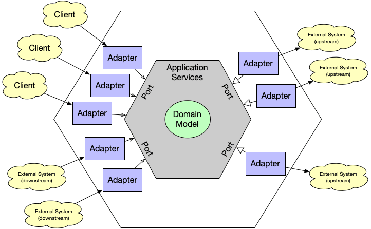

# **Hexagonal Architecture Practice Project**

[현재 서비스를 운영하고 있는 토이 프로젝트](https://youtu.be/c8WNbcxkRhY)는 controller, service, repository로 이루어즌 3 tier layered architecture로 개발하고 있다.

초기 개발 이후 지속적으로 서비스를 개선하고자 리펙토링이나 기능들을 추가하고 있는데, 그 과정에서 **유지보수에 불편함**을 겪었는데 그 원인이 무엇일까 생각해보았다.

<br>

## **문제가 무엇인가?**

### **레이어 간 side effect**

서비스 초기라서 service와 repository의 영역에서 리펙토링 되는 부분이 많았다. 그 과정에서 repository의 변경이 service의 변경을 낳다보니, 유지보수 비용이 많이 들었다. 뿐만 아니라, 각 레이어에서 앞단으로 던지는 데이터의 타입이 변하면 앞 단의 코드도 바뀌어야 했다.

이처럼 한 레이어에서의 변경이 다른 레이어의 변경으로 전이되는 것은 추후 심각한 비효율을 초래할 것이라고 생각했다.

<br>

### **모듈 간 side effect**

각 모듈(user, rank, auth 등)의 service 레이어는 다른 모듈의 service 또는 repository 레이어를 의존하고 있다. 따라서 하나의 모듈의 변경이 다른 모듈의 변경을 낳았다. 그래서 누군가 자신의 백엔드 로직을 수정하여서 다른 팀원이 작성한 코드에 영향을 주었을 때(unit test에서 fail) 영향을 받은 코드와 그 코드의 테스트 코드를 추가로 수정해주어야 했다.

<br>

### **service 레이어가 너무 비대하다.**

각 모듈에서 service 레이어가 갖는 관심사가 너무 다양했고 복잡했다. 결국 의존하는 대상이 많아지기 때문에, 복잡도가 증가한다는 것은 단위 테스트하기가 어렵다는 뜻과 같다. 모킹(mocking)할 대상이 많아지기 때문이다. 이것이 코드를 리펙토링하는데 걸림돌이 되었다.

<br>

---

## **문제를 어떻게 해결할까?**

### **코드 전반의 품질을 개선과 아키텍처 개선**

개발 초기에는 구현이 단순하다는 점, 빠르게 프로젝트 결과를 낼 수 있다는 점에서 아키텍처 설계에 큰 고민 없이 레이어드 아키텍처를 적용했다. 이전 토이프로젝트는 서비스를 개발만 했기 때문에 유지보수나 기능 확장을 경험해보지 않았기 때문인 것 같다.

하지만 코드를 리펙토링하는 과정에서 어떤 코드가 유지보수에 좋은 코드인가 고민을 하면서 [객체지향 프로그래밍](https://growth-msleeffice.tistory.com/144)(객체지향의 특징과 디자인 원칙 - SOLID)에 대해 학습하였고 좋지 않은 코드가 무엇인가 보이기 시작했다.

> 추후 CQRS 도입을 고려하고 있는데, 핵심 로직이 담긴 service 레이어가 persistence 레이어에 의존하기 때문에, repository의 변경에 영향을 받는다는 것도 아키텍처 전반의 개선이 필요하다고 느꼈다.

그래서 이러한 특징과 원칙이 적용된 hexagonal architecture를 선택했다.

### **물론 hexagonal architecture가 정답은 아니라고 생각한다.**

진행하고 있는 토이프로젝트의 도메인은 비즈니스 논리가 그다지 복잡하지 않다. 또한, useCase와 Port interface로 추상화하여 의존성을 역전하는 것은 아키텍처의 복잡도 자체를 높이기 때문에 규모가 작은 우리 서비스의 경우 레이어드 아키텍처에 비해 얻을 수 있는 장점이 크지 않다.

그러나 객체지향 프로그래밍의 특징, SOLID 원칙을 학습했다고 해서 레이어드 아키텍처를 단번에 객체지향적으로 개선하는 것은 막막해서 엄두가 나지를 않았다. 그래서 입증된 디자인 패턴들을 적용한 **hexagonal architecture** 로 간단하게 게시판(board) CRUD API를 개발해보는 토이 프로젝트를 진행했다.

hexagonal architecture를 간단하게 구현해보면서 이러한 개념들을 학습하는 것은 기존 서비스를 어떻게 개선해야 할지 방향 잡을 수 있을 것이라고 생각했다. 또한, 실제 현업에서 지금보다 훨씬 복잡한 비즈니스 로직, 큰 규모의 서비스를 제공하는 api 서버를 개발할 것이기 때문에 이를 대비한 학습에 의의를 두고 프로젝트를 진행했다.

> clean architecture가 아닌 hexagonal architecture를 선택한 이유는 clean architecture 보다는 port와 adaptor라는 이름과 역할이 직관적이었기 때문에 아키텍처를 이해하고 명확하게 구현하는데 편할 것이라고 생각했다.

<br>

---

# **프로젝트 구조**

✅ Github Repository : [https://github.com/myeongseoklee/hexagonal-practice](https://github.com/myeongseoklee/hexagonal-practice)

<br>

```bash
.
├── app.module.ts
├── auth
│   ├── decorator
│   │   └── role.decorator.ts
│   ├── enum
│   │   └── role.enum.ts
│   └── guard
│       ├── auth.guard.ts
│       └── role.guard.ts
├── board
│   ├── adaptor
│   │   ├── in-web
│   │   │   ├── board.controller.ts
│   │   │   └── in-web.module.ts
│   │   └── out-persistence
│   │       ├── board-persistence.adaptor.ts
│   │       ├── board-persistence.module.ts
│   │       ├── board.mapper.ts
│   │       └── board.orm-entity.ts
│   ├── application
│   │   ├── board.service.ts
│   │   └── port
│   │       ├── in
│   │       │   ├── dto
│   │       │   │   ├── board-res.dto.ts
│   │       │   │   ├── create-board-req.dto.ts
│   │       │   │   ├── get-boards-res.dto.ts
│   │       │   │   ├── get-boards.command.ts
│   │       │   │   ├── update-board-body-req.dto.ts
│   │       │   │   └── update-board-req.dto.ts
│   │       │   ├── get-boards.use-case.ts
│   │       │   ├── handle-board.use-case.ts
│   │       │   └── pipe
│   │       │       └── update-board-validation.pipe.ts
│   │       └── out
│   │           ├── get-board.port.ts
│   │           ├── get-boards.port.ts
│   │           └── handle-board.port.ts
│   ├── board.module.ts
│   └── domain
│       ├── board-window.entity.ts
│       └── board.entity.ts
├── common
│   ├── config
│   │   ├── global-config.ts
│   │   └── orm-config.ts
│   ├── exception
│   │   ├── custom-validation-error.ts
│   │   └── http-exception.filter.ts
│   └── res
│       └── response.entity.ts
└── main.ts
```

<br>

---

# **Hexagonal architecture의 간단한 개념**

먼저 헥사고날 아키텍처를 요약하면, **비즈니스 로직(도메인 모델)을 인프라에서 분리한다**는 것이다.

<br>

## **레이어드 아키텍처와 가장 큰 차이**

레이어드 아키텍쳐에서 모든 비즈니스 로직은 서비스레이어에 있지만, 클린 아키텍쳐에서는 도메인 모델(도메인 레이어)에 핵심 비즈니스 로직이 있고, 나머지 부분(서비스 레이어)에서는 도메인 모델을 위한 통신/오케스트레이션을 담당한다.

<br>

## **데이터의 흐름**



> 출처 : https://haandol.github.io/2022/02/13/demystifying-hexgagonal-architecture.html

<br>

좌측의 Adapters를 통해 사용자의 요청을 받아서 Applicaiton Service에 전달한다. 이 때 서비스와 어댑터는 Ports를 인터페이스로 사용해서 통신한다. (어댑터 디자인패턴 같은 느낌)

Application Service는 들어온 요청을 Domain Model로 전달한다.

Domain Model은 전달받은 요청으로 비즈니스 요청을 처리하고 우측에 있는 Adapters를 통해 외부의 데이터를 가져오거나 처리된 데이터를 외부로 저장한다.

필요하다면 Application Service는 도메인 모델의 처리결과를 전달받아 다시 사용자에게 반환해준다.

<br>

# **컴포넌트**

## **1. Board**

### 📌 **Adaptor**

#### **Primary Adaptor(in-web)**

사용자(consumer)의 요청을 받아들이고 도메인 로직 처리 결과를 반환하는 계층

이벤트 드리븐 서비스로 구성될 경우에는 primary adaptor의 역할이 명확하지만 웹 서비스의 경우에는 모호해진다. 따라서 primary adaptor는 웹 프레임워크들의 **controller** 또는 람다의 handler와 같은 개념에 통합되어 사용되며, **클라이언트로부터 입력받은 값의 유효성을 체크하고 적절한 형태로 가공하여 비즈니스 로직을 실행하는 서비스(interface - in port의 use-case)를 호출**한다.

✅ **Controller** : 사용자의 요청 데이터를 받아서 dto 또는 command로 변환하여 Service에 전달한다. 이 때 직접 Service를 호출(의존)하지 않고 interface(useCase)에게 위임한다.

<br>

#### **Secondary adaptor(out-persistence)**

✅ **Adaptor** : 도메인 모델(entity)의 처리에 사용되는 어댑터. 외부 Infra(db, aws 등)와 연결된다.

✅ **Mapper** : persistence adaptor에서 조회한 ORM Entity를 도메인 Entity로 변환하고 웹 어댑터에서 요청하는 도메인 정보를 persistence 어댑터에서 활용하기 위해 ORM Entity로 변환하는 과정이 필요해 만든 Mapper class.

즉, 도메인 -> ORM Entity , ORM Entity -> 도메인 으로 변환하는 Mapper class

> Mapper class의 필요성
>
> mapper class가 있으면 도메인 레이어와 영속성 레이어의 결합을 낮출 수 있음.
>
> 만약 mapper가 없다면, adaptor에서 반환하는 값은 ORM Entity의 형태인데, 만약 DB를 현재 사용하는 MySQL에서 조회용 DB로 MongoDB를 채택하는 경우 ORM DB의 변경으로 인해 port interface와 Service의 코드(서비스에서 port를 통해 반환 받는 데이터의 타입)이 변해야 하고, 그에 따라 사이드 이펙트 발생할 가능성이 있음. 하지만, mapper class를 따로 둔다면, db가 변하더라도 해당 db에 맞는 mapper method만 추가 구현하여 adaptor에서 활용하면 service와 port interface에서는 변경할 코드가 없음.

✅ **ORM entity** : db의 스키마를 정의하는 entity.

<br>

### 📌 **Application**

#### **Port**

서비스에서 구현, 호출 될 인터페이스

✅ **in-port** : use-case 또는 iService. in-web adaptor에 의해 호출됨(in-web adaptor가 in-port를 의존)

✅ **out-port** : port 또는 iRepository. out-persistence에 의해 호출됨(out-persistence adaptor가 out-port를 의존)

✅ **DTO** : req dto와 res dto로 구성. req dto의 경우 command(명령어, ~해라)의 성격이 강하므로 command로 명명해도 될듯.

req dto는 들어오는 데이터를 dto에 담아 유효성을 검증하여 service로 보냄. service에서는 dto 데이터가 아닌 도메인 객체를 다뤄야 하므로 dto를 도메인 객체로 전환하는 메서드 구현(of, toEntity)

res dto는 반환되는 도메인 객체(entity)를 그대로 내보내지 않고, 필요한 데이터만 응답 객체로 변환하기 위해 사용(private 변수 캡슐화)

<br>

#### **Service**

useCase 구현체. 도메인 로직과 함께 사용되는 비즈니스 로직(기반환경, 트랜잭션, 메일&SMS발송 등 다른 인프라와 통신을 담당하는 역할 등)들을 수행한다.

<br>

### 📌 **Domain**

#### **Entity**

도메인 엔티티 계층

도메인의 핵심 기능만을 담당하며 도메인의 문제 해결에 순수하게 집중하는 계층

외부 애플리케이션 로직(service) 등 어떤 계층에도 의존하지 않는 순수한 계층

<br>

## **2. Common**

### **response 엔티티**

응답 객체의 컨벤션을 통일하기 위한 엔티티

> 참고 : https://github.com/jojoldu/monorepo-nestjs-typeorm/blob/da83faabce42ac8521203e19df5df928b3fa4b4d/libs/common-config/src/res/ResponseEntity.ts

### **exception**

응답에 성공한 경우 응답 객체를 반환하기 쉬우나, 예외가 발생할 경우 응답 객체를 조작해야 하는데 그 로직이 들어가있음.

> 참고 : https://github.com/jojoldu/monorepo-nestjs-typeorm/tree/da83faabce42ac8521203e19df5df928b3fa4b4d/libs/common-config/src/filter

<br>

## **3. Auth**

<br>

---

# **구현 기능**

### ✅ typeORM을 활용한 게시판 CRUD

게시글 전체 조회

게시글 단건 조회

게시물 생성

게시물 수정

게시물 삭제

<br>

### ✅ useGuard를 통한 유저 인증

user 엔티티를 따로 두지 않았으므로 회원가입과 로그인 등의 기능은 미 구현.

Request header의 Authorization에 담긴 accessToken의 값에 따라 인증, 인가 처리

> accessToken이 필요 없는 경우 검증 x
>
> 본인만 접근 가능한 리소스의 경우 accessToken이 'me'
>
> 인증된 유저라면 모두 접근 가능한 리소스의 경우 accessToken이 'user'로 보내져야 한다.

<br>

---

## **참고한 자료**

초기 개념을 잡기 위해 염탐?한 깃허브 소스코드와 영상, 블로그이다.

<br>

### **Video**

📌 [NHN FORWARD 22] 클린 아키텍처 애매한 부분 정해드립니다. : [https://youtu.be/g6Tg6_qpIVc](https://youtu.be/g6Tg6_qpIVc)

📌 [NHN FORWARD 22] DDD 뭣이 중헌디? : [https://youtu.be/6w7SQ_1aJ0A](https://youtu.be/6w7SQ_1aJ0A)

<br>

### **Docs**

📌 객체 지향 프로그래밍의 4가지 특징ㅣ추상화, 상속, 다형성, 캡슐화 : [https://www.codestates.com/blog/content/%EA%B0%9D%EC%B2%B4-%EC%A7%80%ED%96%A5-%ED%94%84%EB%A1%9C%EA%B7%B8%EB%9E%98%EB%B0%8D-%ED%8A%B9%EC%A7%95](https://www.codestates.com/blog/content/%EA%B0%9D%EC%B2%B4-%EC%A7%80%ED%96%A5-%ED%94%84%EB%A1%9C%EA%B7%B8%EB%9E%98%EB%B0%8D-%ED%8A%B9%EC%A7%95)

📌 캡슐화란 무엇인가? 어떤 이점이 있는가? : [https://bperhaps.tistory.com/entry/%EC%BA%A1%EC%8A%90%ED%99%94%EB%9E%80-%EB%AC%B4%EC%97%87%EC%9D%B8%EA%B0%80-%EC%96%B4%EB%96%A4-%EC%9D%B4%EC%A0%90%EC%9D%B4-%EC%9E%88%EB%8A%94%EA%B0%80](https://bperhaps.tistory.com/entry/%EC%BA%A1%EC%8A%90%ED%99%94%EB%9E%80-%EB%AC%B4%EC%97%87%EC%9D%B8%EA%B0%80-%EC%96%B4%EB%96%A4-%EC%9D%B4%EC%A0%90%EC%9D%B4-%EC%9E%88%EB%8A%94%EA%B0%80)

📌 객체지향 개발 5대 원리-SOLID : [https://www.nextree.co.kr/p6960/](https://www.nextree.co.kr/p6960/)

📌 객체 지향 4가지 특징과 5가지 원칙 : [https://xangmin.tistory.com/152](https://xangmin.tistory.com/152)

📌 계층형 아키텍처 : [https://jojoldu.tistory.com/603?category=1011740](https://jojoldu.tistory.com/603?category=1011740)

📌 Layered Architecture Deep Dive : [https://msolo021015.medium.com/layered-architecture-deep-dive-c0a5f5a9aa37](https://msolo021015.medium.com/layered-architecture-deep-dive-c0a5f5a9aa37)

📌 객체지향 (Object Oriented) 디자인 (Design) : [https://jojoldu.tistory.com/592](https://jojoldu.tistory.com/592)

📌 디자인 패턴 개요 : [https://gyoogle.dev/blog/design-pattern/Overview.html](https://gyoogle.dev/blog/design-pattern/Overview.html)

📌 쉽게 설명한 클린 / 헥사고날 아키텍쳐 : [https://haandol.github.io/2022/02/13/demystifying-hexgagonal-architecture.html](https://haandol.github.io/2022/02/13/demystifying-hexgagonal-architecture.html)

📌 모두싸인 Backend 아키텍처 해부하기 : [https://team.modusign.co.kr/%EB%AA%A8%EB%91%90%EC%8B%B8%EC%9D%B8-%EB%B0%B1%EC%97%94%EB%93%9C-%EC%95%84%ED%82%A4%ED%85%8D%EC%B2%98-%ED%95%B4%EB%B6%80%ED%95%98%EA%B8%B0-a24aeccebd2a](https://team.modusign.co.kr/%EB%AA%A8%EB%91%90%EC%8B%B8%EC%9D%B8-%EB%B0%B1%EC%97%94%EB%93%9C-%EC%95%84%ED%82%A4%ED%85%8D%EC%B2%98-%ED%95%B4%EB%B6%80%ED%95%98%EA%B8%B0-a24aeccebd2a)

📌 비즈니스 로직, 도메인 로직이 도대체 뭐지? : [https://velog.io/@eddy_song/domain-logic](https://velog.io/@eddy_song/domain-logic)

[번역] 도메인 모델 순수성 vs 도메인 모델 완전성 : [https://velog.io/@leejh3224/%EB%B2%88%EC%97%AD-%EB%8F%84%EB%A9%94%EC%9D%B8-%EB%AA%A8%EB%8D%B8-%EC%88%9C%EC%88%98%EC%84%B1-vs-%EB%8F%84%EB%A9%94%EC%9D%B8-%EB%AA%A8%EB%8D%B8-%EC%99%84%EC%A0%84%EC%84%B1](https://velog.io/@leejh3224/%EB%B2%88%EC%97%AD-%EB%8F%84%EB%A9%94%EC%9D%B8-%EB%AA%A8%EB%8D%B8-%EC%88%9C%EC%88%98%EC%84%B1-vs-%EB%8F%84%EB%A9%94%EC%9D%B8-%EB%AA%A8%EB%8D%B8-%EC%99%84%EC%A0%84%EC%84%B1)

📌 안정된 의존관계 원칙과 안정된 추상화 원칙에 대하여 : [https://techblog.woowahan.com/2561/](https://techblog.woowahan.com/2561/)

📌 타입스크립트 의존성 주입, 제어의 역전 with IOC 컨테이너 : [https://itchallenger.tistory.com/162](https://itchallenger.tistory.com/162)

📌 DTO의 사용 범위에 대하여 : [https://tecoble.techcourse.co.kr/post/2021-04-25-dto-layer-scope/](https://tecoble.techcourse.co.kr/post/2021-04-25-dto-layer-scope/)

📌 정적 팩토리 메서드(Static Factory Method)는 왜 사용할까? : [https://tecoble.techcourse.co.kr/post/2020-05-26-static-factory-method/](https://tecoble.techcourse.co.kr/post/2020-05-26-static-factory-method/)

📌 clean-code-typescript : [https://738.github.io/clean-code-typescript/](https://738.github.io/clean-code-typescript/)

<br>

### **Github Source Code**

📌 헥사고날 아키텍처(nestjs) : [https://github.com/YaroslavTaranenko/nest-hexagonal](https://github.com/YaroslavTaranenko/nest-hexagonal)

📌 헥사고날 아키텍처(nestjs) : [https://github.com/tim-hub/nestjs-hexagonal-example](https://github.com/tim-hub/nestjs-hexagonal-example)

📌 NestJS 파라미터 오류 가공하기 : [https://github.com/jojoldu/monorepo-nestjs-typeorm/tree/master/posts/%ED%8C%8C%EB%9D%BC%EB%AF%B8%ED%84%B0%EC%98%A4%EB%A5%98*%EC%98%88%EC%81%98%EA%B2%8C*%EA%B0%80%EA%B3%B5%ED%95%98%EA%B8%B0](https://github.com/jojoldu/monorepo-nestjs-typeorm/tree/master/posts/%ED%8C%8C%EB%9D%BC%EB%AF%B8%ED%84%B0%EC%98%A4%EB%A5%98_%EC%98%88%EC%81%98%EA%B2%8C_%EA%B0%80%EA%B3%B5%ED%95%98%EA%B8%B0)

📌 응답 객체의 컨벤션을 통일하기 위한 엔티티 : [https://github.com/jojoldu/monorepo-nestjs-typeorm/blob/da83faabce42ac8521203e19df5df928b3fa4b4d/libs/common-config/src/res/ResponseEntity.ts](https://github.com/jojoldu/monorepo-nestjs-typeorm/blob/da83faabce42ac8521203e19df5df928b3fa4b4d/libs/common-config/src/res/ResponseEntity.ts)
