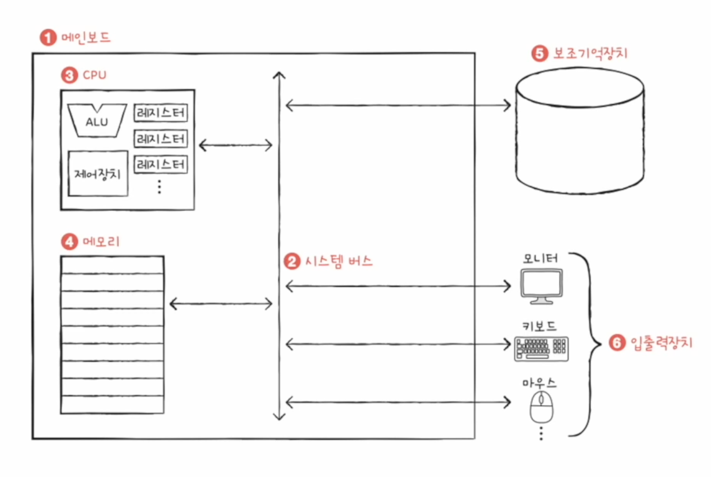

# **컴퓨터 구조의 큰 그림**

```bash
컴퓨터구조
│
├── 컴퓨터가 이해하는 정보
│   │
│   ├── 데이터 : 컴퓨터가 이해하는 숫자, 문자, 이미지, 동영상과 같은 정적인 정보
│   │
│   └── 명령어 : 데이터를 움직이고 컴퓨터를 작동시키는 정보
│
│
└── 컴퓨터의 네 가지 핵심 부품
    │
    ├── CPU : 메모리에 저장된 명령어를 읽어들이고, 해석하고 실행하는 부품
    │
    ├── 메모리(주기억장치) : 실행되는 프로그램의 명령어와 데이터를 저장하는 부품, 보통 RAM을 지칭
    │
    ├── 보조기억장치 : 전원이 꺼져도 저장된 내용을 기억할 수 있는 장치
    │
    └── 입출력장치 : 컴퓨터 외부에 연결되어 컴퓨터 내부와 정보를 교환할 수 있는 장치
```

<br>

## **컴퓨터의 4가지 핵심 부품**



> 출처 : https://www.inflearn.com/course/%ED%98%BC%EC%9E%90-%EA%B3%B5%EB%B6%80%ED%95%98%EB%8A%94-%EC%BB%B4%ED%93%A8%ED%84%B0%EA%B5%AC%EC%A1%B0-%EC%9A%B4%EC%98%81%EC%B2%B4%EC%A0%9C

---

### 메모리

- 메모리는 현재 실행되는 프로그램의 명령어와 데이터를 저장하는 부품이다.
- 프로그램이 실행되려면 반드시 메모리에 저장되어 있어야 한다.
- 메모리에 저장된 값의 위치는 주소로 알 수 있다.

### CPU

- CPU는 메모리에 저장된 명령어를 읽어들이고 읽어들인 명령어를 해석하고, 실행하는 부품이다.
- CPU의 내부 구성요소 중 가장 중요한 세 가지는 **ALU(산술논리연산장치), 레지스터, 제어장치**이다.
  - ALU : 연산을 담당
  - 레지스터 : CPU 내부의 작은 임시 저장 장치. 프로그램 실행에 필요한 값을 임시로 저장하며 CPU 안에는 여러가지의 레지스터가 존재하고 각기 다른 이름과 역할을 갖고 있다.
  - 제어장치 : **제어신호**라는 전기 신호를 내보내고 명령어를 해석하는 장치.

### 보조기억장치와 입출력장치

- 보조기억장치는 메모리보다 크기도 크고 컴퓨터 전원이 꺼져도 저장된 내용을 잃지 않는다. 메모리는 실행되는 프로그램을 저장한다면 보조기억장치는 보관할 프로그램을 저장한다.
- 입출력장치는 마이크, 스피커, 프린터, 마우스, 키보드처럼 컴퓨터 외부에 연결되어 컴퓨터 내부와 정보를 교환하는 장치.

### 메인보드와 시스템 버스

- 4개의 컴퓨터의 핵심 부품들은 모두 메인보드에 연결된다. 메인보드에 연결된 부품들은 서로 정보를 주고받을 수 있는데, 이는 메인보드 내부에 **버스**라는 통로가 있기 때문이다.
- 여러가지 버스 가운데 컴퓨터의 네 가지 핵심 부품을 연결하는 가장 중요한 버스는 **시스템 버스**이다.
- 시스템 버스는 주소 버스(where), 데이터 버스(what), 제어 버스(how)로 구성되어 있다.
  - 주소 버스 : 주소를 주고받는 통로
  - 데이터 버스 : 명령어와 데이터를 주고받는 통로
  - 제어 버스 : 제어신호를 주고받는 통로

### CPU 작동 예시

- CPU가 메모리 속 명령어를 읽어 들이기 위해 제어장치에서 '메모리 읽기'라는 신호를 내보낼 때

  1. 제어 버스로 '메모리 읽기' 제어 신호를 내보낸다.
  2. 주소 버스로 읽고자 하는 주소를 내보낸다.
  3. 메모리는 데이터 버스로 CPU가 요청한 주소에 있는 내용을 보낸다.

- CPU가 메모리에 어떤 값을 저장할 때도 CPU는 데이터 버스를 통해 메모리에 저장할 값을, 주소 버스를 통해 저장할 주소를, 제어 버스를 통해 '메모리 쓰기' 제어 신호를 내보낸다.
