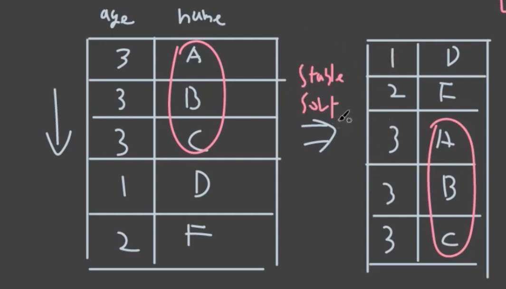
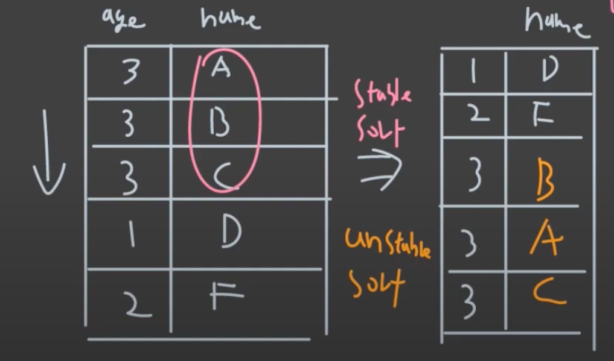
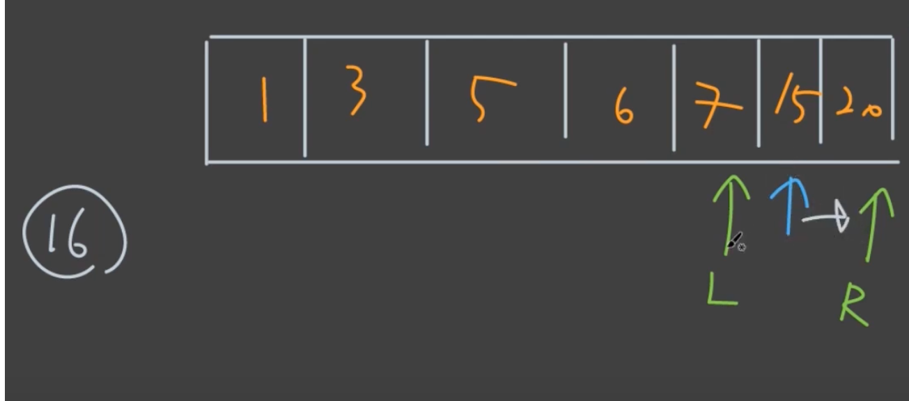
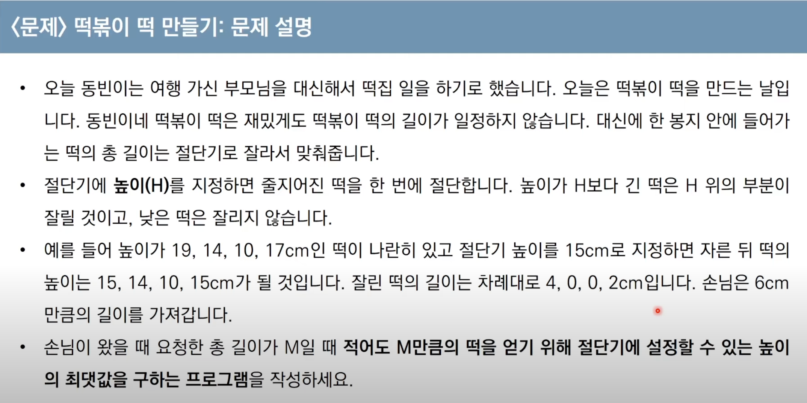

# **Binary Search(이분탐색)**

### **Array Search**

- sorting에는 heap sort, quick sort, merge sort가 있다.
- sorting은 O(nlogn)의 시간복잡도를 갖는다.
- sorting 알고리즘에는 stable의 개념이 있다.
- merge sorting은 stable한 sorting이고 quick sort, heap sort는 unstable한 sorting이다.

</br>

### **Stable Search**



> 출처 : https://youtu.be/tLG10WsVntI

</br>

### **Unstable Search**



> 출처 : https://youtu.be/tLG10WsVntI

</br>

### **Binary Search(이분탐색)**

- 일반적인 search, 즉 순차탐색은 O(n)의 시간 복잡도를 갖는데 반해, sorted array를 binary search 할 때는 O(logn)의 시간 복잡도를 갖는다. 따라서, 배열을 일정 기준으로 정렬해도 무관하다면, binary search를 적극 사용하는 것이 좋다.
- binary search를 직접 구현 해야만 풀 수 있는 문제들이 있기 때문에 직접 구현할 줄 알아야 한다.
- 주요 개념은 left(start), right(end), pivot(mid)의 개념이다.
- pivot = (left + right) / 2, 즉 pivot은 중간 값이다.
- 찾고자 하는 숫자가 pivot이 가리키는 숫자보다 작다면 right의 값이 pivot보다 하나 작은 값이 되고
- 찾고자 하는 숫자가 pivot이 가리키는 숫자보다 크다면 left의 값이 pivot보다 하나 큰 값이 된다.
- 이러한 로직이 반복되면서 해당 숫자의 위치를 찾게 된다.

### 예제 : leetcode 704. Binary Search

> Given an array of integers nums which is sorted in ascending order, and an integer target, write a function to search target in nums. If target exists, then return its index. Otherwise, return -1.
> </br> You must write an algorithm with O(log n) runtime complexity.
> </br></br>**Example 1:** > </br>Input: nums = [-1,0,3,5,9,12], target = 9
> </br>Output: 4
> </br>Explanation: 9 exists in nums and its index is 4
> </br></br>**Example 2:** > </br>Input: nums = [-1,0,3,5,9,12], target = 2
> </br>Output: -1
> </br>Explanation: 2 does not exist in nums so return -1
> </br></br>**Constraints:** > </br>1 <= nums.length <= 104
> </br>-104 < nums[i], target < 104
> </br>All the integers in nums are unique.
> </br>nums is sorted in ascending order.


> 출처 : https://youtu.be/tLG10WsVntI

위의 정렬된 배열에서 15라는 숫자를 찾을 때, pivot은 (0 + 6) / 2 = 3이므로 3이다.

그리고 pivot이 가리키는 숫자는 6이다

pivot이 가리키는 숫자가 15보다 작기 때문에 15라는 숫자의 위치는 pivot 보다 우측에 있을 것이다.

따라서 그 다음에는 left가 pivot의 바로 우측 숫자로 변경된다.

이 때, pivot은 (4+6)/2 = 5이다.

pivot 5가 가리키는 숫자는 15이므로, 15라는 숫자는 배열의 5번째 index에 위치한 것으로 찾을 수 있다.



> 출처 : https://youtu.be/tLG10WsVntI

만약 16이라는 숫자를 찾는다면, pivot이 5일 때의 숫자 15보다 더 큰 숫자이므로,

16이라는 숫자의 위치는 5보다 클 것으로 예상된다.

따라서 left가 6으로 바뀌고, pivot은 6이 된다.

pivot 6이 가리키는 숫자는 20으로 16보다 큰 수이므로,

16이라는 숫자가 pivot의 좌측에 있을 것으로 예상된다.

이때, right가 pivot의 왼쪽으로 이동하게 되는데 이때, left와 right의 위치가 뒤바뀌므로

우리가 찾고자 하는 숫자를 찾을 수 없었다는 결론을 내고 그 결과(-1)를 return 한다.

```js
// 반복문

function binarySearchForLoop(arr, target) {
  let start = 0;
  let end = arr.length - 1;

  let idxDiff = end - start;
  while (idxDiff >= 0) {
    let centerIdx = Math.floor((end + start) / 2);
    let centerVal = arr[centerIdx];

    if (target === centerVal) {
      return centerIdx;
    }

    if (centerVal < target) {
      start = centerIdx + 1;
    } else {
      end = centerIdx - 1;
    }

    idxDiff = end - start;
  }

  return -1;
}

const data = [1, 3, 4, 5, 6, 7, 15, 20];
const target = [15, 8, 1, 200];

target.forEach((item, i) => {
  let result = binarySearchForLoop(data, item);
  if (result === -1) {
    console.log(`${target[i]} 요소가 없습니다.`);
    return;
  }
  console.log(`${target[i]} 요소는 ${result} index에 있습니다.`);
});
```

</br>

```js
// 이진 검색 구현 (재귀 함수)
function binarySearchRecursive(array, target, start, end) {
  if (start > end) {
    // 시작 인덱스가 끝 인덱스보다 크면, 값이 없는 경우
    return -1;
  }
  const mid = Math.floor((start + end) / 2); // 중간 인덱스 계산
  // 중간 값이 찾는 값과 같으면, 중간 인덱스를 반환
  if (array[mid] === target) {
    return mid;
  }
  // 찾는 값이 중간 값보다 작으면, 왼쪽 하위 배열에서 다시 검색
  else if (array[mid] > target) {
    return binarySearchRecursive(array, target, start, mid - 1);
  }
  // 찾는 값이 중간 값보다 크면, 오른쪽 하위 배열에서 다시 검색
  else {
    return binarySearchRecursive(array, target, mid + 1, end);
  }
}

// 끝 인덱스 n  구하기
const data = [1, 3, 4, 5, 6, 7, 15, 20];
const end = data.length - 1;
const target = [15, 8, 1, 200];

target.forEach((item, i) => {
  let result = binarySearchRecursive(data, item, 0, end);
  if (result === -1) {
    console.log(`${target[i]} 요소가 없습니다.`);
    return;
  }
  console.log(`${target[i]} 요소는 ${result} index에 있습니다.`);
});
```

</br>

### **값이 특정 범위에 속하는 데이터 개수 구하기**

```js
function binarySearchForLoop(arr, target) {
  let start = 0;
  let end = arr.length - 1;

  let idxDiff = end - start;
  while (idxDiff >= 0) {
    let centerIdx = Math.floor((end + start) / 2);
    let centerVal = arr[centerIdx];

    if (target === centerVal) {
      return centerIdx;
    }

    if (centerVal < target) {
      start = centerIdx + 1;
    } else {
      end = centerIdx - 1;
    }

    idxDiff = end - start;
  }

  return -1;
}

function countByRange(nums, start, end) {
  nums.sort((a, b) => a - b);
  const startIndex = binarySearchForLoop(nums, start);
  const endIndex = binarySearchForLoop(nums, end);

  return endIndex - startIndex;
}

const arr = [1, 2, 3, 3, 3, 3, 4, 4, 5, 6, 7, 8, 9];
countByRange(arr, 3, 7); // 8
```

</br>

### **파라메트릭 서치(Parametric Search)**

- 파라메트릭 서치란 최적화 문제(극대화, 극소화 등)를 결정문제('예' 혹은 '아니오')로 바꾸어 해결하는 기법입니다.
  - 예시 : 특정한 조건을 만족하는 가장 알맞은 값을 빠르게 찾는 최적화 문제
- 일반적으로 코딩 테스트에서 파라메트릭 서치 문제는 이진 탐색을 이용하여 해결할 수 있다.

</br>

### **동빈나 예제 1**



> 출처 : https://youtu.be/94RC-DsGMLo

</br>

```js
// 이진탐색 적용 못한 풀이
function simpleSolution(arr, m) {
  // h 보다 큰 요소만 1씩 뺐을때 요소들의 합이 m임 근데, h의 최댓값은 가장 큰 떡의 길이에 해당한다.
  // 가장 큰 떡의 길이에서 1씩 계속 빼주면서 원하는 m 값이 최초 등장할 때의 h를 리턴한다.

  // 내림차순 정렬
  arr.sort((a, b) => b - a);
  let end = arr.length - 1;
  let target;

  // h 최대값 도출
  for (let i = 1; i <= arr[0]; i++) {
    target = arr[0] - i;
    let result = arr
      .filter((item) => item > target)
      .map((item) => item - target)
      .reduce((acc, cur) => (acc += cur));
    // console.log('result: ', result);
    if (result >= m) {
      return target;
    }
  }
  return target;
}

// 실행시간 0.655ms
console.time('simpleSolution');
console.log('simpleSolution : ', simpleSolution(heightOfRiceCake, 1230));
console.timeEnd('simpleSolution');
```

</br>

```js
// 이진탐색 적용한 풀이
function binarySearchForExample2(arr, m) {
  // 오름차순 정렬
  arr.sort((a, b) => a - b);

  let start = 0;
  let end = Math.max(...arr);
  let result;
  // h를 바이너리 서치로 임의로 정해준다.
  while (start <= end) {
    let sum = 0;
    let mid = Math.floor((start + end) / 2);
    for (let i = 0; i < arr.length; i++) {
      if (arr[i] > mid) {
        sum += arr[i] - mid;
      }
    }
    if (sum < m) {
      end = mid - 1;
      continue;
    } else if (sum >= m) {
      result = mid;
      start = mid + 1;
    }
  }

  return result;
}

// 실행시간 : 2.416ms
console.time('binarySearchForExample2');
console.log(
  'binarySearchForExample2 : ',
  binarySearchForExample2(heightOfRiceCake, 1230),
);
console.timeEnd('binarySearchForExample2');
```

</br>

```js
// 동빈나 솔루션
function sol(arr, m) {
  // Set start and end points for binary search
  let start = 0;
  let end = Math.max(...arr);

  // Perform binary search (recursive)
  let result = 0;
  while (start <= end) {
    let total = 0;
    let mid = Math.floor((start + end) / 2);
    for (let i = 0; i < arr.length; i++) {
      let x = arr[i];
      // Calculate the amount of tteokbokki when cut
      if (x > mid) {
        total += x - mid;
      }
    }
    // If the amount of tteokbokki is insufficient, cut more (search for the right part)
    if (total < m) {
      end = mid - 1;
    }
    // Cut less if the amount of tteokbokki is sufficient (search for the left part)
    else {
      result = mid; // Since cutting as little as possible is the correct answer, record it here in result
      start = mid + 1;
    }
  }
  return result;
}
```

</br>

그런데 이상한 것이.. 실행시간에 왜 저런 차이가 나는걸까?

자료가 기하급수적으로 늘어나면 물론 나의 초반 풀이보다 이진탐색 방식이 더 빠를지도 잘 모르겠다.

</br>

### **동빈나 예제2**


> 출처 : https://youtu.be/94RC-DsGMLo

<br>

```js
function findLeft(arr, target, start = 0, end = arr.length - 1) {
  let mid = Math.floor((start + end) / 2);

  if (target < arr[mid]) {
    return findLeft(arr, target, start, mid - 1);
  }

  if (arr[mid] < target) {
    return findLeft(arr, target, mid + 1, end);
  }

  if (arr[mid] === target) {
    return arr[mid - 1] === target ? findLeft(arr, target, 0, mid - 1) : mid;
  }

  return -1;
}

function findRight(arr, target, start = 0, end = arr.length - 1) {
  let mid = Math.floor((start + end) / 2);

  if (target < arr[mid]) {
    return findRight(arr, target, start, mid - 1);
  }

  if (arr[mid] < target) {
    return findRight(arr, target, mid + 1, end);
  }

  if (arr[mid] === target) {
    return arr[mid + 1] === target
      ? findRight(arr, target, mid + 1, arr.length - 1)
      : mid;
  }

  return -1;
}

function countNumber(arr, target) {
  let end = arr.length - 1;
  let start = 0;

  const leftIdx = findLeft(arr, target, start, end); // 2
  const rightIdx = findRight(arr, target, start, end); // 5

  return rightIdx - leftIdx;
}

const arr = [1, 1, 2, 2, 2, 2, 3];
console.log(countNumber(arr, 2)); // 3
```
