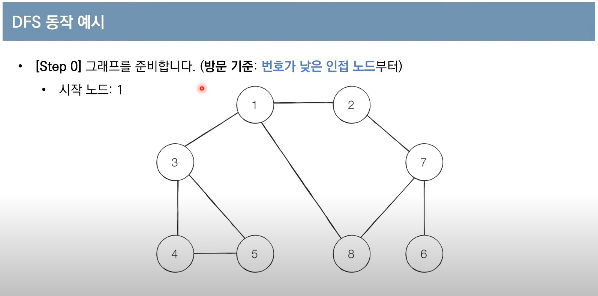

# **DFS(Depth-First Search)**

- DFS는 깊이 우선 탐색이라고도 부르며 그래프에서 깊은 부분을 우선적으로 탐색하는 알고리즘
- DFS는 **스택 자료구조(혹은 재귀함수)를 이용**하며, 구체적인 동작과 과정은 다음과 같다.

  1. 탐색 시작 노드를 스택에 삽입하고 방문 처리
  2. 스택의 최상단 노드에 방문하지 않은 인접 노드가 하나라도 있으면 그 노드를 스택에 쌓고 방문 처리. 방문하지 않은 인접 노드가 없으면 스택에서 최상단 노드를 꺼낸다.
  3. 더 이상 2번의 과정을 수행할 수 없을 때 까지 반복

- DFS 동작 예시

  

  ```jsx
  function dfs(graph, idx, visited) {
    // 현재 노드를 방문 처리
    visited[idx] = true;
    console.log(idx);

    // 현재 노드와 연결된 다른 노드를 재귀적으로 방문
    for (const node of graph[idx]) {
      if (!visited[node]) dfs(graph, node, visited);
    }
  }

  // 각 노드가 연결된 정보를 표현 (2차원 리스트)
  const graph = [
    [],
    [2, 3, 8],
    [1, 7],
    [1, 4, 5],
    [3, 5],
    [3, 4],
    [7],
    [2, 6, 8],
    [1, 7],
  ];

  // 각 노드가 방문된 정보를 표현 (1차원 리스트)
  const visited = [
    false,
    false,
    false,
    false,
    false,
    false,
    false,
    false,
    false,
  ];

  dfs(graph, 1, visited); // 1 2 7 6 8 3 4 5
  ```

---

- 예제 1 : 음료수 얼려 먹기


> 시간제한 : 1초\
> 입력 조건 :
>
> > - 첫 번째 줄에 얼음 틀의 세로 길이 N과 가로 길이 M이 주어진다.( 1 <= N, M <= 1,000 )
> > - 두 번째 줄 부터 N + 1 번째 줄까지 얼음 틀의 형태가 주어진다.
> > - 이때 구멍이 뚫려 있는 부분은 0, 그렇지 않은 부분은 1이다.
>
> 출력 조건 : 한 번에 만들 수 있는 아이스크림의 개수를 출력한다.\
> 입력 예시 :
>
> > 4 5\
> > 00110\
> > 00011\
> > 11111\
> > 00000
>
> 출력 예시 : 3

- 동빈나 풀이


- 특정 지점에서 dfs, bfs를 수행해서 이동 가능한 모든 경로에 대해 방문 처리를 한다.
- 방문 처리 된 이후, 이동 불가능한 노드를 만나면 이동 불가 처리를 한다.
- 모든 노드에 대해 방문처리가 이루어 지는 노드만 카운트 하면 연결되어 있는 요소 묶음이 총 몇 개 인지 알 수 있다.
- DFS를 활용 하는 알고리즘
  1. 특정한 지점의 주변 상, 하, 좌, 우를 살펴본 뒤에 주변 지점 중에서 값이 '0'이면서 아직 방문하지 않은 지점이 있다면 해당 지점을 방문한다.
  2. 방문한 지점에서 다시 상, 하, 좌, 우를 살펴보면서 방문을 진행하는 과정을 반복하면, 연결된 모든 지점을 방문할 수 있다.
  3. 모든 노드에 대하여 1 ~ 2번의 과정을 반복하며, 값이 '0'이면서 방문하지 않은 지점의 지점 수를 카운트한다.

```js
const graph = [
  [0, 0, 1, 1, 0],
  [0, 0, 0, 1, 1],
  [1, 1, 1, 1, 1],
  [0, 0, 0, 0, 0],
];

const [n, m] = [4, 5];

function dfsIceCream(x, y, graph) {
  if (x < 0 || y < 0 || x > n - 1 || y > m - 1) return false;

  if (graph[x][y] === 0) {
    graph[x][y] = 1;
    dfsIceCream(x - 1, y, graph);
    dfsIceCream(x, y - 1, graph);
    dfsIceCream(x + 1, y, graph);
    dfsIceCream(x, y + 1, graph);
    return true;
  }
  return false;
}

function iceCream(n, m, graph) {
  let result = 0;

  for (let i = 0; i < n; i++) {
    for (let j = 0; j < m; j++) {
      if (dfsIceCream(i, j, graph) === true) {
        result++;
      }
    }
  }

  return result;
}

console.time('test');
const result = iceCream(n, m, graph);
console.timeEnd('test');

console.log(result); // 3
```

> 출처 : [(이코테 2021 강의 몰아보기) 3. DFS/BFS](https://youtu.be/7C9RgOcvkvo)
