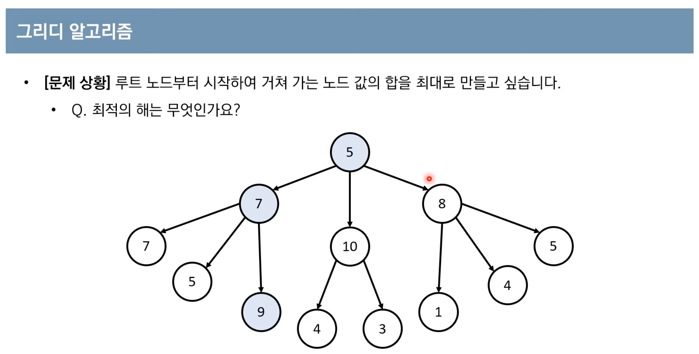
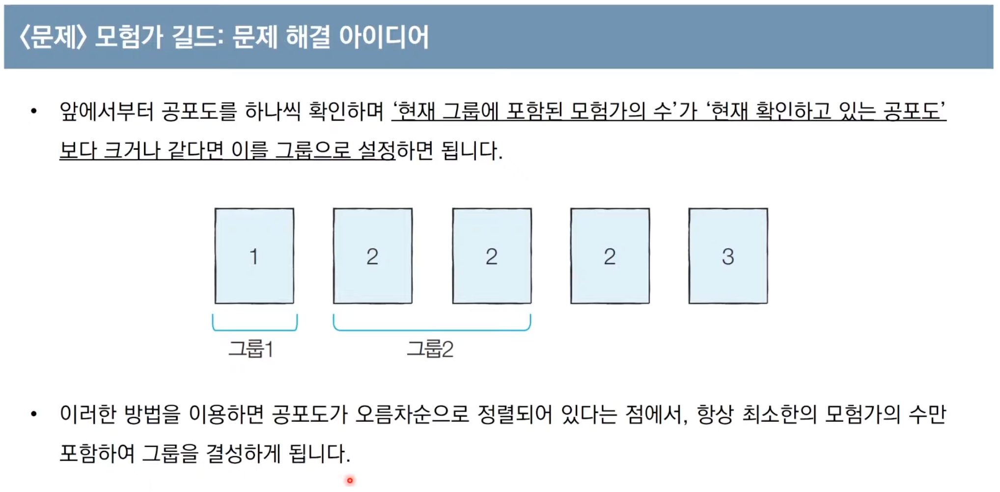

# **Greedy**

- 그리디 알고리즘(탐욕법)은 현재 상황에서 지금 당장 좋은 것만 고르는 방법을 의미한다.
- 일반적인 그리디 알고리즘은 문제를 풀기 위한 최소한의 아이디어를 떠올릴 수 있는 능력을 요구한다.
- 그리디 해법은 그 정당성 분석이 중요하다.

  - **_단순히 가장 좋아 보이는 것을 반복적으로 선택해도 최적의 해를 구할 수 있는지 검토_**하는 과정이 필요하다.
    
    위 예의 경우, 최적의 해는 5->7->9이다. <br>
    그런데, 단순히 매 상황에서 가장 큰 값만 고른다면, 5->10->4 가 해가 되어 최적의 해인 21보다 낮은 값이 된다.
    그리디 알고리즘은 이처럼 단순히 매 상황에서 큰 값만 고르는 방식이라고 할 수 있다.

  - 따라서 일반적인 상황에서 그리디 알고리즘은 최적의 해를 보장할 수 없을 때가 많다.
  - 하지만 코딩 테스트에서의 대부분의 그리디 문제는 탐욕법으로 얻은 해가 최적의 해가 되는 상황에서, 이를 추론할 수 있어야 풀리도록 출제된다.

<br>
<hr>

### 예제 1. 거스름돈

당신은 음식점의 계산을 도와주는 점원입니다. 카운터에는 거스름돈으로 사용할 500원, 100원, 50원, 10원 짜리 동전이 무한히 존재한다고 가정합니다. 손님에게 거슬러 주어야 할 돈이 N원일 때 거슬러 주아야 할 동전의 최소 개수를 구하세요. 단 거슬러 줘야 할 돈 N은 항상 10의 배수입니다.

- 해결 아이디어 : 최적의 해를 빠르게 구하기 위해서는 가장 큰 화폐 단위부터 돈을 거슬러 주어야 동전의 개수를 최소화할 수 있다는 것을 추론할 수 있다.

- N = 1260원 인 경우
  <br>
  500원 개수 = 2개 --> 1000원
  <br>
  100원 개수 = 2개 --> 200원
  <br>
  50원 개수 = 1개 --> 50원
  <br>
  10원 개수 = 1개 --> 10원
  <br>
  최적의 해 : 6개

- 정당성 분석

  - 가장 큰 화폐 단위부터 돈을 거슬러 주는 것이 최적의 해를 보장하는 이유는, **가지고 있는 동전 중에서 큰 단위가 항상 작은 단위의 배수**이므로 작은 단위의 동전들을 종합해 다른 해가 나올 수 없기 때문이다.
  - 만약에 800원을 거슬러 주어야 하는데 화폐 단위가 500원, 400원, 100원 이라면?
    <br> --> 500원이 400원의 배수가 아니기 때문에 큰 화폐 단위부터 거슬러 주는 것은 최적해가 아니다.
  - 그리디 알고리즘 문제에서는 이처럼 문제 풀이를 위한 최소한의 아이디어를 떠올리고 이것이 정당한지 검토할 수 있어야 한다.

- 풀이

```js
function minCoinNumbers(n, coins) {
  let count = 0;
  for (let i = 0; i < coinTypes.length; i++) {
    count += parseInt(n / coinTypes[i]);
    n %= coinTypes[i];
  }
  return count;
}

const n = 1260;
const coinTypes = [500, 100, 50, 10];
const result = minCoinNumbers(n, coinTypes);
console.log(result); // 6
```

- 시간 복잡도 분석
  - 화폐의 종류가 K라고 할 때, 소스코드의 시간 복잡도는 O(K)이다.
  - 이 알고리즘의 시간 복잡도는 거슬러줘야 하는 금액과는 무관하며, 동전의 총 종류에만 영향을 받는다.

<br>
<hr>

### 예제 2. 1이 될 때 까지

어떠한 수 **N이 1이 될 때 까지** 다음의 두 과정 중 하나를 반복적으로 선택하여 수행하려고 한다. 단, 두 번째 연산은 N이 K로 나누어 떨어질 때만 선택할 수 있다.

1. N에서 1을 뺀다.
2. N을 K로 나눈다.

예를 들어 N이 17, K가 4라고 가정하자. 이 때, 1번의 과정을 한 번 수행하면 N은 16이 된다. 이후에 2번의 과정을 두 번 수행하면 N은 1이 된다. 결과적으로 이 경우 전체 과정을 실행한 횟수는 3이 된다. 이는 N을 1로 만드는 최소 횟수이다.

N과 K가 주어질 때 N이 1이 될 때 까지 1번 혹은 2번의 **과정을 수행해야 하는 최소 횟수**를 구하는 프로그램을 작성하시오.

> \- 입력 조건 : 첫째 줄에 N (1 <= N <= 100,000)과 K (2 <= K <= 100,000)가 공백을 기준으로 하여 각각 자연수로 주어진다.
> <br> \- 시간제한 : 2초
> <br> \- 출력 조건 : 첫째 줄에 N이 1이 될 때 까지 1번 혹은 2번의 과정울 수행해야 하는 횟수의 최솟값을 출력한다.
> <br> \- 입력 예시 : n=25, k=5
> <br> \- 출력 예시 : 2

<br>

- 나의 답안\
  \- 빼는 수가 1이기 때문에, 1보다 큰 수로 나눈다면 횟수를 최소화 할 수 있을 것이라고 생각했다.\
  \- 시간 복잡도는 n의 크기에 비례하는 O(n)이다.\
  \- 그런데, 만약 n과 k의 입력조건 범위가 무수히 커질 경우 시간이 매우 오래걸렸다.

```js
function minCalculationNumbers(n, k) {
  let counts = 0;
  while (n > 1) {
    if (n >= k && n % k === 0) {
      n /= k;
      counts++;
      continue;
    } else {
      n--;
      counts++;
      continue;
    }
  }
  return counts;
}

console.time('test1');
console.log(minCalculationNumbers(21, 4)); // 4, 3.201ms
console.timeEnd('test1');

console.time('test2');
console.log(minCalculationNumbers(17, 4)); // 3, 0.032ms
console.timeEnd('test2');

console.time('test3');
console.log(minCalculationNumbers(25, 5)); // 2, 0.022ms
console.timeEnd('test3');

console.time('test4');
console.log(minCalculationNumbers(98899, 20000)); // 18903, 1.335ms
console.timeEnd('test4');

console.time('test5');
console.log(minCalculationNumbers(9889900000, 5000000000)); // 4889900001, 37.531s
console.timeEnd('test5');
```

<br>

- 동빈나 답안\
  \- 동빈나의 답안은 O(n)의 시간 복잡도를 O(log n)으로 낮출 수 있는 풀이였다.\
  \- 내 답안은 나누거나 뺄 때 마다 while문을 순회하도록 if문을 사용했다면 동빈나의 답안은 if문 없이, 그리고 1씩 빼기 보다 나머지를 한 번에 빼줌으로써 **시간 복잡도를 많이 잡아먹는 뺄셈 연산의 횟수를 줄였다.**

```js
// 동빈나 솔루션
function solution(n, k) {
  let counts = 0;
  while (true) {
    counts += n % k;
    n -= n % k;

    if (n < k) break;

    n /= k;
    counts++;
  }
  counts += n - 1;
  return counts;
}

console.time('test1');
console.log(solution(21, 4)); // 4, 3.281ms
console.timeEnd('test1');

console.time('test2');
console.log(solution(17, 4)); // 3, 0.037ms
console.timeEnd('test2');

console.time('test3');
console.log(solution(25, 5)); // 2, 0.027ms
console.timeEnd('test3');

console.time('test4');
console.log(solution(9889900000, 5000000000)); // 4889900001, 0.026ms
console.timeEnd('test4');
```

<br>
<hr>

### 예제 3. 곱하기 혹은 더하기

각 자리가 숫자 (0부터 9)로만 이루어진 문자열 S가 주어졌을 때, 왼쪽부터 오른쪽으로 하나씩 모든 숫자를 확인하며 숫자 사이에 'x' 혹은 '+' 연산자를 넣어 결과적으로 만들어질 수 있는 가장 큰 수를 구하는 프로그램을 작성하시오.\
(단, + 보다 x를 먼저 계산하는 일반적인 방식과는 달리, 모든 연산은 왼쪽부터 순서대로 이루어진다고 가정한다.)\
예를 들어 02984라는 문자열로 만들 수 있는 가장 큰 수는 ((((0 + 2) x 9) x 8) x 4) = 576이다.\
또한 만들어질 수 있는 가장 큰 수는 항상 20억 이하의 정수가 되도록 입력이 주어진다.

> \- 시간제한 : 1초
> <br> \- 입력 조건 : 첫째 줄에 여러 개의 숫자로 구성된 하나의 문자열 S가 주어진다. ( 1 <= S의 길이 <= 20)
> <br> \- 입력 예시 : '02984', '567'
> <br> \- 출력 예시 : 576, 210

<br>

- 나의 답안\
  \- 숫자 0을 발견하면 더해주고 나머지의 경우는 곱하는 것이 출력값을 가장 크게 만들 수 있는 방법이다. 그런데 0을 더하는 것은 의미가 없고, 1을 곱하는 것보다 더하는 것이 출력 값을 크게 해준다, 따라서, 0과 1은 더해주고 이를 제외한 나머지 숫자는 곱해준다.\
  \- 시간 복잡도는 0이 없을 경우 모든 자리수를 순회 해야 하므로 O(n) 이다.

```js
function solution(numString) {
  const numArr = [...numString];
  return numArr.reduce(
    (acc, cur) => (cur !== '0' ? (acc *= +cur) : (acc *= 1)),
    1,
  );
}

console.time('test1');
console.log(solution('02984')); // 576, 3.285ms
console.timeEnd('test1');

console.time('test2');
console.log(solution('567')); // 210, 0.032ms
console.timeEnd('test2');
```

<br>
<hr>

### 예제 4. 모험가 길드

한 마을에 모험가가 N명 있다. 모험가 길드에서는 N명의 모험가를 대상으로 '공포도'를 측정했는데, '공포도'가 높은 모험가는 쉽게 공포를 느껴 위험 상황에서 제대로 대처할 능력이 떨어진다.\
모험가 길드장인 동빈이는 모험가 그룹을 안전하게 구성하고자 <u>공포도가 X인 모험가는 반드시 X명 이상으로 구성한 모험가 그룹에 참여</u>해야 여행을 떠날 수 있도록 규정했다.\
동빈이는 최대 몇 개의 모험가 그룹을 만들 수 있는지 궁금하다.\
N명의 모험가에 대한 정보가 주어졌을 때, 여행을 떠날 수 있는 그룹 수의 최댓값을 구하는 프로그램을 작성하시오.\

\- 예를 들어 N = 5이고, 각 모험가의 공포도가 다음과 같다고 가정한다.

> 2 3 1 2 2

이 경우 그룹 1에 공포도가 1, 2, 3인 모험가를 한 명씩 넣고, 그룹 2에 공포도가 2인 남은 두 명을 넣게 되면 총 2개의 그룹을 만들 수 있다.\
또한 몇 명의 모험가는 마을에 그대로 남아있어도 되기 때문에, 모든 모험가를 특정한 그룹에 넣을 필요는 없다.

> \- 시간제한 : 1초\
> \- 입력 조건:\
> \-> 첫째 줄에 모험가의 수 N이 주어진다. ( 1 <= N <= 100,000)\
> \-> 둘째 줄에 각 모험가의 공포도의 값을 N 이하의 자연수로 주어진다.\
> \- 입력 예시 : '5', '2 3 1 2 2'\
> \- 출력 예시 : 2

<br>

- 내 답안 \
  공포도가 큰 모험가 부터 짝지으면 된다고 생각했다. 반대로 생각해서 공포도가 작은 모험가부터 짝지어도 같은 결과가 나올 것으로 판단했지만, 극단적인 예외의 경우를 생각하지 못했다.

```js
function adventurersGuild(n, fears) {
  const fearsArr = fears
    .split(' ')
    .sort((a, b) => b - a)
    .map((item) => +item);
  console.log('fearsArr: ', fearsArr);

  let idx = 0;
  let groupCounts = 0;
  while (n > 0) {
    groupCounts += 1; // group을 만들 탐험가가 남아있다면 group 수 증가 시키기
    n -= fearsArr[idx]; // 공포도 크기 만큼 group에 탐험가 할당
    console.log('n: ', n);
    idx += fearsArr[idx]; // 다음 그룹을 시작 할 index 설정
  }

  return groupCounts;
}

console.time('test');
console.log(adventurersGuild(5, '2 3 1 2 2')); // 2, 3.702ms
console.timeEnd('test');

console.time('test2');
console.log(adventurersGuild(5, '5 5 1 1 1')); // 1, 0.032ms
console.timeEnd('test2');
```

<br>
<hr>

- 동빈나 답안



```js
function solution(n, fears) {
  const fearsArr = fears
    .split(' ')
    .map((item) => parseInt(item))
    .sort((a, b) => a - b);

  let result = 0;
  let count = 0;

  for (let i = 0; i < n; i++) {
    count += 1;
    if (count >= fearsArr[i]) {
      result += 1;
      count = 0;
    }
  }

  return result;
}

const n = 5;
const fears = '2 3 1 2 2';

console.time('test1');
console.log(solution(5, '2 3 1 2 2')); // 2, 3.352ms
console.timeEnd('test1');

console.time('test2');
console.log(solution(5, '5 5 1 1 1')); // 3, 0.032ms
console.timeEnd('test2');
```

> 출처 : [(이코테 2021 강의 몰아보기) 2. 그리디 & 구현](https://youtu.be/94RC-DsGMLo)
