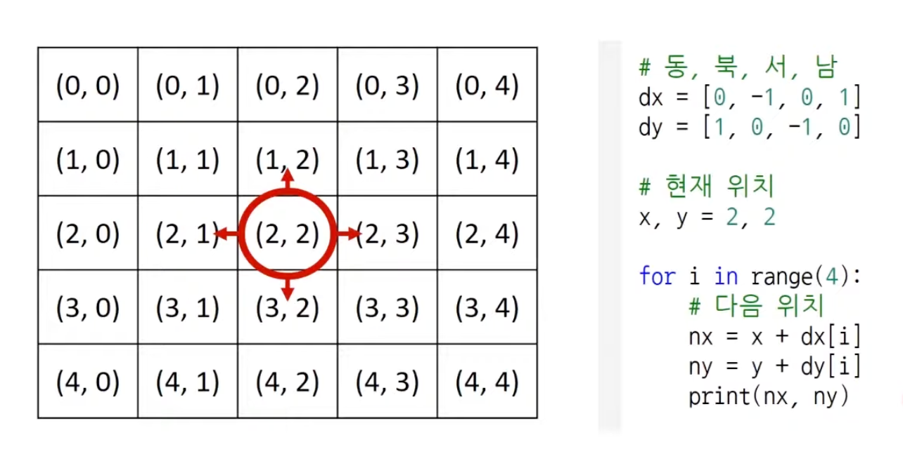
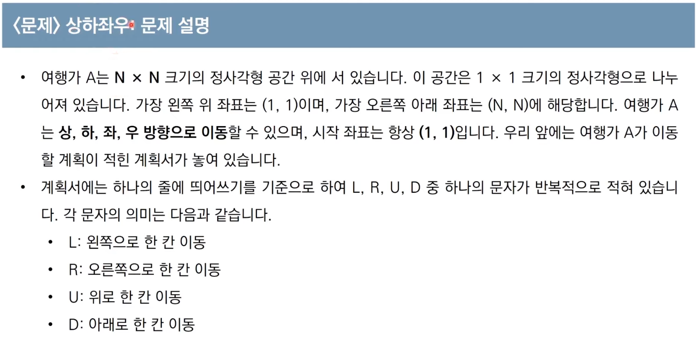
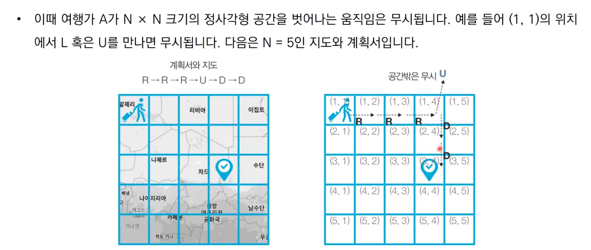
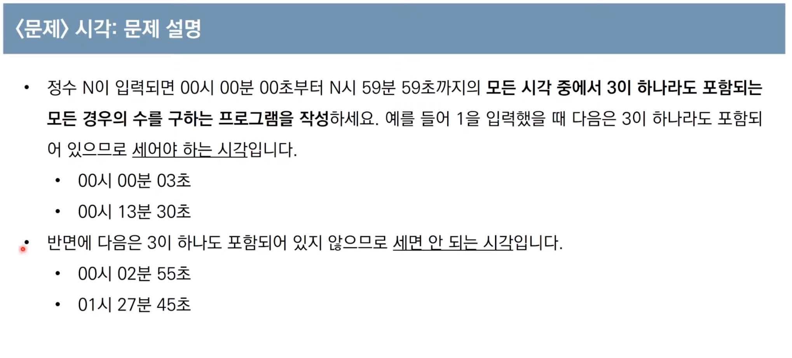
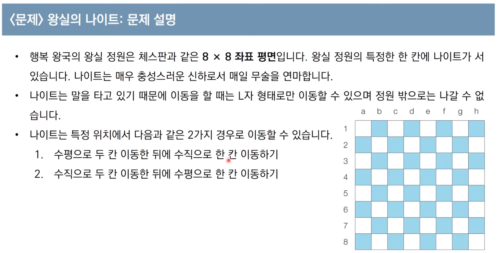
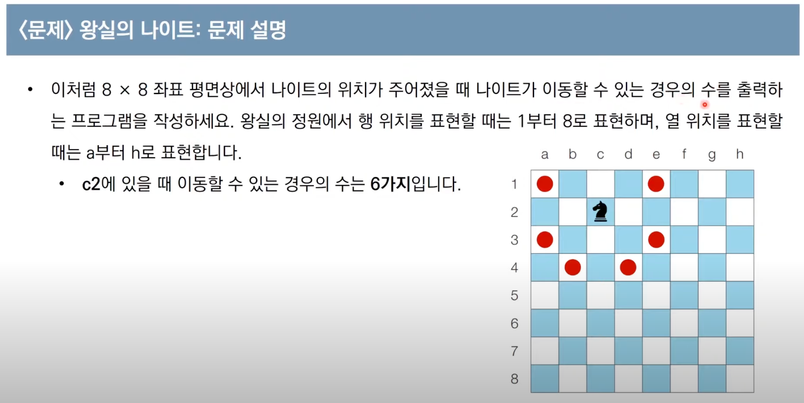
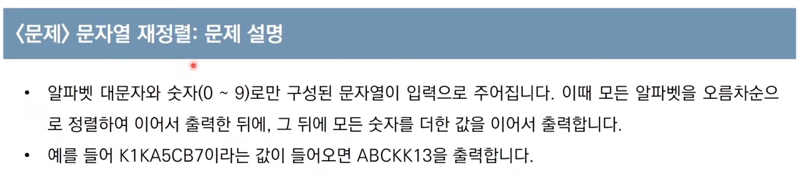

# **구현 : 시뮬레이션과 완전 탐색**

- 구현이란 머릿속에 있는 알고리즘을 소스코드로 바꾸는 과정입니다.

- 흔히 알고리즘 대회에서 구현유형의 문제란 무엇을 의미할까

  - 풀이를 떠올리는 것은 쉽지만 소스코드로 옮기기 어려운 문제

- 구현 유형의 예시

  - 알고리즘은 간단한데 코드가 지나칠 만큼 길어지는 문제
  - 실수 연산을 다루고, 특정 소수점 자리까지 출력해야 하는 문제
  - 문자열을 특정한 기준에 따라서 끊어 처리해야 하는 문제
  - 적절한 라이브러리를 찾아서 사용해야 하는 문제

- 이런 구현 문제는 다양한 풀이 경험이 필요하다.

- 일반적으로 알고리즘 문제에서의 2차원 공간은 행렬의 의미로 사용한다.
- 시뮬레이션 및 완전 탐색 문제에서는 2차원 공간에서의 방향 벡터가 자주 활용된다.



```js
// 동, 북, 서, 남
const dx = [0, -1, 0, 1];
const dy = [1, 0, -1, 0];

// 현재 위치
let [x, y] = [2, 2];

for (let i = 0; i < 4; i++) {
  let nx = x + dx[i];
  let ny = y + dy[i];
  console.log(nx, ny);
}
```

---

### 예제 1. 상하좌우




> \- 시간제한 : 2초\
> \- 입력 조건 :\
> \-> 첫째 줄에 공간의 크기를 나타내는 N이 주어진다. ( 1 <= N <= 100 )\
> \-> 둘째 줄에 여행가 A가 이동할 계획서 내용이 주어진다. ( 1 <= 이동횟수 <= 100 )\
> \- 출력 조건 : 첫째 줄에 여행가 A가 최종적으로 도착할 지점의 좌표 (X,Y)를 공백을 기준으로 구분하여 출력한다.\
> \- 입력 예시 : 5, 'R R R U D D'\
> \- 출력 예시 : 3 4

- 나의 답안

```js
function upDownLeftRight(n, plan) {
  let [x, y] = [1, 1];
  const planArr = plan.split(' ');

  // LRUD
  const dx = [0, 0, -1, 1];
  const dy = [-1, 1, 0, 0];
  const LRUD = { L: 0, R: 1, U: 2, D: 3 };

  // move
  for (let i = 0; i < planArr.length; i++) {
    let idx = LRUD[`${planArr[i]}`];

    x = x + dx[idx];
    y = y + dy[idx];

    x = x < 1 ? 1 : x;
    x = x > n ? n : x;
    y = y < 1 ? 1 : y;
    y = y > n ? n : y;
  }
  return `${x} ${y}`;
}

const n = 5;
const plan = 'R R R U D D';

console.log(upDownLeftRight(n, plan));
```

- 동빈나 답안
  - 일련의 명령에 따라서 개체를 차례대로 이동시킨다는 점에서 시뮬레이션 유형으로도 분류되며 구현이 중요한 대표적인 문제유형.
  - 다만 알고리즘 교재나 문제풀이 사이트에 따라서 다르게 일컬을 수 있으므로 코딩테스트에서의 시뮬레이션 유형, 구현 유형, 완전 탐색 유형은 서로 유사한 점이 많다는 정도로만 기억하면 된다.

```jsx
function solution(n, plan) {
  let [x, y] = [1, 1];

  const plans = plan.split(' ');

  // LRUD
  const dx = [0, 0, -1, 1];
  const dy = [-1, 1, 0, 0];
  const moveTypes = ['L', 'R', 'U', 'D'];

  // move
  for (let i = 0; i < plans.length; i++) {
    let plan = plans[i];

    for (let j = 0; j < moveTypes.length; j++) {
      if (plan === moveTypes[j]) {
        let nx = x + dx[j];
        let ny = y + dy[j];

        if (nx < 1 || ny < 1 || nx > n || ny > n) {
          continue;
        }

        x = nx;
        y = ny;
        break;
      }
    }
  }
  return x + ' ' + y;
}

const n = 5;
const plan = 'R R R U D D';

console.log(solution(n, plan));
```

- 개인적으로 for 문을 두 번 쓰는 것 보다는, moveTypes를 객체로 받아서 한 번에 쓰는게 낫지 않나 싶다.
- 나처럼 x,y에 값을 직접 넣기 보다 동빈나 처럼 nx, ny로 먼저 만든 후에 할당 조건에 따라 할당 하거나 하지 않는 방식으로 코드를 작성하는 것이 가독성에는 더 좋아 보인다.

- 수정 답안

```js
'use strict';

function upDownLeftRight(n, plan) {
  // LRUD
  const LRUD = { L: 0, R: 1, U: 2, D: 3 };
  const dx = [0, 0, -1, 1];
  const dy = [-1, 1, 0, 0];
  let [x, y] = [1, 1];

  const planArr = plan.split(' ');
  for (let i = 0; i < planArr.length; i++) {
    let idx = LRUD[`${planArr[i]}`];

    let nx = x + dx[idx];
    let ny = y + dy[idx];

    if (nx < 1 || nx > n || ny < 1 || ny > n) {
      continue;
    }

    [x, y] = [nx, ny];
  }
  return `${x} ${y}`;
}

let n = 5;
let plan = 'R R R U D D';

console.time('test1');
console.log(upDownLeftRight(n, plan)); // 3.085ms
console.timeEnd('test1');
```

---

### 예제 2. 시각



> \- 시간제한 : 2초\
> \- 입력 조건 : 첫째 줄에 정수 N이 입력된다. ( 0 <= N <= 23 )\
> \- 출력 조건 : 00시 00분 00초부터 N시 59분 59초 까지의 모든 시각 중에서 3이 하나라도 포함되는 모든 경우의 수를 출력한다.\
> \- 입력 예시 : 5\
> \- 출력 예시 : 11475

- 나의 답안

```js
function time(n) {
  let counts = 0;
  const Three = '3';
  for (let h = 0; h <= n; h++) {
    for (let m = 0; m < 60; m++) {
      for (let s = 0; s < 60; s++) {
        let time = `${h}${m}${s}`;
        const isThreeInclude = time.includes(Three);
        if (isThreeInclude) counts++;
      }
    }
  }
  return counts;
}

console.time('test');
console.log(time(5)); // 6.381ms
console.timeEnd('test');
```

- 동빈나 답안
  - 이 문제는 가능한 모든 시각의 경우를 하나씩 모두 세서 풀 수 있는 문제.
  - 하루는 86,400초 이므로 00시 00분 00초 부터 23시 59분 59초 까지의 모든 경우는 86,400(= 24 x 60 x 60)가지로 얼마 안된다. 즉, 컴퓨터는 1초에 2000만 번 정도의 연산을 수행한다고 가정하면 합리적인데(파이썬 기준), 86400번의 연산 수행은 무리가 없다.
  - 따라서 단순히 시각을 1씩 증가 시키면서 3이 하나라도 포함되어 있는지를 확인하면 된다.
  - 이러한 유형은 **완전 탐색(Brute Forcing)**문제 유형이라고도 불린다.
    - <u> 가능한 경우의 수를 모두 검사해보는 탐색 방법을 의미한다.</u>
  - 동빈나는 파이썬 코드로는 나의 답안 방식을, java와 C++은 아래의 방식을 사용했다.

```jsx
function check(h, m, s) {
  if (
    h % 10 === 3 ||
    Math.floor(m / 10) === 3 ||
    m % 10 === 3 ||
    Math.floor(s / 10) === 3 ||
    s % 10 === 3
  )
    return true;
  return false;
}

function solution(n) {
  let counts = 0;
  for (let i = 0; i <= n; i++) {
    for (let j = 0; j < 60; j++) {
      for (let k = 0; k < 60; k++) {
        // increment count if '3' is included in every hour
        if (check(i, j, k)) {
          counts++;
        }
      }
    }
  }
  return counts;
}

console.time('test');
console.log(solution(5));
console.timeEnd('test');
```

---

# 예제 3. 왕실의 나이트




> \- 시간제한 : 1초\
> \- 입력 조건 : 첫째 줄에 8 X 8 좌표 평면상에서 현재 나이트가 위치한 곳의 좌표를 나타내는 두 문자로 구성된 문자열이 입력된다. 입력 문자는 a1, c2처럼 열과 행으로 이뤄진다.\
> \- 출력 조건 : 현재 위치에서 나이트가 이동할 수 있는 경우의 수를 출력하시오\
> \- 입력 예시 : a1, c2\
> \- 출력 예시 : 2, 6

- 나의 답안

```jsx
function royalKnight(coordinate) {
  let [x, y] = coordinate.split('');
  const stringX = { a: 1, b: 2, c: 3, d: 4, e: 5, f: 6, g: 7, h: 8 };
  [x, y] = [stringX[x], +y];

  let moveTypes = [
    'leftUp',
    'leftDown',
    'rightUp',
    'rightDown',
    'upLeft',
    'upRight',
    'downLeft',
    'downRight',
  ];
  const dx = [-2, -2, 2, 2, -1, 1, -1, 1];
  const dy = [-1, 1, -1, 1, -2, -2, 2, 2];

  let counts = 0;
  for (let i = 0; i < moveTypes.length; i++) {
    let nx = x + dx[i];
    let ny = y + dy[i];

    if (nx < 1 || ny < 1 || nx > 8 || ny > 8) {
      continue;
    }
    counts++;
  }
  return counts;
}

let coordinate = 'a1';
console.time('test1');
console.log(royalKnight(coordinate)); // 2
console.timeEnd('test1');

coordinate = 'c2';
console.time('test2');
console.log(royalKnight(coordinate)); // 6
console.timeEnd('test2');
```

- 동빈나 답안
  - 전형적인 완전 탐색, 이차원 배열, 구현 문제이다.
  - moveTypes를 애초에 배열 쌍으로 지정할 수 있다. 훨씬 깔끔하다.

```jsx
function royalKnight(coordinate) {
  let [x, y] = coordinate.split('');
  const stringX = { a: 1, b: 2, c: 3, d: 4, e: 5, f: 6, g: 7, h: 8 };
  [x, y] = [stringX[x], +y];

  const moveTypes = [
    [-2, -1],
    [-2, 1],
    [2, -1],
    [2, 1],
    [-1, -2],
    [1, -2],
    [-1, 2],
    [1, 2],
  ];

  let counts = 0;
  for (let i = 0; i < moveTypes.length; i++) {
    let step = moveTypes[i];
    let nx = x + step[1];
    let ny = y + step[0];

    if (nx < 1 || ny < 1 || nx > 8 || ny > 8) {
      continue;
    }
    counts++;
  }
  return counts;
}

let coordinate = 'a1';
console.time('test1');
console.log(royalKnight(coordinate));
console.timeEnd('test1');

coordinate = 'c2';
console.time('test2');
console.log(royalKnight(coordinate));
console.timeEnd('test2');
```

---

### 예제 4. 문자열 재정렬



> \- 시간제한 : 1초\
> \- 입력 조건 : 첫째 줄에 하나의 문자열 S가 주어진다. ( 1 <= S의 길이 <= 10,000 )\
> \- 출력 조건 : 첫째 줄에 문제에서 요구하는 정답을 출력한다.\
> \- 입력 예시 : K1KA5CB7, AJKDLSI412K4JSJ9D\
> \- 출력 예시 : ABCKK13, ADDIJJJKKLSS20

- 나의 답안

```jsx
function rearrangeString(str) {
  const stringArr = [...str].sort();
  let stringStartIdx = 0;
  for (let i = 0; i < stringArr.length; i++) {
    if (isNaN(stringArr[i])) {
      stringStartIdx = i;
      break;
    }
  }
  const string = stringArr.slice(stringStartIdx).join('');

  let numberSum = 0;
  for (let i = 0; i < stringStartIdx; i++) {
    numberSum += +stringArr[i];
  }

  return string + numberSum;
}

let string = 'K1KA5CB7';
console.time('test1');
console.log(rearrangeString(string)); // ABCKK13
console.timeEnd('test1');

string = 'AJKDLSI412K4JSJ9D';
console.time('test2');
console.log(rearrangeString(string)); // ADDIJJJKKLSS20
console.timeEnd('test2');
```

- 동빈나 풀이
  - 요구사항대로 충실히 구현하면 되는 문제.
  - 문자열이 입력되었을 때 문자를 하나씩 확인한다.
    - 숫자인 경우 따로 합계를 계산하고
    - 알파벳은 별도의 리스트에 저장한다.
  - 결과적으로 리스트에 저장된 알파벳을 정렬해 출력하고, 합계를 뒤에 붙여 출력하면 정답이다.

```jsx
function solution(str) {
  let stringArr = [];
  let number = 0;

  // check each character
  for (let i = 0; i < str.length; i++) {
    let x = str[i];
    // If alphabetic, insert into result list
    if (x.match(/[a-zA-Z]/)) {
      stringArr.push(x);
    } else {
      number += parseInt(x);
    }
  }
  const string = stringArr.sort().join('');

  // If at least one number exists, insert it at the end and Return
  return number !== 0 ? string + number : string;
}

let string = 'K1KA5CB7';
console.time('test1');
console.log(solution(string)); // ABCKK13
console.timeEnd('test1');

string = 'AJKDLSI412K4JSJ9D';
console.time('test2');
console.log(solution(string)); // ADDIJJJKKLSS20
console.timeEnd('test2');
```

- 나는 처음부터 정렬시켜서 문자열이 시작되는 지점을 찾았다. 문자와 숫자가 섞인 배열을 오름차순 정렬하면 숫자가 앞에 나온다. 따라서 isNaN으로 문자열 요소가 시작되는 인덱스를 찾아 그 인덱스 부터 끝까지 slice하여 문자열을 만들고, 숫자를 모두 더하여 결과를 return했다.
- 원하는 결과를 얻을 수는 있지만, 코드만 보았을때는 좋지 못한 코드로 보인다.

  1. isNaN()\
     '숫자가 아니니까 알파벳이다' 라는 것은 생각을 한번 꼰 접근이다. 그런데 만약 입력 조건이 '숫자와 알파벳'이 아니라 '숫자와 알파벳과 특수문자'였다면? 이 문제를 위의 코드로 풀 수 없다. 문제가 후자로 바뀌면 코드가 상당 부분 바뀌어야 한다.\
     추가적으로 마음에 안드는 점은, 문제의 경우 문자열에는 숫자와 알파벳만 존재하지만 엄밀히 말하면 숫자도 문자열이다. 그런데 원하는 결과값을 얻을 수 있었던 이유는 isNaN의 경우 인자를 강제로 숫자로 변환하기 때문이다. 따라서 문자열형태의 숫자가 숫자로 변환되어 isNaN의 결과 false가 나온다. 즉 숫자로 인식된 것이다. 나는 단지, '숫자가 아니냐? === 알파벳이냐?' 정도의 논리로 사용했지만 isNaN()의 속성을 모르고 썼다. 만약 이러한 속성을 모르는 누군가가 본다면 '1'도 문자열인데 왜 이게 돌아가는 코드이지? 라고 한 번 생각해 봐야하는 코드이다.

  2. 연산 과정을 2회의 for 문으로 쪼갠 것\
     위의 문제와 마찬가지로, 입력 조건에 특수문자나 다른 조건이 추가되면 해당 조건이 시작하는 index를 찾고, for문 을 그만큼 추가해야한다.

- 이러한 이유로 나동빈의 풀이가 좋아보인다.
  - 하나의 for 문 안에서 if 분기 처리로 문제를 어떻게 해결하는지 이해하기가 슆다.
  - 처리해야 할 경우가 늘어난다면 let으로 따로 처리할 메모리를 할당하고 if 분기처리만 for문 안에 추가해주면 된다.
  - 그러나, 지금 상태로는 정규식을 잘 모르기 때문에 다른 것은 다 적용하여 풀더라도 isNaN은 썼을 것 같다.
  - string.match() 메소드와 정규표현식 작성 방법을 조금 학습해 둔다면 문자열 search 문제에 접근이 조금 더 쉬워질 것 같다. 정규식 작성법이 복잡하긴 하지만...

---

> 출처 : [(이코테 2021 강의 몰아보기) 2. 그리디 & 구현](https://youtu.be/94RC-DsGMLo)
