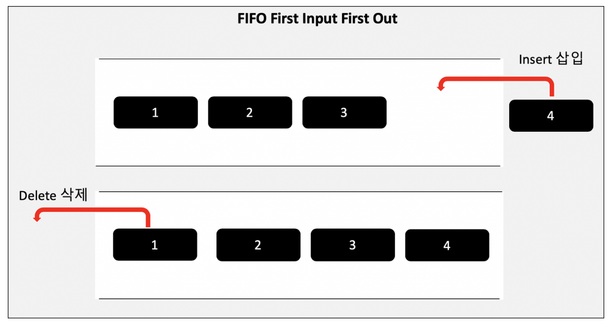
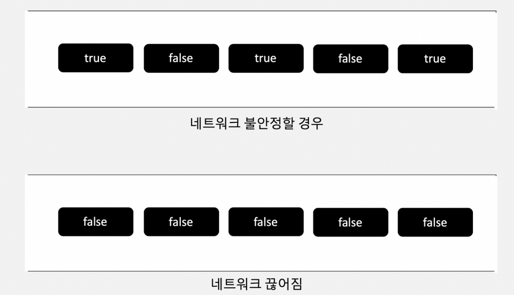
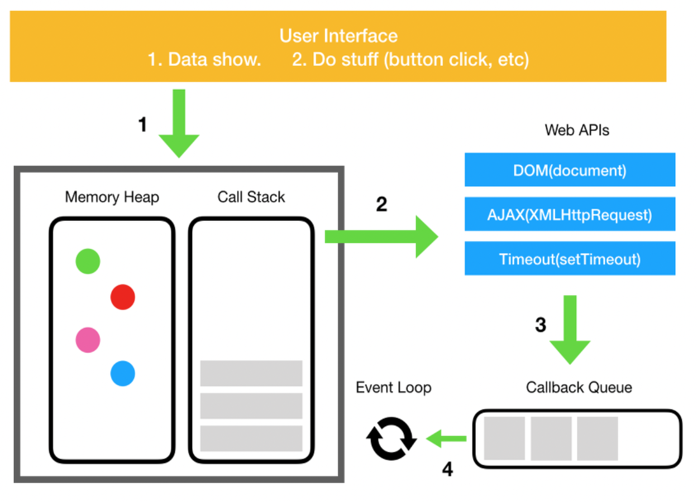

# **Queue**

## 큐란?

스택의 반대 개념이다.

데이터 접근 방법은 선입 선출(FIFO, First In First Out)이다.

<br>



<br>

이러한 구조이기 때문에 마지막에 삽입한 요소를 삭제하기 위해서는 앞의 모든 요소가 삭제되어야 한다.

주로 순서를 보장하기 위한 처리가 필요할 때 사용되는 자료구조이다.

<br>

## 시간복잡도

**삽입과 삭제**는 큐는 선입 선출 구조이기 때문에 **O(1)**의 시간 복잡도를 가진다.

**검색**은 큐 안의 데이터를 찾을 때 까지 진행되기 때문에 **O(n)**의 시간복잡도를 가진다.

<br>

## 큐 예시

### 네트워크 연결 상태 Check

```js
setInterval(() => {
  if (!checkNetwork()) {
    // 네트워크 끊어짐
  };
}, 1000);

function checkNetwork() {
  if (네트워크 연결 되었음) {
  	return true;
  } else {
  	return false;
  }
}
```

<br>

위의 코드는 1초마다 네트워크 상태를 확인하는 코드이다.

그런데 네트워크가 불안정하여 1초마다 “연결”과 “끊어짐”을 반복하는 상황이 발생한 후 다시 안정화가 된 상황을 가정해보면, 이 상황은 불안정한 시기가 있지만 결과적으로는 안정화가 되었다.

하지만 “끊어짐” 상태가 한번이라도 존재하면, 이 코드는 연결이 끊어졌다고 판단한다.

즉, 결과적으로 네트워크 상태는 끊어졌다고 판단한다.

<br>

```js
const interval = setInterval(async () => {
  const result = await checkNetwork();

  queue.push(result); // 삽입
  if (queue.length > 5) {
    if (queue.every((item) => !item)) {
      toast.error('네트워크 연결이 되지 않았습니다!');
    }
    queue.shift(); // 삭제
  }
}, 1000);
```

<br>

위의 코드는 5초 이상 네트워크가 끊어졌을 경우에만 네트워크가 연결되지 않았다고 판단하는 코드이다.

이 때, queue를 활용할 수 있다.

a) 큐의 길이는 5이다.

b) 큐에 1초마다 네트워크 상태를 삽입한다.

c) 큐가 가득차면 맨 앞에 있는 값을 삭제한 후 새로운 값을 삽입한다.

이러한 코드의 흐름을 그림으로 보면 다음과 같다.

<br>



<br>

연결이 안정할 때는 모든 값이 true일 것이고 불안정할 때는 큐의 값이 true와 false가 섞여서 존재할 것이다.

그러다가 큐의 모든 값이 false로 동일할 때만 네트워크가 끊어졌다고 판단이 된다.

즉 5초동안 연속으로 네트워크가 끊어졌을 때만, 끊어졌다고 판단할 수 있다.

<br>

### 이벤트 큐(Event Queue)와 비동기 콜백의 처리 과정

앞의 stack 글에서 설명한 것 처럼 자바스크립트는 단일 스레드에서 코드를 실행한다. 즉, 하나의 호출스택만 있기 때문에 하나의 함수 처리가 오래걸려서 다른 함수 실행에 지장을 줄 수 있다. 이러한 문제를 해결하기 위해 비동기 콜백을 사용한다.

> 참고 : [Stack](https://growth-msleeffice.tistory.com/150)

<br>



<br>

자바스크립트 실행환경은 이벤트 큐를 가지고 있다.

이는 처리할 메시지 목록과 실행할 콜백함수들의 리스트이다.

비동기 처리는 다음과 같은 과정으로 진행된다.

UI 버튼 클릭과 같은 이벤트가 발생하면 DOM 이벤트, HTTP 요청, setTimeout과 같은 비동기 함수는 web API를 호출하고, web API는 콜백 함수를 이벤트 큐(콜백 큐)에 밀어넣는다(push). 이후 이벤트 큐는 대기하다가 콜스택이 텅 비는 시점에 이벤트 루프를 돌려 이벤트 큐에 담긴 메시지와 콜백을 스택에 쌓는다.(push) 이후 각 메시지와 콜백은 다른 메시지가 처리되기 전에 완전히 처리된다.

자세한 설명 : https://new93helloworld.tistory.com/361

<br>

## 구현 방법

큐는 배열의 push와 shift 메소드와 같은 방식으로 Class 큐 자료구조를 만들 수 있다.

만약 배열 자료형으로 큐를 사용하고자 한다면 기존의 push, shift 메소드를 사용하면 된다.

하지만, shift 메소드 사용 시 배열의 0번째 요소를 삭제한 후 인덱싱이 다시 되기 때문에 시간 복잡도가 (n)으로 늘어난다. 따라서 보통 큐 자료구조의 경우, 많은 데이터를 삽입/삭제할 경우 큐 자료 구조형을 직접 구현하는 것이 좋다.

<br>

```js
class Node {
  constructor(item) {
    this.item = item;
    this.next = null;
  }
}

class Queue {
  constructor() {
    this.front = null;
    this.rear = null;
    this.size = 0;
  }

  // 배열의 push
  enQueue(item) {
    const node = new Node(item);

    if (!this.rear) {
      this.front = node;
      this.rear = node;
    } else {
      this.rear.next = node;
      this.rear = node;
    }
    this.size++;
  }

  // 배열의 shift
  deQueue() {
    if (!this.front) {
      return;
    }

    const deQueued = this.front;
    if (this.front === this.rear) {
      this.rear = null;
    }
    this.front = this.front.next;
    this.size--;

    return deQueued.item;
  }

  isExist(item) {
    let clone = this.front;

    while (clone !== null) {
      if (clone.item === item) return true;

      clone = clone.next;
    }

    return false;
  }
}
```

<br>

> 참고
>
> > https://mygumi.tistory.com/357
> >
> > https://new93helloworld.tistory.com/358
> >
> > https://hanamon.kr/자료구조-queue-큐-feat-buffering/
> >
> > https://velog.io/@jangws/15.-%EC%8A%A4%ED%83%9Dstack-%EC%9E%90%EB%A3%8C%EA%B5%AC%EC%A1%B0-JS
