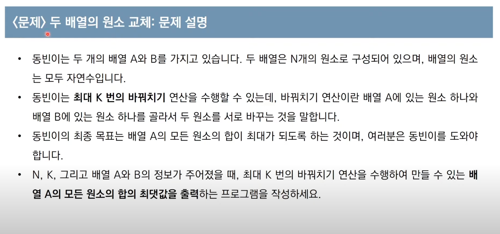

# **Sorting**

✅ 정렬이란 데이터를 특정한 기준에 따라 순서대로 나열하는 것

✅ 일반적으로 문제 상황에 따라서 적절한 정렬 알고리즘이 공식처럼 사용된다.

> 데이터의 개수가 적을 때, 혹은 데이터의 개수가 많지만 특정 범위로 한정되어 있을 때, 이미 데이터가 정렬되어 있을 때 등

<br />

## **선택정렬(Selection sort)**

### 알고리즘

#### ✅ 처리되지 않은 데이터 중에서 가장 작은 데이터를 선택해 맨 앞에 있는 데이터와 바꾸는 것을 반복한다.

> 첫 번째 요소를 가장 작은 값이라고 가정하고 저장한다.
>
> > 더 작은 수를 찾을 때까지 가장 작은 값(가정)을 값을 비교하지 않은 나머지 배열의 요소들과 비교한다.
> >
> > 더 작은 숫자가 발견되면 더 작은 숫자를 새로운 "최소값"으로 저장하고 배열이 끝날 때 까지 이 과정을 반복한다.
> >
> > 배열의 끝까지 왔을 때, "최소값"이 처음에 시작한 값(인덱스)이 아니면 두 값을 바꾼다.
>
> 배열이 모두 정렬될 때 까지 다음 요소에 대해 상기 작업을 반복한다.

<br>

### 선택정렬의 시간 복잡도

> 선택정렬은 N번 만큼 가장 작은 수를 찾아서 맨 앞으로 보내야 한다.
>
> > 구현 방식에 따라서 사소한 오차는 있을 수 있지만, 전체 연산 횟수는 다음과 같다.
> >
> > N + (N - 1) + (N - 2) + ... + 2
>
> 이는 (N^2 + N - 2) / 2 로 표현할 수 있는데, 빅오 표기법에 따라서 **O(N^2)** 이다.

<br>

### 구현

```jsx
const array = [7, 5, 9, 0, 3, 1, 6, 2, 4, 8];

function selectionSort(array) {
  for (let i = 0; i < array.length; i++) {
    let minIndex = i;

    for (let j = i + 1; j < array.length; j++) {
      if (array[minIndex] > array[j]) minIndex = j;
    }

    if (i !== minIndex)
      [array[i], array[minIndex]] = [array[minIndex], array[i]];
  }

  return array;
}

console.time('test');
selectionSort(array); // 0 1 2 3 4 5 6 7 8 9
console.timeEnd('test'); // 0.0102ms
```

<br />

---

## **삽입정렬(InsertionSort)**

### 알고리즘

#### ✅ 처리되지 않은 데이터를 하나씩 골라 적절한 위치에 삽입한다.

> 배열에서 두 번째 요소를 선택하여 루프를 시작한다.
>
> > 두 번째 요소를 이전 요소와 비교하고 더 작은 경우 위치를 바꾼다.
> >
> > 다음 요소로 진행하고 순서가 잘못된 경우 왼쪽에 정렬된 부분에서 루프를 돌려 해당 요소가 있어야 할 위치에 배치한다.
>
> 배열이 정렬될 때 까지 상기 작업을 반복한다.

<br>

### 시간복잡도

선택 정렬에 비해 구현 난이도가 높지만 일반적으로 더 효율적이다.

삽입 정렬의 시간 복잡도는 **O(N^2)** 이며, 선택 정렬과 마찬가지로 반복문이 두 번 중첩되어 사용된다.

삽입 정렬은 현재 리스트의 데이터와 거의 정렬되어 있는 상태라면 매우 빠르게 동작한다.

> 최선의 경우 **O(N)** 의 시간 복잡도를 갖는다.

<br>

### 구현

```jsx
const array = [7, 5, 9, 0, 3, 1, 6, 2, 4, 8];

function insertionSort(arr) {
  for (let i = 1; i < arr.length; i++) {
    for (let j = i; j > 0; j--) {
      if (arr[j] < arr[j - 1]) {
        [arr[j - 1], arr[j]] = [arr[j], arr[j - 1]];
      } else {
        break;
      }
    }
  }
  return arr;
}

console.time('test');
insertionSort(array); // 0 1 2 3 4 5 6 7 8 9
console.timeEnd('test'); // 0.094ms
```

<br />

---

## **퀵 정렬(Quick sort)**

일반적인 상황에서 가장 많이 사용되는 정렬 알고리즘 중 하나이다.

병합 정렬과 더불어 대부분의 프로그래밍 언어의 정렬 라이브러리의 근간이 되는 알고리즘이다.

가장 기본적인 퀵 정렬은 첫 번째 데이터를 기준 데이터(Pivot)로 설정한다.

<br>

### 알고리즘

#### ✅ <u>기준 데이터를 설정</u>하고 그 기준보다 큰 데이터와 작은 데이터의 위치를 바꾸는 방법

> 배열의 첫 번째 원소를 고른다. 이렇게 고른 원소를 **피벗**이라고 한다.
>
> 피벗 앞에는 피벗보다 값이 작은 원소들이 오고, 피벗 뒤에는 피벗보다 값이 큰 모든 원소들이 오도록 피벗을 기준으로 리스트를 둘로 나눈다. 이렇게 리스트를 둘로 나누는 것을 **분할**이라고 한다. 분할을 마친 뒤에 피벗은 더 이상 움직이지 않는다.
>
> > 분할은 다음과 같은 과정으로 이루어진다.
> >
> > 왼쪽에서부터 피벗값보다 큰 데이터를 찾고, 오른쪽에서부터 피벗 값보다 작은 데이터를 찾아서 두 데이터의 위치를 바꾼다.
> >
> > 선택 된 데이터의 위치가 서로 엇갈리게 된다면, 피벗 값과 값이 작은 데이터의 위치를 바꾼다.
> >
> > 이것을 반복하면 피벗 값을 중심으로 왼쪽의 데이터는 피벗 값보다 작은 원소만 위치하게 되고 우측에는 피벗보다 큰 값의 원소만 위치하게 되는데, 이 것을 분할이라고 한다.
>
> 분할된 두 개의 작은 리스트에 대해 재귀적으로 이 과정을 반복한다. 재귀는 배열의 크기가 0이나 1이 될 때 까지 반복된다.
>
> > 배열이 0개나 1개의 요소를 가지면 각자 정렬된 배열이 된다는 점을 이용한다.
> >
> > 재귀 호출이 한 번 진행될 때마다 최소한 하나의 원소(피벗)은 최종적인 위치가 정해지므로, 이 알고리즘은 반드시 끝난다는 것을 보장할 수 있다.

<br>

### 퀵 정렬의 시간 복잡도

퀵 정렬은 평균의 경우 **O(NlogN)** 의 시간복잡도를 가진다.

하지만 최악의 경우 **O(N^2)** 의 시간 복잡도를 가진다.

> 첫 번째 원소를 피벗으로 삼을 때, 이미 정렬된 배열에 대해서 퀵 정렬을 수행하면 O(N^2)의 시간 복잡도를 갖는다.

<br>

### 구현

```jsx
const array = [8, 9, 5, 7, 0, 3, 1, 6, 2, 4];

function pivot(arr, start = 0, end = arr.length - 1) {
  let pivot = arr[start];
  let swapIdx = start;
}

function quickSort(arr, start = 0, end = arr.length - 1) {
  if (start >= end) return;

  let pivot = start;
  let left = start + 1;
  let right = end;

  while (left <= right) {
    // 피벗보다 큰 데이터를 찾을 때 까지 반복
    while (left <= end && arr[left] <= arr[pivot]) left++;

    // 피벗보다 작은 데이터를 찾을 때 까지 반복
    while (right > start && arr[right] >= arr[pivot]) right--;

    // 엇갈렸다면 작은 데이터와 피벗을 교체
    if (left > right) {
      [arr[pivot], arr[right]] = [arr[right], arr[pivot]];
      pivot = right;
    } else {
      // 엇갈리지 않았다면 작은 데이터와 큰 데이터를 교체
      [arr[left], arr[right]] = [arr[right], arr[left]];
    }
  }

  // 분할 이후 pivot의 왼쪽 부분과 오른쪽 부분에서 각각 quickSort 재귀적으로 수행
  quickSort(arr, start, pivot - 1);
  quickSort(arr, pivot + 1, end);
}

console.time('test');
quickSort(array);
console.timeEnd('test'); // 0.087ms
```

<br>

## **계수정렬(CountingSort)**

특정 조건이 부합할 때만 사용할 수 있지만 매우 빠르게 동작하는 정렬 알고리즘

> 계수정렬은 데이터의 크기 범위가 제한되어 0과 양의 정수 형태로 표현할 수 있을 때 사용 가능하다.

데이터의 개수가 N, 데이터 중 최댓값이 K일 때, 최악의 경우에도 수행시간 **O(N+K)**를 보장한다.

하지만 계수정렬은 때에 따라 심각한 비효율성을 초래한다.

> 데이터가 0과 999,999로 단 2개만 존재하는 경우 1부터 999,998까지 메모리가 낭비된다.

계수 정렬은 **동일한 값을 가지는 데이터가 여러 개 등장할 때** 효과적으로 사용할 수 있다.

> 성적의 경우 동점자 학생이 여러 명일 수 있기 때문에 계수 정렬이 효과적이다.

<br>

### 알고리즘

가장 작은 데이터부터 가장 큰 데이터까지의 범위가 모두 담길 수 있도록 배열을 생성한다.

데이터를 하나씩 확인하며 데이터의 값과 동일한 인덱스의 데이터를 1씩 증가시킨다.

결과적으로 최종 리스트에는 각 데이터가 몇 번씩 등장했는지 그 횟수가 기록된다.

결과를 확인할 때는 리스트의 첫 번째 데이터부터 하나씩 그 값만큼 반복하여 인덱스를 출력한다.

<br>

```jsx
const goodCase = [
  10, 0, 20, 30, 50, 10, 50, 100, 100, 80, 90, 90, 40, 6010, 0, 20, 30, 50, 10,
  50, 100, 100, 80, 90, 90, 40, 6010, 0, 20, 30, 50, 10, 50, 100, 100, 80, 90,
  90, 40, 60,
];
const badCase = [0, 999999];

function countingSort(arr) {
  const max = Math.max(...arr);

  const countsArr = new Array(max + 1).fill(0);

  let result = [];

  for (let i = 0; i < arr.length; i++) {
    countsArr[arr[i]] += 1;
  }

  for (let i = 0; i < countsArr.length; i++) {
    const numString = i.toString().repeat(countsArr[i]);
    const nums = [...numString].map((el) => +el);
    result.push(...nums);
  }

  return result;
}

console.time('good case');
countingSort(goodCase);
console.timeEnd('good case'); // 3.544ms

console.time('good case in sort method');
goodCase.sort((a, b) => a - b);
console.timeEnd('good case in sort method'); // 0.019ms

console.time('bad case in counting sort');
countingSort(goodCase);
console.timeEnd('bad case in counting sort'); // 0.841ms

console.time('bad case in sort method');
badCase.sort((a, b) => a - b);
console.timeEnd('bad case in sort method'); // 0.01ms
```

<br>

---

## 예제



> 시간제한 : 2초
>
> 입력 조건
>
> > 첫 번째 줄에 N, K가 공백을 기준으로 구분되어 입력된다. (1 <= N <= 100,000, 0 <= K <= N)
> >
> > 두 번째 줄에 배열 A의 원소들이 공백을 기준으로 구분되어 입력된다. 모든 원소는 10,000,000보다 작은 자연수이다.
> >
> > 세 번째 줄에 배열 B의 원소들이 공백을 기준으로 구분되어 입력된다. 모든 원소는 10,000,000보다 작은 자연수이다.
>
> 출력 조건 : 최대 K 번의 바꿔치기 연산을 수행하여 만들 수 있는 배열 A의 모든 원소의 합의 최댓값을 출력한다.
>
> 입력 예시 :
>
> > 5 3
> >
> > 1 2 3 4 5
> >
> > 5 5 6 6 5
>
> 출력 예시 : 26

<br>

### 풀이

핵심아이디어 : 매번 배열 A에서 가장 작은 원소를 골라서 배열 B에서 가장 큰 원소와 교체한다.

가장 먼저 배열 A와 B가 주어지면 A에 대하여 오름차순 정렬, B에 대해 내림차순 정렬한다.

이후 두 배열의 원소를 첫 번째 인덱스부터 차례로 확인하면서 A의 원소가 B의 원소보다 작을 때에만 교체를 수행한다.

이 문제에서는 두 배열의 원소가 최대 100,000개까지 입력될 수 있으므로, 최악의 경우 O(N log N)을 보장하는 정렬 알고리즘을 사용해야 한다.

<br>

```jsx
function maxSum(a, b, k) {
  const ascendA = a.sort((a, b) => a - b);
  const descendB = b.sort((a, b) => b - a);

  for (let i = 0; i < k; i++) {
    if (ascendA[i] < descendB[i]) ascendA[i] = descendB[i];
  }

  return ascendA.reduce((pre, cur) => (cur += pre));
}

const a = [1, 2, 5, 4, 3];
const b = [5, 5, 6, 6, 5];
const k = 3;

console.time('test');
const result = maxSum(a, b, k);
console.timeEnd('test'); // 0.056ms
```

<br>

---

## **정렬 알고리즘 비교**

| 정렬 알고리즘 | 평균 시간 복잡도 | 공간 복잡도 | 특징                                                                           |
| :-----------: | :--------------: | :---------: | :----------------------------------------------------------------------------- |
|   선택 정렬   |      O(N^2)      |    O(N)     | 아이디어가 매우 간단하다.                                                      |
|   삽입 정렬   |      O(N^2)      |    O(N)     | 데이터가 거의 정렬되어 있을 때 가장 빠르다.                                    |
|    퀵 정렬    |    O(N log N)    |    O(N)     | 대부분의 경우에 가장 적합하고 충분히 빠르다.                                   |
|   계수 정렬   |      O(N+K)      |   O(N+K)    | 데이터의 크기가 한정되어 있는 경우에만 사용이 가능하지만 매우 빠르게 동작한다. |

### 자바스크립트의 sort 메소드는 병합정렬과 삽입정렬이 혼합된 형태로 안정적(stable)한 정렬로 최적화 되어 있고, 최악의 경우에도 **O(n log n)**의 시간 복잡도를 보장한다. 따라서, 문제에서 정렬 구현을 유도한 것이 아니라면 sort 메소드를 사용하는 것이 효과적이다.

<br>

> 출처 : [(이코테 2021 강의 몰아보기) 4. 정렬 알고리즘](https://youtu.be/KGyK-pNvWos)
