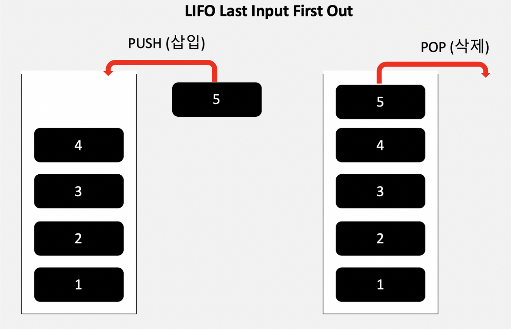
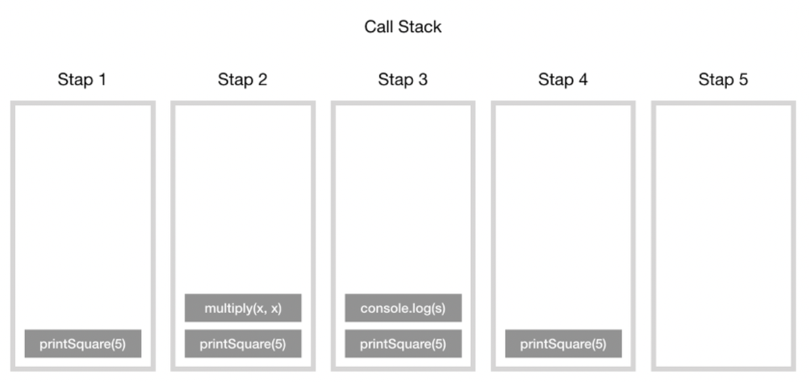
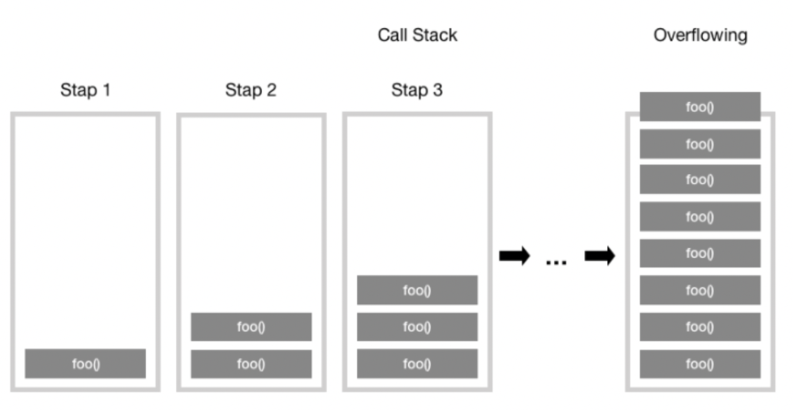
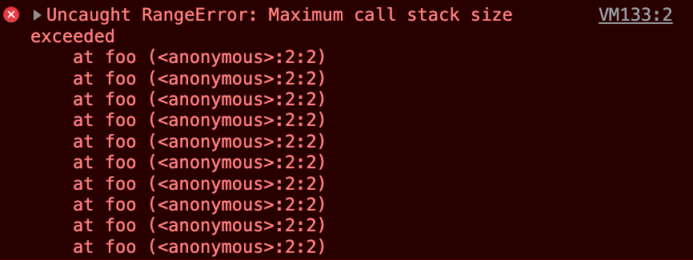

# **Stack**

## 스택이란?

데이터를 순서대로 쌓는 자료구조

입력과 출력이 하나의 방향으로 이루어져 접근이 제한적

입력과 출력은 **후입 선출**(LIFO, Last Input First Out) 방식이다.

<br>



<br>

아래가 막혀있고 위가 뚫려있는 구조로, 데이터가 차곡차곡 쌓이는 구조

이러한 구조 때문에, 마지막에 삽입된 요소만을 삭제할 수 있다.

Stack에서 삽입은 push, 삭제는 pop이라는 용어를 사용한다.

<br>

## 시간복잡도

**삽입과 삭제**는 스택은 후입 선출 구조이기 때문에 **O(1)**의 시간 복잡도를 가진다.

**검색**은 스택 안의 데이터를 찾을 때 까지 진행되기 때문에 **O(n)**의 시간복잡도를 가진다.

<br>

## 스택 예시

### Javascript call stack(호출 스택)

자바스크립트는 단일 스레드 프로그래밍 언어이므로 단일 호출 스택을 사용한다.

> 호출 스택이란, 여러 함수들을 호출하는 스크립트에서 해당 위치를 추적하는 인터프리터(웹 브라우저의 자바스크립트 인터프리터 같은)를 위한 메커니즘이다. 현재 어떤 함수가 동작하고 있는지, 그 함수 내에서 어떤 함수가 동작하는지, 다음에 어떤 함수가 호출되어야 하는지 등을 제어한다. (출처 : MDN)
>
> > 스크립트가 함수를 호출하면 인터프리터는 이를 호출 스택에 추가한 다음 함수를 수행한다.
> >
> > 해당 함수에 의해 호출되는 모든 함수는 호출 스택에 추가되고 호출이 도달하는 위치에서 실행된다.
> >
> > 메인 함수가 끝나면 인터프리터는 스택을 제거하고 메인 코드목록에서 중단된 실행을 다시 시작한다.
> >
> > 스텍이 할당된 공간보다 많은 공간을 차지하면 “stack overflow”에러가 발생한다.

<br>

호출 스텍이 동작하는 방식은 위의 설명과 같다. 간단하게 요약하면 “함수 실행 → 함수의 기록을 스택 맨 위에 추가(push) → 함수 결과값을 반환 → 스택에 쌓여있던 함수 제거(pop)”의 과정으로 동작한다. 아래는 그 예시 코드이다.

<br>

```js
function multiply(x, y) {
return x \* y;
}
function printSquare(x) {
var s = multiply(x, x);
console.log(s);
}
printSquare(5);
```

<br>

자바스크립트 엔진이 이 코드를 실행하기 전에는 호출 스택이 비어있다. 가장 아래줄에 printSquare 함수가 실행되면 이후 단계는 다음과 같다. (호출 스텍의 각 항목을 스텍 프레임이라고 한다)

<br>



<br>

### 스텍 오버 플로우

이름 그대로 스텍의 사이즈를 초과했을 때 발생하는 오류이다. 스텍 오버 플로우 에러는 재귀 함수를 호출할 때 많이 경험한다.

<br>

```js
function foo() {
  foo();
}

foo();
```

<br>

마지막 줄에서 foo() 함수가 실행되는데, foo() 함수의 내부를 살펴보면 종료조건없이 자신을 계속해서 호출하게 된다. 따라서 함수의 스텍 프레임이 계속해서 호출 스텍에 쌓이게 된다.

<br>



<br>

그러다가 어떠한 시점에서 호출 스텍의 함수 호출 수가 호출 스텍의 실제 크기를 초과하게 되고 브라우저는 다음과 같은 오류를 발생시키고 함수를 종료시킨다.

<br>



<br>

## 구현 방법

스택은 배열에서 unshift 메서드와 shift 메서드와 같은 방식으로 Class 스택 자료구조를 만들 수 있다.

만약 배열 자료형으로 스택을 사용하고자 한다면 기존의 push, pop 메소드를 사용하면 된다.(그래야 새로운 배열요소가 삭제되거나 추가될 때 인덱싱 로직이 작동 안한다.)

<br>

```js
class Node {
  constructor(item) {
    this.item = item;
    this.next = null;
  }
}

class Stack {
  constructor() {
    this.front = null;
    this.rear = null;
    this.size = 0;
  }

  // 배열의 unshift
  push(item) {
    const node = new Node(item);

    if (!this.front) {
      this.front = node;
      this.rear = node;
    } else {
      const next = this.front;
      this.front = node;
      this.front.next = next;
    }

    this.size++;
  }

  // 배열의 shift
  pop() {
    if (!this.front) return null;

    const popped = this.front;

    if (this.front === this.rear) {
      this.rear = null;
    }

    this.front = this.front.next;
    this.size--;

    return popped.item;
  }

  isExist(item) {
    let clone = this.front;

    while (clone !== null) {
      if (clone.item === item) return true;

      clone = clone.next;
    }

    return false;
  }
}
```

<br>

> 참고
>
> > https://mygumi.tistory.com/357
> >
> > https://new93helloworld.tistory.com/358
> >
> > https://hanamon.kr/자료구조-stack-스택/
> >
> > https://velog.io/@jangws/15.-%EC%8A%A4%ED%83%9Dstack-%EC%9E%90%EB%A3%8C%EA%B5%AC%EC%A1%B0-JS
