# **SQL Query - SELECT**

## **IT 회사 관련 RDB 만들기**

부서, 사원, 프로젝트 관련 정보들을 저장할 수 있는 RDB 만들기

RDBMS는 MySQL(Inno DB)을 사용

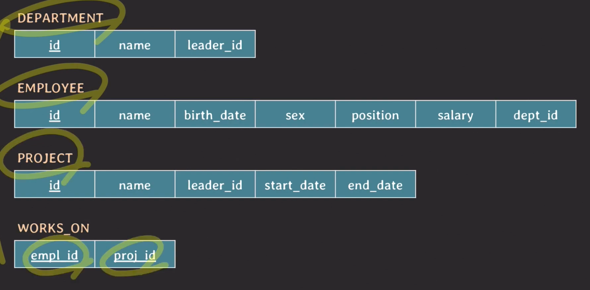

<br>

## **SELECT Query Statement**

<br>

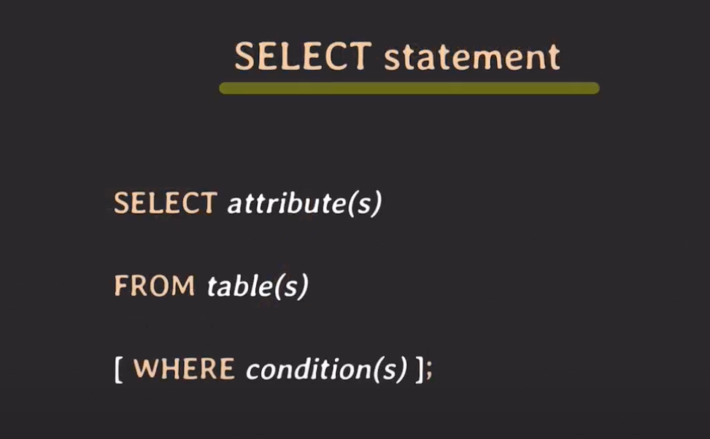

<br>

### ID가 9인 임직원의 이름을 알고 싶다.

```sql
SELECT name, position FROM employee where id = 9;
```

<br>

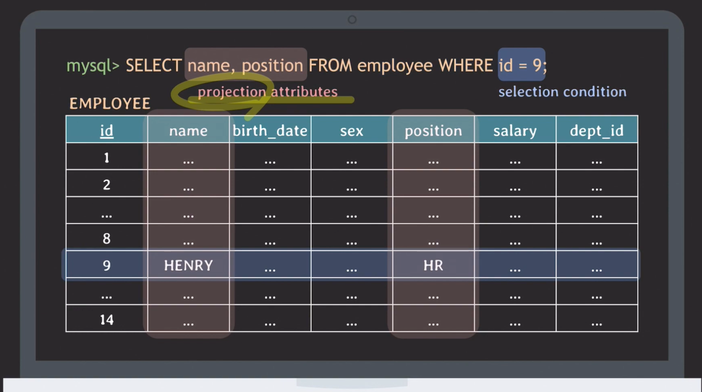

<br>

SELECT를 수행하면 selection condition을 통해 선택된 튜플의 값들 중에서 projection attributes에 의해 지정된 attribute에 대응하는 값만 가져오게 된다. 따라서 최종적으로 위의 쿼리를 수행하게 되면 다음과 같은 결과를 얻을 수 있다.

<br>

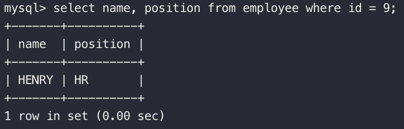

<br>

### project 2002를 리딩(leading)하고 있는 임직원의 ID와 이름과 직군을 알고 싶다.

```sql
-- 암묵적 조인
select employee.name, employee.id, employee.position
from employee, project
where project.id = 2002 and project.leader_id = employee.id;

-- 명시적 조인
select employee.name, employee.id, employee.position
from employee
inner join project on employee.id = project.leader_id
where project.id = 2002;
```

<br>

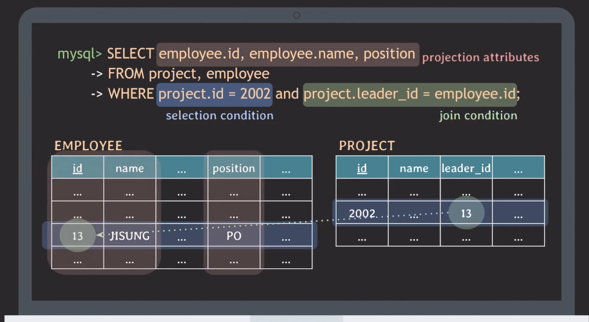

<br>

위의 예에서 join condition은 두 개의 테이블을 연결시키는 조건이다. 앞에서 selection condition에 의해 project 테이블에서 튜플이 선택된다. 그다음 selection condition이 join condition과 함께 and로 묶였기 때문에 두 조건을 모두 만족해야 한다. 따라서 두 조건을 모두 만족한다면 leader_id가 employee table의 id에 연결이 되어서 select condition이 employee 테이블의 튜플까지도 선택이 되게 하는 것이다.

attribute의 앞에 테이블 이름을 적어주었는데 그 이유는, employee 테이블과 project 테이블에 같은 attribute(id, name)가 있기 때문이다. 따라서 테이블 이름을 적어주지 않으면 id와 name이 어느 테이블의 attribute인지 식별할 수 없기 때문에 반드시 테이블 이름을 적어주어야 한다. 만약 아래 이미지처럼 테이블 이름을 적어주지 않으면 오류가 난다.

<br>

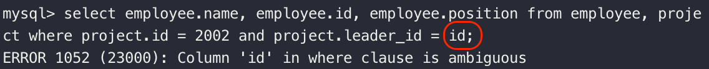

<br>

다만 겹치지 않는 attribute에도 테이블 이름을 적어도 되고 안 적어주어도 되지만 개인적으로 가독성과 일관성을 위해 적어주는 것이 나을 것 같다.

<br>

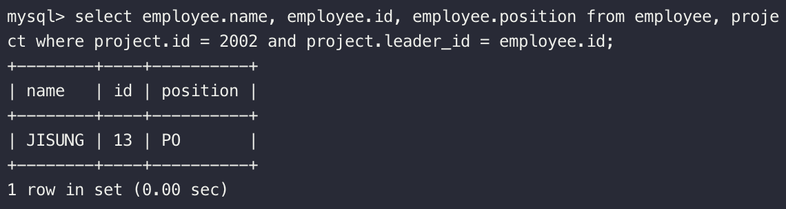

<br>

## **AS 키워드 사용하기**

AS 키워드는 테이블이나 attribute에 별칭(alias)을 붙일 때 사용하는데 생략이 가능하다

<br>

```sql
select e.name leader_id, e.id leader_name, e.position leader_position
from employee e, project p
where p.id = 2002 and p.leader_id = e.id;
```

<br>

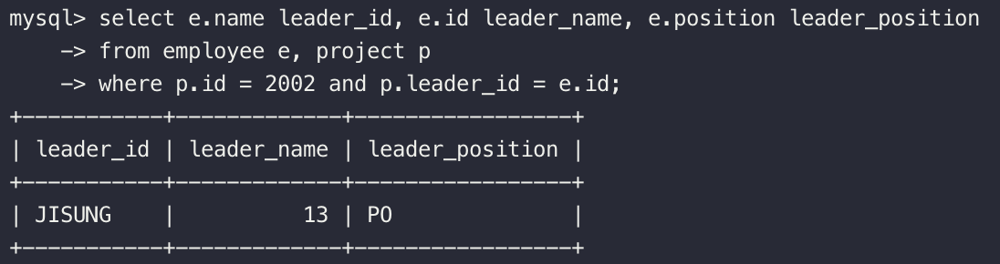

<br>

## **DISTINCT 키워드 사용하기**

distinct는 select 결과에서 중복되는 tuples은 제외하고 싶을 때 사용한다.

<br>

### 디자이너들이 참여하고 있는 프로젝트들의 ID와 이름을 알고 싶다.

```sql
select p.id, p.name
from employee e, works_on w, project p
where e.position = 'DSGN' and e.id = w.empl_id and w.proj_id = p.id;
```

<br>

### 중복 발생

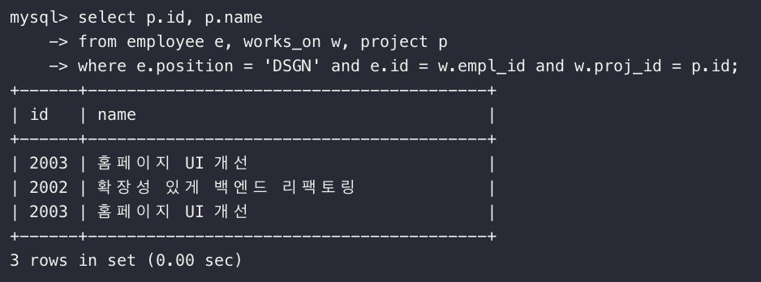

<br>

### DISTINCT로 중복 제거

```sql
select distinct p.id, p.name
from employee e, works_on w, project p
where e.position = 'DSGN' and e.id = w.empl_id and w.proj_id = p.id;
```

<br>

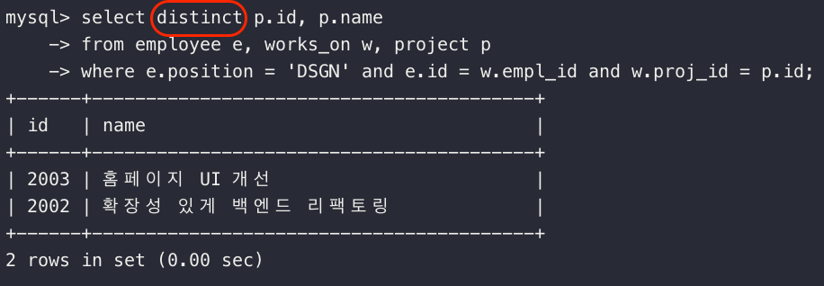

<br>

## **Like 사용하기**

### 이름이 N으로 시작하거나 N으로 끝나는 임직원들의 이름을 알고 싶다.

```sql
select name
from employee
where name like 'N%' or name like '%N';
```

<br>

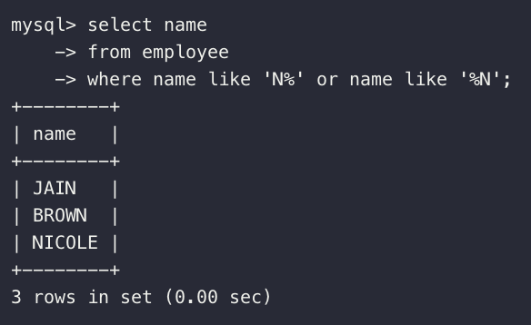

<br>

### 이름에 NG가 들어가는 임직원들의 이름을 알고 싶다.

```sql
select name
from employee
where name like '%NG%';
```

<br>

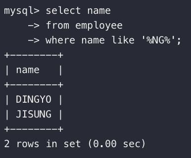

<br>

### 이름이 J로 시작하고 총 네 글자의 이름을 가지는 임직원들의 이름을 알고 싶다.

<br>

```sql
select name
from employee
where name like 'J___'

-- under score (_)를 사용하면 된다!
```

<br>

### 만약 %로 시작하거나 \_로 끝나는 프로젝트 이름을 찾고 싶다면?

escape 문자(\\)를 활용한다.

<br>

```sql
select name
from project
where name like '\%%' or name like '%\_'
```

<br>

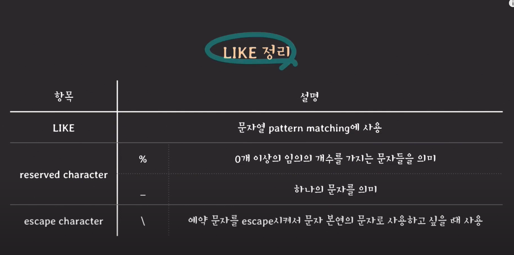

<br>

## **\*(asterisk) 사용하기**

\*(asterisk)는 선택된 tuples의 모든 attributes를 보여주고 싶을 때 사용한다.

<br>

### ID가 9인 임직원의 모든 attributes를 알고 싶다.

```sql
select * from employee where id = 9;
```

<br>

---

## 주의사항

### select로 조회할 때 조건들을 포함해서 조회를 한다면 이 조건들과 관련된 attributes에 index가 걸려있어야 한다. 그렇지 않다면 데이터가 많아질수록 조회 속도가 느려진다.
