# **SQL**

## **SQL 뜻**

Structured Query Language

현업에서 쓰이는 relational DBMS의 표준 언어

종합적인 database 언어 : DDL + DML + VDL

<br>

## **SQL 주요 용어**

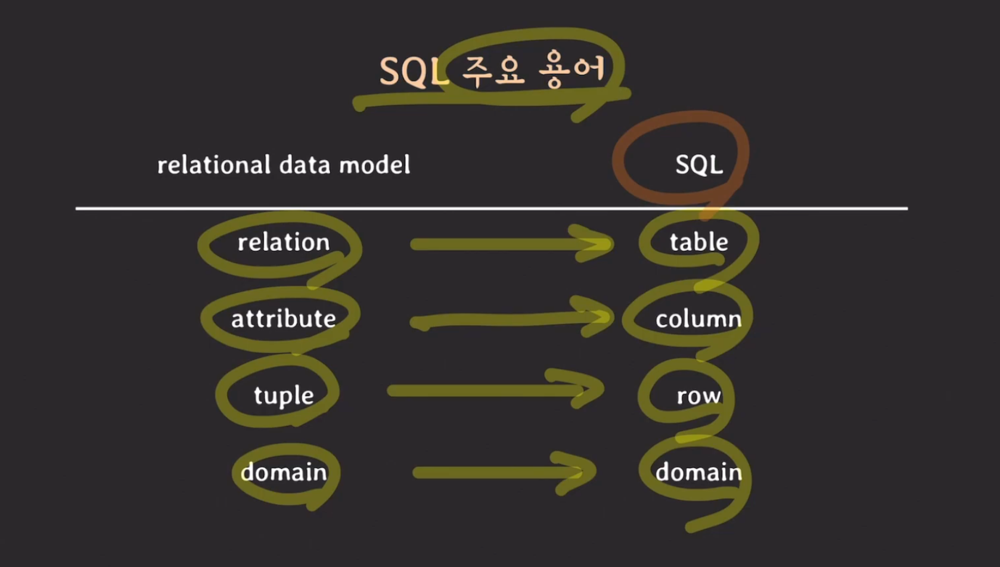

<br>

## **SQL에서 relation이란?**

multiset(=bag) of tuples @ SQL

SQL에서는 중복된 tuple을 허용한다.

<br>

## **SQL & RDBMS**

SQL은 RDBMS의 표준 언어이지만 실제 구현에 강제가 없기 때문에 RDBMS마다 제공하는 SQL의 스펙이 다양하다.

<br>

---

# **예제를 통해 SQL로 DB 정의하기**

## **IT 회사 관련 RDB 만들기**

부서, 사원, 프로젝트 관련 정보들을 저장할 수 있는 관계형 데이터베이스를 만들자.

**사용할 RDBMS는 MySQL(InnoDB)**

<br>

### **Database 정의하기**

```sql
-- RDBMS 내 데이터베이스 목록 조회
SHOW DATABASES

-- DB schema 생성
CREATE DATABASES [db 이름]

-- 현재 사용중인 db 조회
SELECT database() 어떤 데이터 베이스를 사용하고 있는지 확인하는 sql

-- 사용 할 db 선택
USE [db 이름]

-- db 삭제
DROP DATABASE [db 이름]
```

<br>

### **DATABASE vs SCHEMA**

MySQL에서는 DATABASE와 SCHEMA가 같은 뜻을 의미한다.

CREATE DATABASE company = CREATE SCHEMA company

<br>

> 하지만, 다른 RDBMS에서는 의미가 다르게 쓰인다.
>
> i.g.) PostgreSQL에서는 SCHEMA가 DATABASE의 namespace를 의미
>
> 따라서 PostgreSQL에서는 하나의 DATABASE가 여러개의 SCHEMA를 가질 수 있다.

<br>

### **DB Schema 정의**

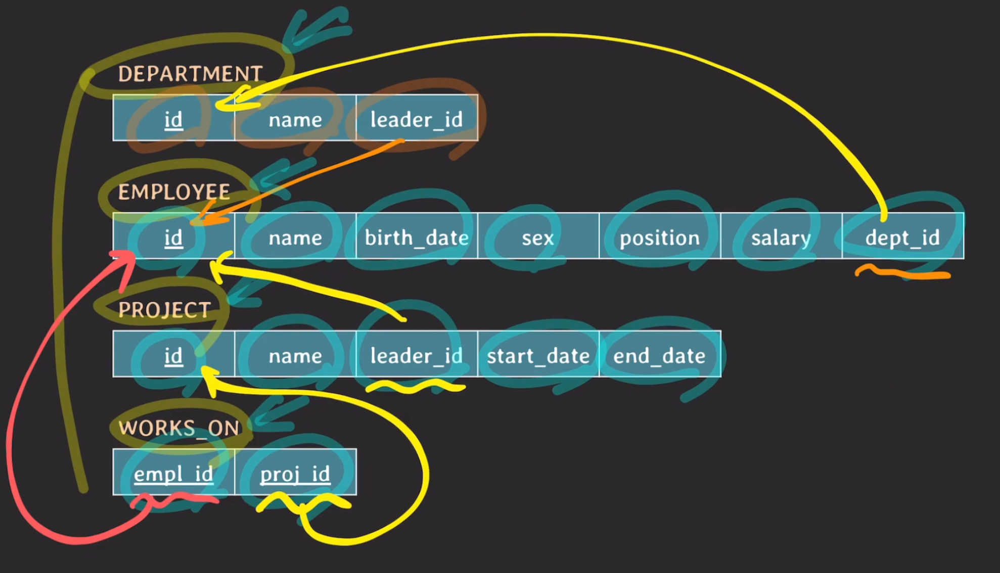

<br>

### **DEPARTMENT Table 정의하기**

```sql
create table DEPARTMENT (
  id INT PRIMARY KEY,
  name VARCHAR(20) NOT NULL UNIQUE,
  leader_id INT
);
```

<br>

### **EMPLOYEE Table 정의하기**

```sql
create table EMPLOYEE(
  id INT PRIMARY KEY,
  name VARCHAR(30) NOT NULL,
  birth_date DATE,
  sex CHAR(1) CHECK (sex in ('M', 'F')),
  position VARCHAR(10),
  salary INT DEFAULT 50000000,
  dept_id INT,
  FOREIGN KEY (dept_id) references DEPARTMENT(id) on delete SET NULL on update CASCADE,
  CHECK (salary >= 50000000)
);
```

<br>

### **PROJECT Table 정의하기**

```sql
create table PROJECT(
  id INT PRIMARY KEY,
  name VARCHAR(20) NOT NULL UNIQUE,
  leader_id INT,
  start_date DATE,
  end_date DATE,
  FOREIGN KEY (leader_id) references EMPLOYEE(id) on delete SET NULL on update CASCADE,
  CHECK (start_date < end_date)
);
```

<br>

### **WORKS_ON Table 정의하기**

```sql
create table WORKS_ON(
  empl_id INT,
  proj_id INT,
  PRIMARY KEY (empl_id, proj_id),
  FOREIGN KEY (empl_id) references EMPLOYEE(id) on delete CASCADE on update CASCADE,
  FOREIGN KEY (proj_id) references PROJECT(id) on delete CASCADE on update CASCADE
);
```

<br>

### **DEPARTMENT Table 스키마 변경하기**

```sql
ALTER TABLE department ADD FOREIGN KEY (leader_id)
REFERENCES employee(id)
on update CASCADE
on delete SET NULL;
```

<br>

---

## **MySQL STATEMENT**

### **기본 문법**

#### **ALTER Table**

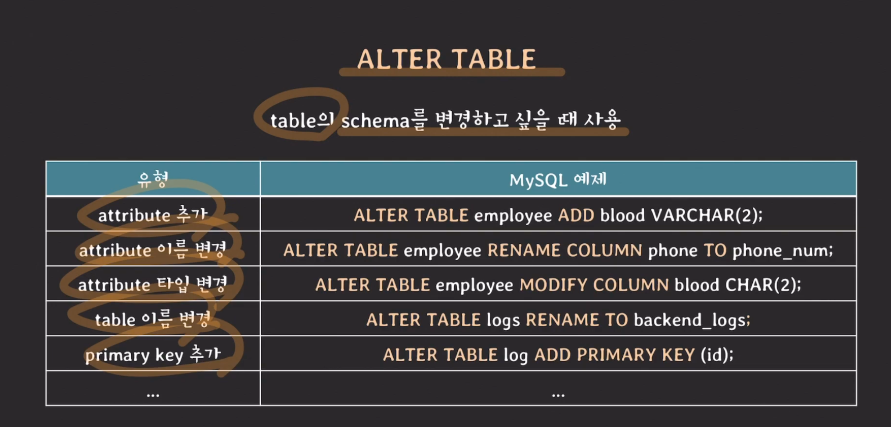

이미 서비스 중인 table의 schema를 변경하는 것이라면 변경 작업 때문에 서비스의 백엔드에 영향이 없을지 검토한 후에 변경하는 것이 중요하다.

#### **DROP Table**

```sql
DROP TABLE table_name
```

<br>

### **Data type**

#### **Number**

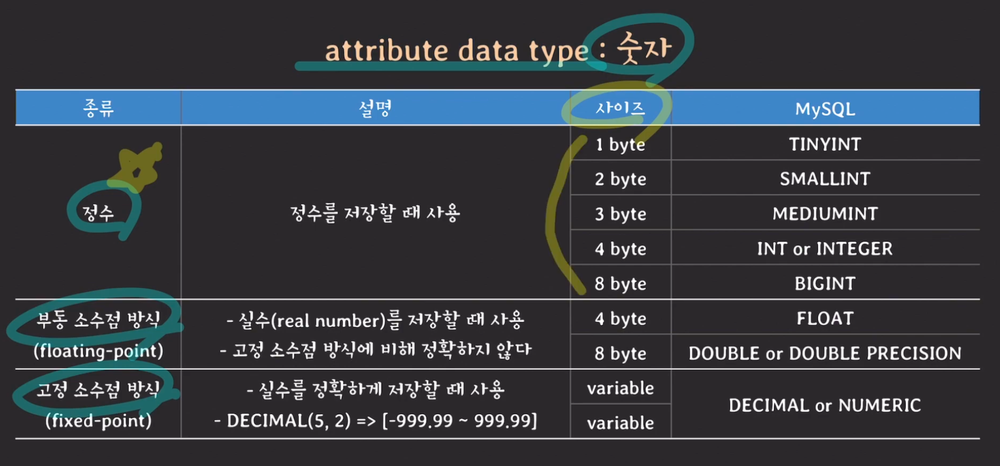

<br>

#### **String**

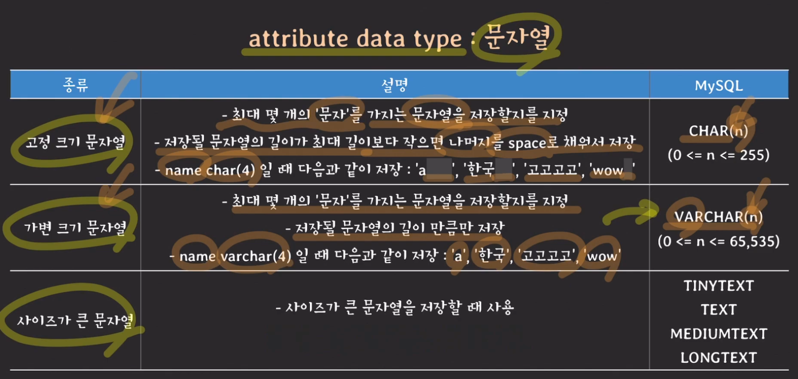

varchar vs char

PostgreSQL은 varchar를 권장, 그러나 mysql은 varchar가 스토리지 상의 이점은 있으나, 시간적인 성능이 char보다 안 좋다는 이야기가 있어서, 보통 MySQL에서는 phone number같이 길이가 정해져 있는 경우 char를 사용하고 길이가 가변적이라면 varchar를 구별해서 사용한다.

varchar보다 더 많은 길이의 문자를 저장할 수 있는 것은 mediumtext, longtext

tinytext 나 text는 varchar보다 짧은 길이의 문자를 저장할 수 있다.

<br>

#### **Time**

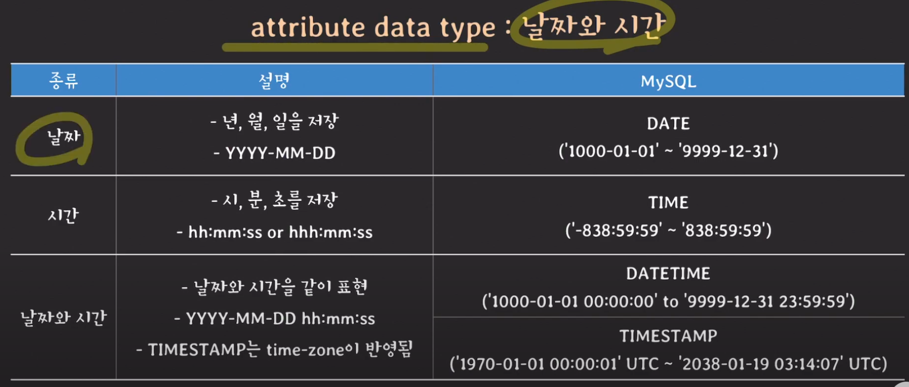

시간에서 hhh는 어떤 일이 끝날 때 까지의 경과 시간을 나타낼 때 쓴다.

<br>

#### **ETC**

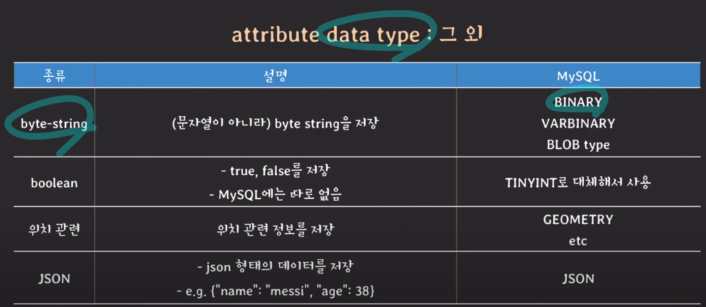

byte-string은 암호화 키를 저장할 때 사용할 수 있다

mysql은 boolean은 tinyint로 저장(0 or 1)

<br>

### **Constraints**

#### **PRIMARY KEY 선언하기**

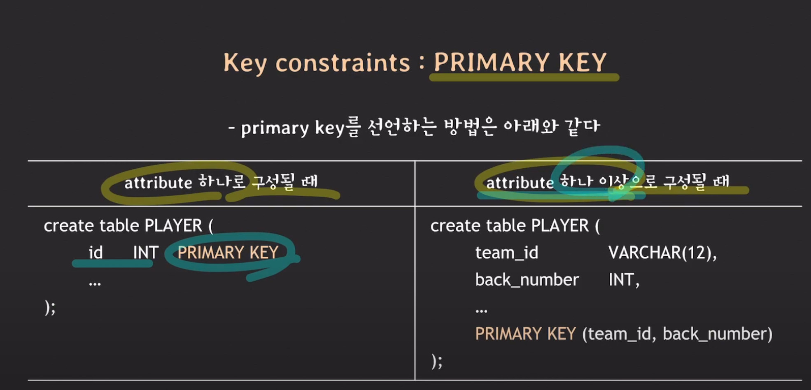

<br>

#### **UNIQUE KEY 선언하기**

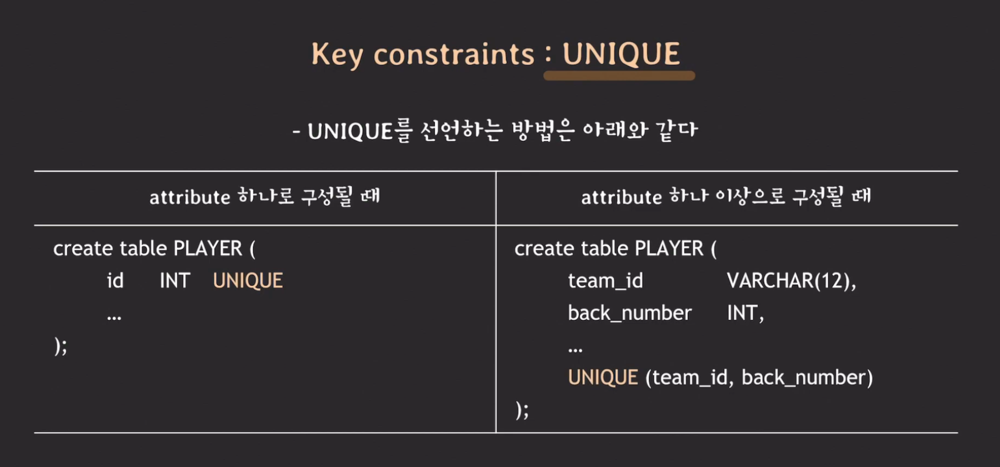

UNIQUE로 지정된 attributes는 중복된 값을 가질 수 없다.

단, MySQL의 경우 NULL은 중복을 허용할 수 있다.

<br>

#### **attribute DEFAULT**

attribute의 default 값을 정의할 때 사용

새로운 tuple을 저장할 때 해당 attribute에 대한 값이 없다면 default 값으로 저장

<br>

#### **CHECK constraints**

attribute의 값을 제한하고 싶을 때 사용

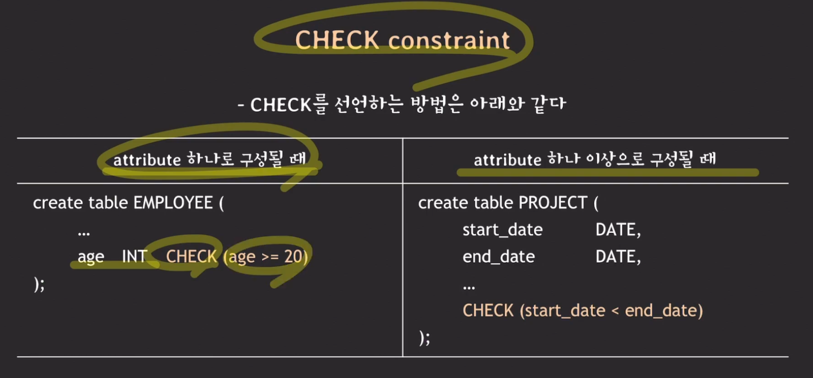

<br>

#### **Foreign KEY constraints : Referential integrity constraint**

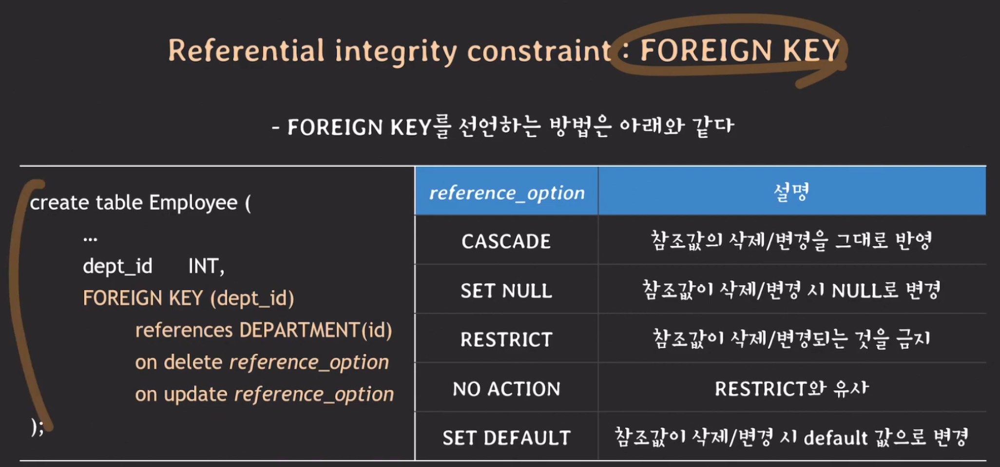

mysql의 경우, no action과 set default를 잘 지원하지 않는다.

<br>

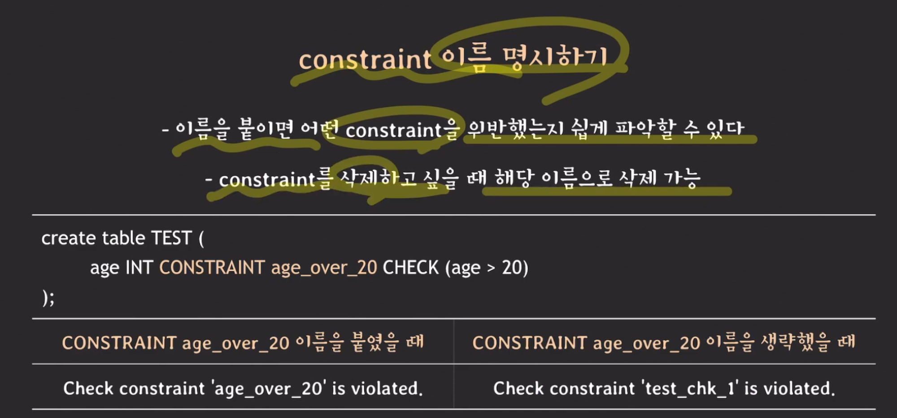

constraints의 이름을 붙이는 것이 디버깅 할 때 도움이 된다.

```sql
FOREIGN KEY (dept_id) references DEPARTMENT(id) on delete SET NULL on update CASCADE

-- 이 부분을 constraints 이름을 붙여주면

CONSTRAINT `employee_department_fk` FOREIGN KEY (`dept_id`)
REFERENCES `DEPARTMENT` (`id`)
ON DELETE SET NULL
ON UPDATE CASCADE,
```
