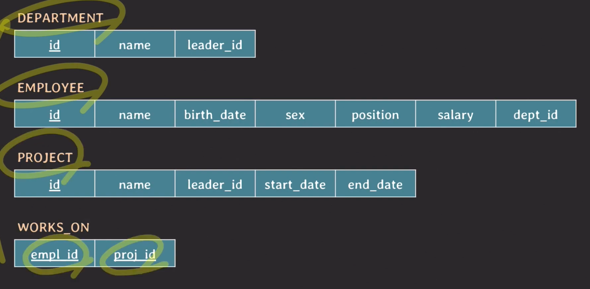
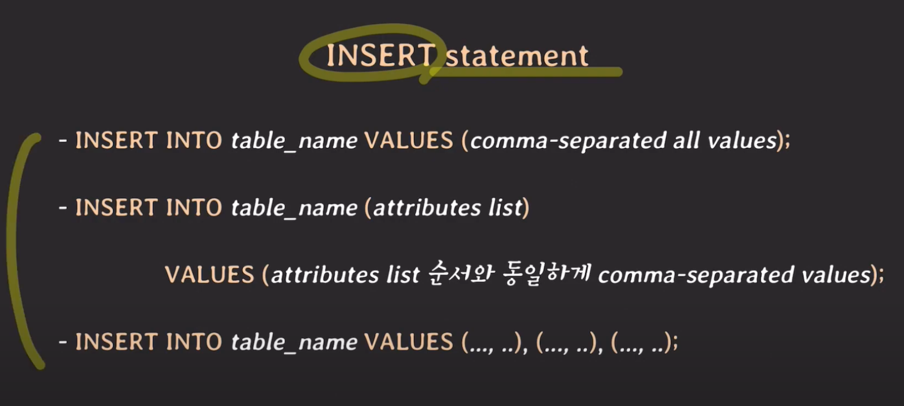
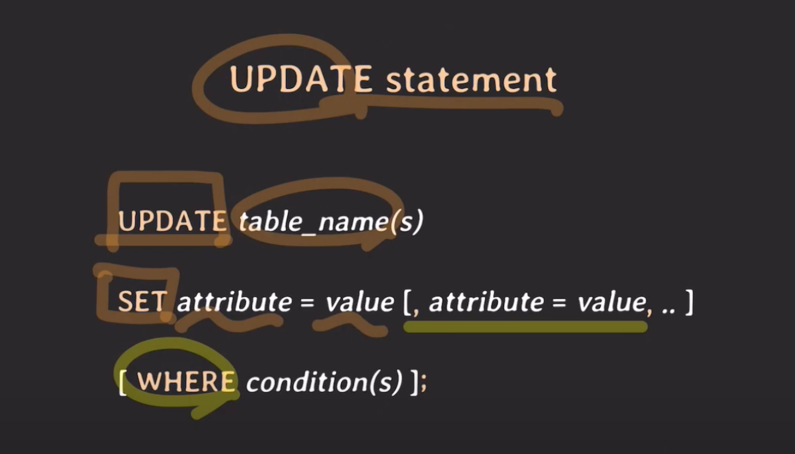
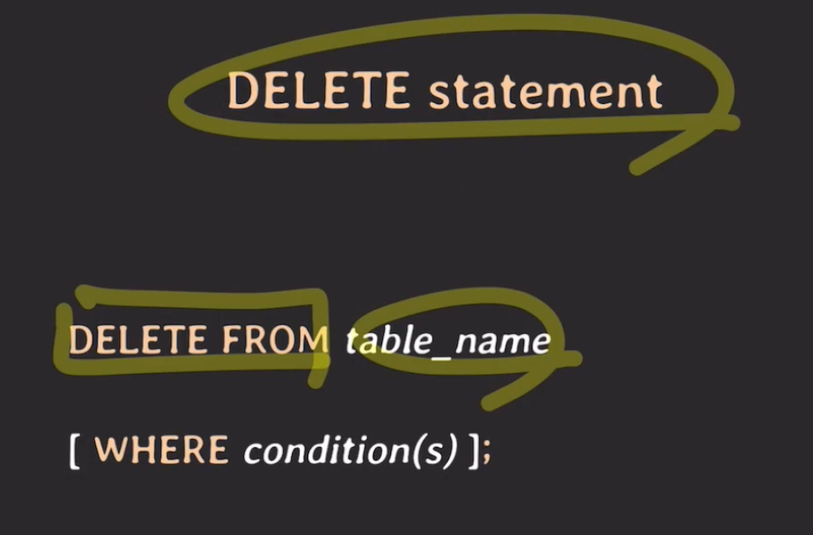

# **SQL Command(insert, update, delete)**

## **IT 회사 관련 RDB 만들기**

부서, 사원, 프로젝트 관련 정보들을 저장할 수 있는 RDB 만들기

RDBMS는 MySQL을 사용



<br>

## **Insert**



<br>

```sql
CREATE TABLE `employee` (
  `id` int NOT NULL,
  `name` varchar(30) NOT NULL,
  `birth_date` date DEFAULT NULL,
  `sex` char(1) DEFAULT NULL,
  `position` varchar(10) DEFAULT NULL,
  `salary` int DEFAULT '50000000',
  `dept_id` int DEFAULT NULL,
  PRIMARY KEY (`id`),
  KEY `employee_department_fk` (`dept_id`),
  CONSTRAINT `employee_department_fk` FOREIGN KEY (`dept_id`) REFERENCES `DEPARTMENT` (`id`) ON DELETE SET NULL ON UPDATE CASCADE,
  CONSTRAINT `employee_chk_1` CHECK ((`sex` in (_utf8mb4'M',_utf8mb4'F'))),
  CONSTRAINT `employee_chk_2` CHECK ((`salary` >= 50000000))
) ENGINE=InnoDB DEFAULT CHARSET=utf8mb4 COLLATE=utf8mb4_0900_ai_ci


INSERT INTO employee
VALUES (1, 'MESSI', '1987-02-01', 'M', 'DEV_BACK', 100000000, null);

-- Query OK, 1 row affected (0.01 sec)

INSERT INTO employee
VALUES (1, 'JAIN', '1996-05-05', 'F', 'DSGN', 90000000, null);

-- ERROR 1062 (23000) : Duplicate entry '1' for key 'employee.PRIMARY'

INSERT INTO employee
VALUES (2, 'JAIN', '1996-05-05', 'F', 'DSGN', 40000000, null);

-- ERROR 3819 (HY000) : Check constraint 'employee_chk_2' is violated.
-- CONSTRAINT `employee_chk_2`는 salary가 5000만원 이상인지 체크하는 제약조건이다.

INSERT INTO employee
VALUES (2, 'JAIN', '1996-05-05', 'F', 'DSGN', 90000000, 111);

-- ERROR 1452 (23000): Cannot add or update a child row:
-- a foreign key constraint fails (`company`.`employee`, CONSTRAINT `employee_ibfk_1` FOREIGN KEY (`dept_id`) REFERENCES `department` (`id`) ON DELETE SET NULL ON UPDATE CASCADE)
-- dept_id에 111이라는 값은 없다.

INSERT INTO employee
VALUES (2, 'JAIN', '1996-05-05', 'F', 'DSGN', 90000000, null);

-- Query OK, 1 row affected (0.01 sec)

INSERT INTO employee (name, birth_date, sex, position, id)
VALUES ('JENNY', '2000-10-12', 'F', 'DEV_BACK', 3);

-- Query OK, 1 row affected (0.01 sec)
-- 위에서는 employee 테이블의 모든 attribute를 values로 입력해주었기 때문에 테이블에 정의 된 컬럼의 순서대로 모든 값을 넣어주어야 한다.
-- 하지만 데이터를 넣을 컬럼을 따로 입력해주게 된다면 어떤 값을 넣을지, 입력 순서를 어떻게 할 지 개발자 마음대로 정할 수 있다.

```

<br>

---

## **Update**



<br>

### dept_id 추가하기

```sql
--  employee id가 1인 MESSI는 개발팀이다. 개발팀의 코드는 1003이다. 이 정보를 가지고 dept_id를 부여한다.
UPDATE employee SET dept_id = 1003 WHERE id = 1;
```

### 개발팀 연봉을 두 배로 인상하기

```sql
UPDATE employee SET salary = salary * 2 WHERE dept_id = 1003;
```

### 프로젝트 id 2003에 참여한 임직원의 연봉을 두 배로 올리고 싶다.

```sql
UPDATE employee, works_on SET salary = salary * 2 WHERE employee.id = works_on.empl_id AND works_on.proj_id = 2003;
```

### 회사의 모든 구성원의 연봉을 두 배로 올리기

```sql
UPDATE employee
SET salary = salary * 2

-- ERROR 1264 (22003): Out of range value for column 'salary' at row 7
```

위 오류는 id 7인 직원의 급여가 너무 커서 생긴 오류.

salary의 type은 int인데, int의 range는 -2147483647 ~ 2147483647 이다. 현재 급여가 1억 6000만원이므로 2배로 올렸을 때 3억 2000만원이 된다. 따라서 range를 벗어난 정수로 업데이트를 시도했기에 위와 같은 에러가 나왔다.

salary의 경우 default가 5000만원이고 그 이상만 입력이 가능하게 constraint가 설정 되어 있다. 따라서 signed int가 아니라 unsigned int로 타입을 설정하면 range가 0 ~ 4294967295로 늘어난다.

이외에 bigint 타입으로 바꿔주어도 되는데, unsigned bigint 타입의 range는 0 ~ 18446744073709551615이다.

그런데 여기서 문제는, int와 bigint의 저쟝용량 차이이다. int는 4byte, bigint는 8byte로 저쟝 용량이 int보다 bigint가 두 배 크다. 급여가 unsigned bigint만큼 될 수도 있겠으나, 그런 사람보다 아닌 사람이 많을 것이므로 attribute의 데이터 타입을 bigint로 설정하는 것은 비효율적이다.

hr 도메인에서 연봉 협상의 금액 단위 정책을 어떻게 시행하느냐에 따라 다르겠지만, 보통 연봉을 100만원 단위로 조정한다고 가정하면, 100만원 단위로 급여를 저장하거나 회계에서 많이 쓰는 천원 단위로 저장하면 int 타입으로도 충분히 급여를 저장할 수 있지 않을까 생각한다.

### 스키마를 설계할 때 데이터 타입을 중요하게 생각하지 않고 얼렁뚱땅 설계하면 이와 같은 문제가 발생할 수 있다.

만약 이것이 비즈니스 영역에서 발생한 오류라고 한다면, db 저장단위 하나 때문에 비즈니스 서비스 장애를 초래할 수 있기 때문에 db에 데이터를 저장하는 단위, 타입을 신중하게 설정해야 할 것이다.

<br>

---

## **Delete**



### 퇴사자 john의 정보를 employee 테이블에서 삭제 해야 한다. john의 employee id는 8이고 현재 project 2001에 참여하고 있었다.

```sql
DELETE FROM employee WHERE id = 8;

--- works_on 테이블 생성 시, employee 테이블의 id를 참조하여 데이터가 delete, update 될 경우 cascade 되도록 설정해두었기 때문에, wokrs_on 테이블의 정보는 따로 삭제하지 않아도 된다.

CREATE TABLE `works_on` (
  `empl_id` int NOT NULL,
  `proj_id` int NOT NULL,
  PRIMARY KEY (`empl_id`,`proj_id`),
  KEY `proj_id` (`proj_id`),
  CONSTRAINT `works_on_ibfk_1` FOREIGN KEY (`empl_id`) REFERENCES `EMPLOYEE` (`id`) ON DELETE CASCADE ON UPDATE CASCADE,
  CONSTRAINT `works_on_ibfk_2` FOREIGN KEY (`proj_id`) REFERENCES `PROJECT` (`id`) ON DELETE CASCADE ON UPDATE CASCADE
) ENGINE=InnoDB DEFAULT CHARSET=utf8mb4 COLLATE=utf8mb4_0900_ai_ci
```

<br>

### Jane이 휴직을 떠나게 되면서 현재 진행중인 프로젝트에서 중도하차하게 됐다. Jane의 employee id는 2이다.

```sql
DELETE FROM works_on WHERE empl_id = 2;
```

<br>

### 현재 Dingyo가 세 개의 프로젝트에 참여하고 있었는데 프로젝트 2001에 선택과 집중을 하기로 하고 나머지 프로젝트(2002,2003)에서는 빠지기로 했다. Dingyo의 employee id는 5다.

```sql
DELETE FROM works_on WHERE empl_id = 5 and proj_id <> 2001;
-- <> 과 != 은 같다.
DELETE FROM works_on WHERE empl_id = 5 and proj_id != 2001;
```

<br>

### 회사에 문제가 되어서 모든 프로젝트가 중단되었다

```sql
DELETE FROM project;
```

<br>

> 출처 : [쉬운코드](https://youtu.be/mgnd5JWeCK4)님의 유튜브 강의
