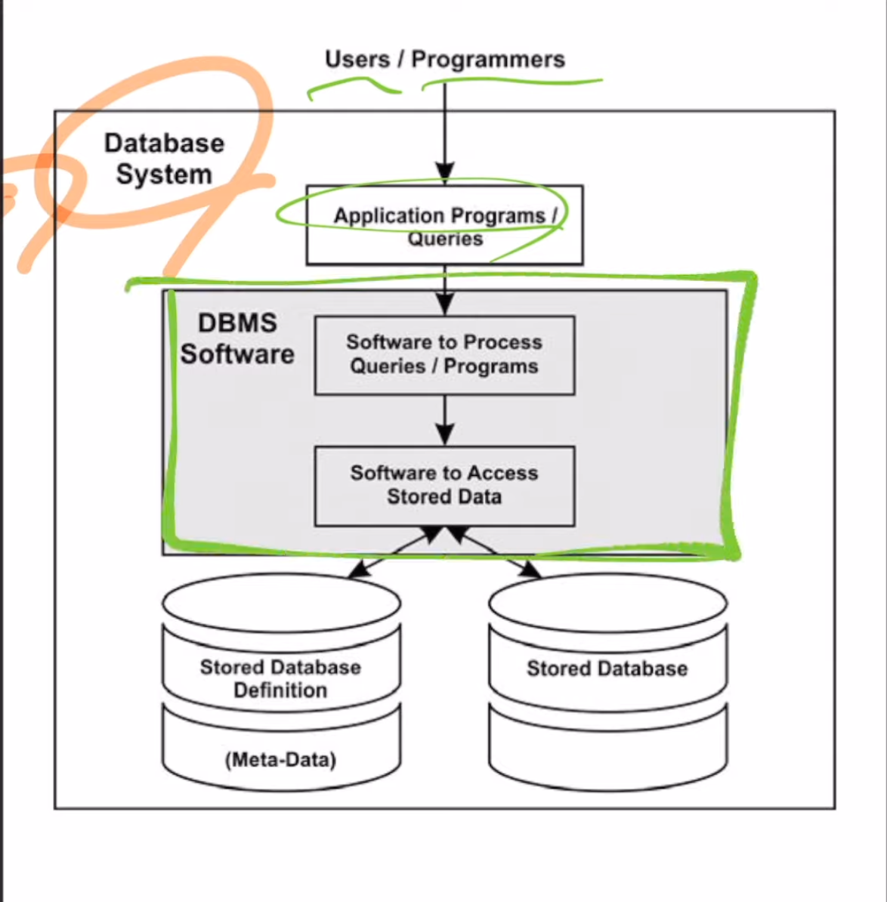
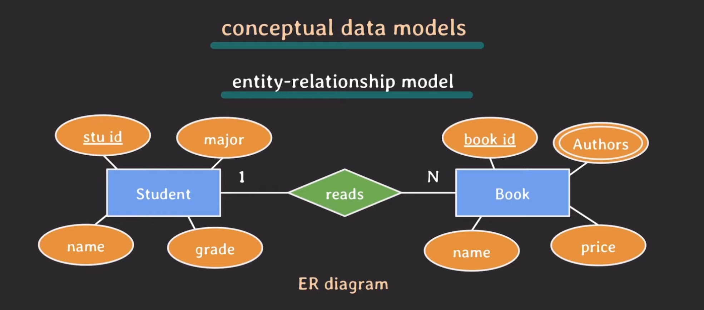
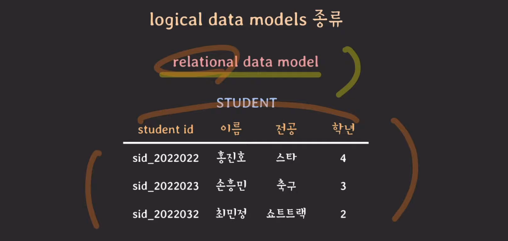
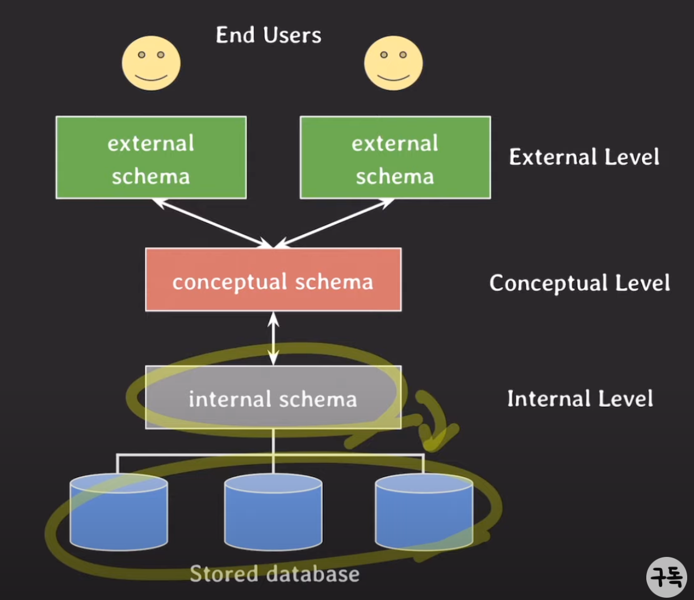

# **Database 기본 개념**

### DB

전자적으로 저장되고 사용되는 **관련있는 데이터**들의 **조직화된 집합**

- 관련있는 데이터 : 같은 출처나 같은 목적, 서비스 안에서 생성되는 데이터들을 관련 있는 데이터라고 설명할 수 있다.
- 조직화된 집합 : 찾고자 하는 데이터들을 더욱 빨리 찾을 수 있게, 불필요한 데이터가 중복되어 생성 되는 것을 막고 데이터의 불일치를 막기 위해 관련있는 데이터들 끼리 잘 조직화 해야 한다.

### DBMS(Database Management System)

- 사용자에게 DB를 정의하고 만들고 관리하는 기능을 제공하는 소프트웨어 시스템

- 데이터베이스를 사용하다보면 부가적인 정보(metadata)가 생성된다
  - metadata : 데이터베이스를 정의하거나 기술하는 데이터, 즉 데이터를 위한 데이터
  - catalog라고도 부르고, metadata가 저장되는 곳을 catalog라고도 부른다.
  - e.g.) 데이터 유형, 구조, 제약조건, 보안, 저장, 인덱스, 사용자 그룹 등등
  - metadata 또한 DBMS를 통해 저장/관리된다.

### Database system

- database + DBMS + 연관된 applications을 통틀어 Database system이라 한다.
- 줄여서 database라고도 부른다.
- 두 의미가 혼재되어 사용하기 때문에, 문서를 읽을 때 문맥에 따라 잘 해석해야 한다.

- DBMS 작동 원리

1. 사용자나 프로그래머의 특정 요청 발생
2. 애플리케이션 프로그램에서 쿼리를 날린다.
3. DBMS이 쿼리를 받아서 분석하고 요청한 것이 무엇인지 파악이 되면
4. 요청을 처리해야 하는데, 요청을 처리하기 위해서는 요청된 데이터가 어떤 형태로 되어 있는지 부가적인 정보를 알아야 한다.
5. 확인한 부가적인 정보를 바탕으로 실제 저장된 데이터를 찾아서 애플리케이션에 돌려준다.

   이러한 방식으로 DBMS가 동작한다.

---

### Data models

- DB의 구조(structure)를 기술하는데 사용될 수 있는 개념들이 모인 집합
- DB 구조\* 를 **추상화**해서 표현할 수 있는 수단을 제공한다.
- data model은 여러 종류가 있으며 추상화 수준과 DB 구조화 방식이 조금씩 다르다
- DB에서 읽고 쓰기 위한 기본적인 동작(operation)들도 포함한다.\
  \* DB구조 : 데이터 유형, 데이터 관계, 제약사항 등등

### data models 분류

- conceptual (or high-level) data models

  - 일반 사용자들이 쉽게 이해할 수 있는 개념들로 이뤄진 모델
  - 추상화 수준이 가장 높다.
  - 비즈니수 요구사항을 추상화하여 기술할 때 사용한다.

- logical (or representational) data models

  - 이해하기 어렵지 않으면서도 디테일하게 DB를 구조화할 수 있는 개념들을 제공
  - 데이터가 컴퓨터에 저장될 때의 구조와 크게 다르지 않게 DB 구조화를 가능하게 함
  - 특정 DBMS나 storage에 종속되지 않는 수준에서 DB를 구조화할 수 있는 모델
  - 백엔드 개발자는 logical 모델을 많이 사용하는데, relational data model을 많이 사용한다.
  - relation이 table을 의미한다.

- physical (or low-level) data models
  - 컴퓨터에 데이터가 어떻게 파일 형태로 저장되는지를 기술할 수 있는 수단을 제공
  - data format, data orderings, access path 등등
  - access path : 데이터 검색을 빠르게 하기 위한 구조체, e.g.) index

---

### database schema

- data model을 바탕으로 database의 구조를 기술(description)한 것
- schema는 database를 설계할 때 정해지며 한 번 정해지면 자주 바뀌지 않는다.

### database state

- database에 있는 실제 데이터는 꽤 자주 바뀔 수 있다.
- 특정 시점에 database에 있는 데이터를 database state 혹은 snapshot이라고 한다.
- 혹은 database에 있는 현재 instance의 집합이라고도 한다.

---

### three-schema architecture

- database system을 구축하는 architecture 중 하나인데 대부분 이 구조를 채택하고 있다.
- user application으로 부터 물리적인(physical) database를 분리시키는 목적
- 세 가지 level이 존재하며 각각의 level마다 schema가 정의되어 있다
- 각 레벨을 독립시켜서 어느 레벨에서의 변화가 상위 레벨에 영향을 주지 않기 위해 이 아키텍처를 사용한다.
- 대부분의 DBMS가 three level을 완벽하게 혹은 명시적으로 나누지는 않는다.
- 데이터가 존재하는 곳은 internal level이다.

- external schemas(or user views) at external (or view) level
  - external views, user views 라고도 불림
  - 특정 유저들이 필요로 하는 데이터만 표현
  - 그 외 알려줄 필요가 없는 데이터는 숨김
  - logical data model을 통해 표현
- internal schemas at internal level
  - 물리적으로 데이터가 어떻게 저장되는지 physical data model을 통해 표현
  - data storage, data structure, access path 등등 실체가 있는 내용 기술

시스템 초창기 아키텍처는 인터널 스키마와 익스터널 스키마 밖에 없었는데 문제가 있었다.
각각의 유저마다 필요로 하는 데이터들이 달라지다보니 인터널 레벨에서 점점 중복되는 데이터들이 생겨났다.
그 니즈에 맞춰 데이터를 제공하려 하다보니 같은 데이터를 포함함에도 조금씩 다른 인터널 스키마들이 생기니까 관리도 힘들어지고 데이터 불일치 문제가 발생했다.
그래서 conceptual schema가 생겨났다

- **conceptual schemas** at conceptual level
  - 전체 database에 대한 구조를 기술
  - 물리적인 저장 구조에 관한 내용은 숨김
  - entities, data types, relationships, user operations, constraints에 집중
  - logical data model을 통해 기술

---

### database language

- data definition language (DDL)

  - conceptual schema를 정의하기 위해 사용되는 언어
  - internal schema까지 정의할 수 있는 경우도 있음(많지는 않음)

- storage definition language (SDL)

  - internal schema를 정의하는 용도로 사용되는 언어
  - 요즘 relational DBMS에서는 SDL이 거의 없고 파라미터 등의 설정으로 대체됨

- view definition language (VDL)

  - external schemas를 정의하기 위해 사용되는 언어
  - 대부분의 DBMS에서는 DDL이 VDL 역할까지 수행

- data manipulation language (DML)

  - database에 있는 data를 활용하기 위한 언어
  - data CRUD등의 기능을 제공한다.

- 통합된 언어
  - 오늘날의 DBMS는 DML, VDL, DDL이 따로 존재하기보다는 통합된 언어로 존재
  - 대표적인 예가 relational database language : SQL

> 출처 : [쉬운코드](https://youtu.be/aL0XXc1yGPs)님의 유튜브 강의
