# **Relational data model**

## Set

수학의 집합과 같은 개념이다.

서로 다른 elements를 가지는 collection

하나의 set에서 elements의 순서는 중요하지 않다.

> e.g. {1, 3, 11, 4, 7}

 

## Relation in mathematics

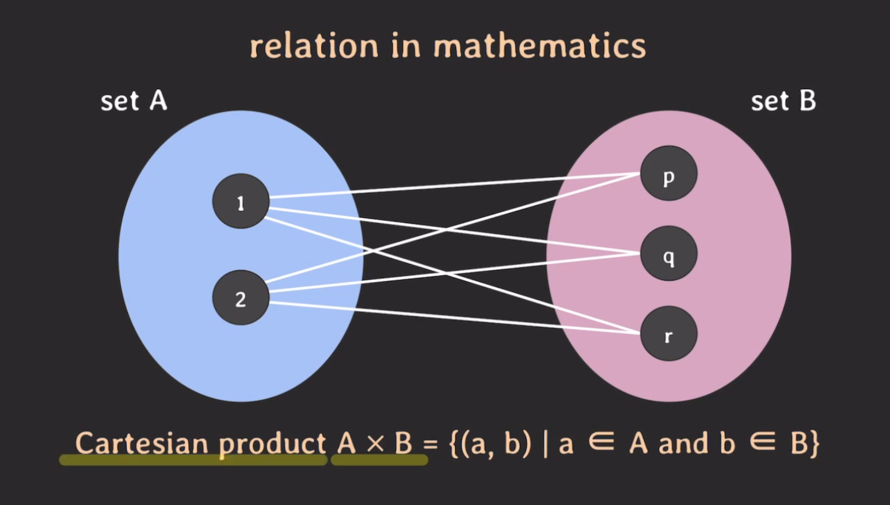

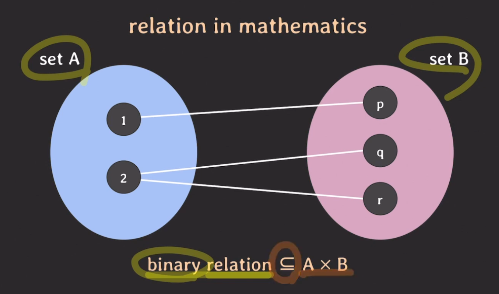

binary relation은 cartesian product의 부분집합이다.

이것이 수학에서 말하는 relation의 개념이다.

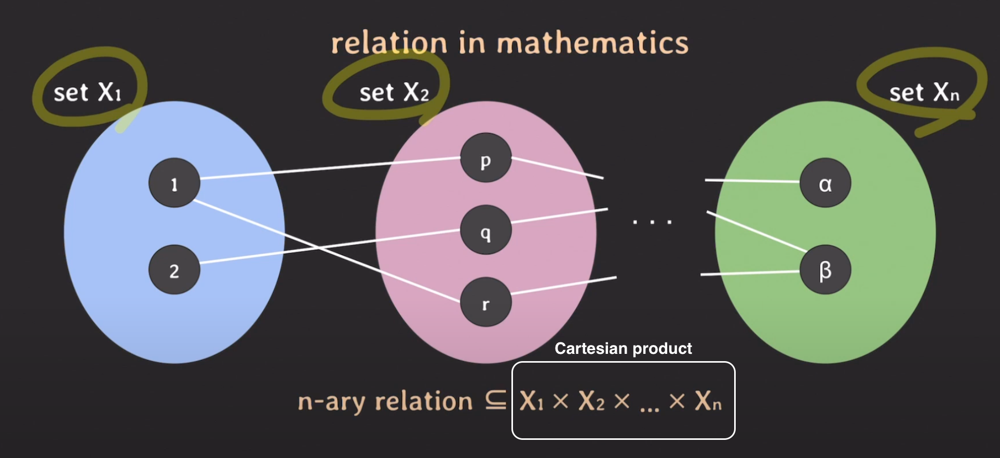

3개의 list로 이루어진 relation은 n개의 set에 대한 cartesian product의 부분 집합이다.

그리고 각각의 list를 tuple이라고 부를 수 있다.

 

✅ **즉 정리하면, 수학에서의 relation은**

Cartesian Product의 부분집합(subset of Cartesian Product) 또는 튜플의 집합(set of tuples)이라고 할 수 있다.

 

## relation in mathematics & relational data model

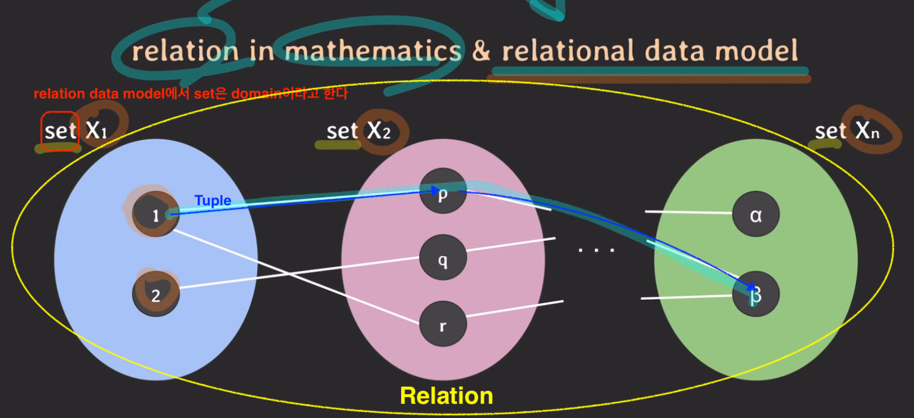

relation data model에서 set은 domain이라고 한다.

그리고 각 set은 집합의 이름 X1처럼 이름을 가질 수 있다.(attribute, column)

그리고 연결된 set 사이에 튜플이 존재한다.

이 모든 것을 relation이라고 한다.

 

## relational data model의 예시 (student relation)

### attribute

domain의 역할을 표시해주기 위해 relational data model에서는 attribute를 사용한다. 즉, 각각의 domain이 relation에서 어떤 역할을 하는지를 지정하는 것이다.

 

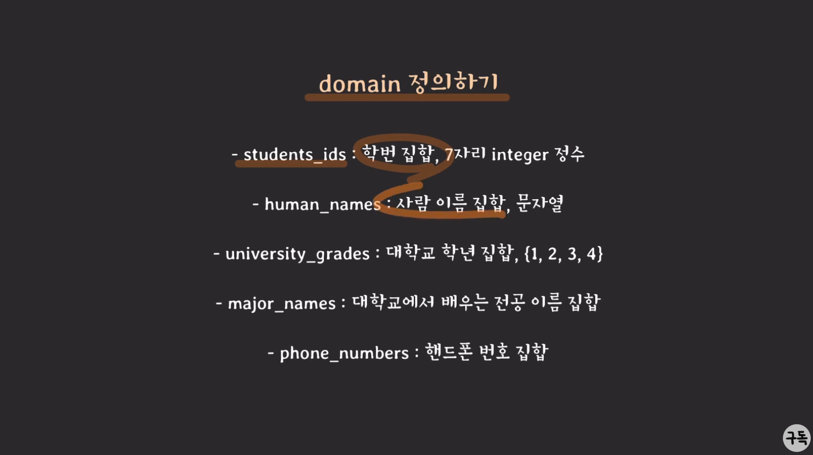

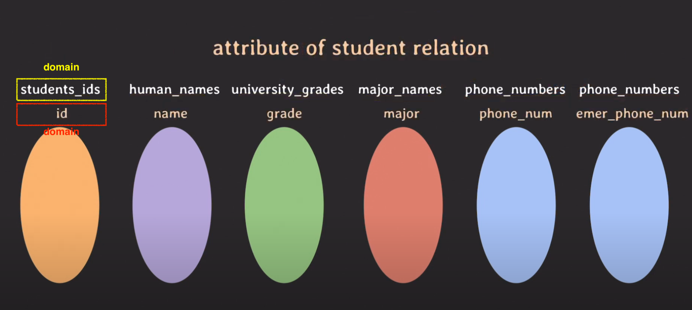

 

### Table

이러한 tuple의 집합을 표현하기 위해 table을 사용한다. 즉 table이 relation이다.

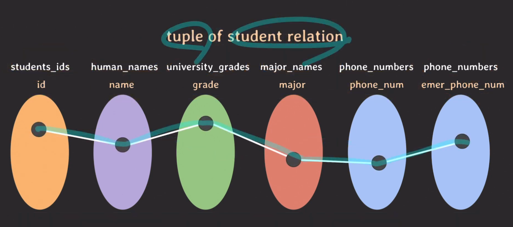

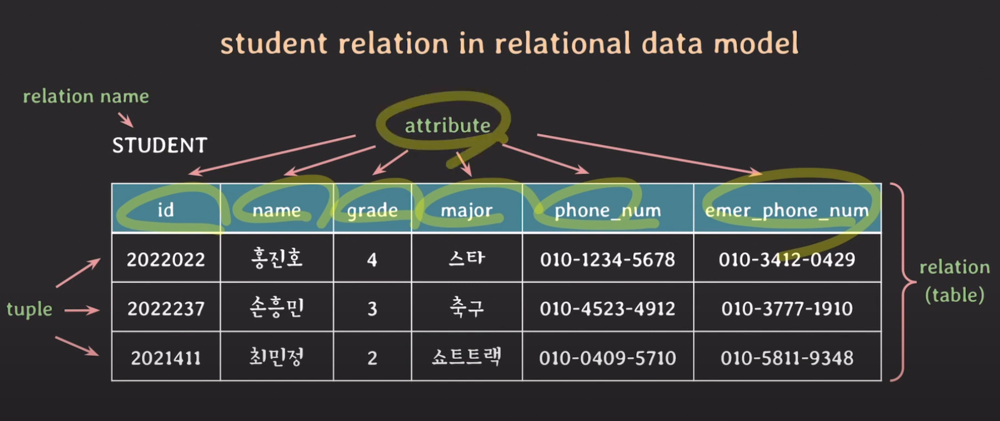

 

### 정리

|   주요 개념   |                               설명                               |
| :-----------: | :--------------------------------------------------------------: |
|    domain     |                     set of **atomic** values                     |
|  domain name  |                           domain 이름                            |
|   attribute   |               domain이 relation에서 맡은 역할 이름               |
|     tuple     | 각 attribute의 값으로 이루어진 리스트, 일부 값은 null일 수 있다. |
|   relation    |                     set of tuples, 즉 table                      |
| relation name |                         relation의 이름                          |

 

---

# Relation schema

## Relation schema란 relation의 구조를 나타낸다.

relation 이름과 attributes 리스트로 표기된다

e.g.) STUDENT(id, name, grade, major, phone_number, emer_phone_num)

attributes와 관련된 constraints도 포함한다.

 

## degree of a relation

- relation schema에서 attributes의 수
- e.g. STUDENT(id, name, grade, major, phone_number, emer_phone_num) -> **degree : 6**

 

---

# **Relational database**

## relational database

relational data model에 기반하여 구조화된 database

relational database는 여러개의 relations으로 구성된다.

 

## relational database schema

relation schemas set + integrity constraints set(무결성 제약 조건)

 

## relation의 특징

#### ✅ relation은 중복된 tuple을 가질 수 없다.

relation은 tuple의 집합(set)이기 때문이다.

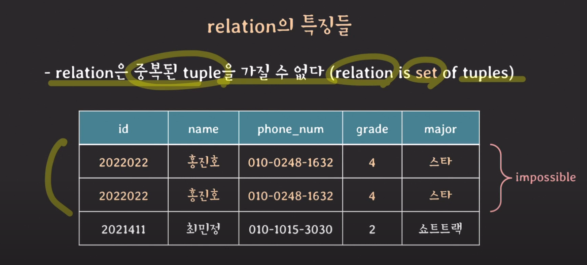

 

#### ✅ relation의 tuple을 식별하기 위해 attribute의 부분 집합을 key로 설정한다.

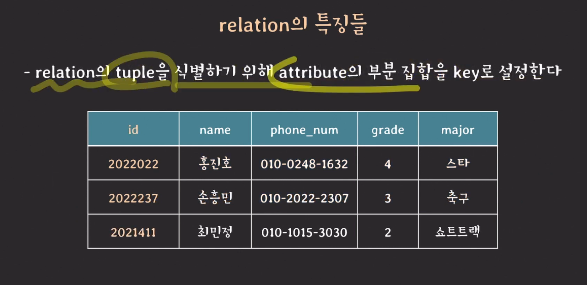

#### ✅ relation에서 tuple의 순서는 중요하지 않다.

#### ✅ 하나의 relation에서 attribute의 이름은 중복되면 안된다.

#### ✅ 하나의 tuple에서 attribute의 순서는 중요하지 않다.

#### ✅ attribute는 atomic 해야 한다 (composite or multivalued attribute 허용 안됨)

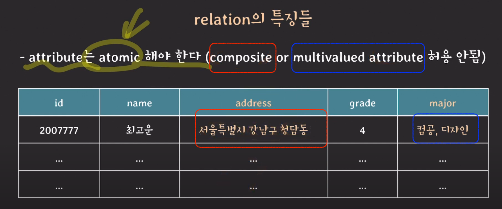

 

## NULL의 의미

값이 존재하지 않는다

값이 존재하나 아직 그 값이 무엇인지 알지 못한다

해당 사항과 관련이 없다

 

## Super key

#### relation에서 tuples를 **unique**하게 식별할 수 있는 attributes set

> e.g. PLAYER(id, name, team_id, back_number, birth_date)의 super key는
>
> {id, name, team_id, back_number, birth_date}, {id, name}, {name, team_id, back_number}, ... etc

 

## Candidate key

#### 어느 한 attribute라도 제거하면 unique하게 tuples를 식별할 수 없는 super key

key or minimal super key라고도 부른다.

> e.g. PLAYER(id, name, team_id, back_number, birth_date)의 candidate key는
>
> {id}, {team_id, back_number}

 

## Primary key

#### relation에서 tuples를 unique하게 식별하기 위해 선택된 candidate key

보통 attribute 수가 적은 키를 primary key로 사용한다.

> e.g. PLAYER(id, name, team_id, back_number, birth_date)의 primary key는
>
> {id} or {team_id, back_number}

 

## Unique key

#### primary key가 아닌 candidate keys

alternate key 라고도 부른다.

> e.g. PLAYER(<u>id</u>, name, team_id, back_number, birth_date)의 unique key는
>
> {team_id, back_number}
>
> <u>id attribute에 밑줄이 쳐져 있는 것은, id가 PK라는 뜻</u>

 

## Foreign key

다른 relation의 PK를 참조하는 attributes set

> e.g. PLAYER(<u>id</u>, name, team_id, back_number, birth_date)와 TEAM(<u>id</u>, name, manager)가 있을 때
>
> foreign key는 PLAYER의 {team_id}

 

## Constraints

relational database의 relations들이 언제나 항상 지켜줘야 하는 제약 사항

**constraints는 데이터베이스가 일치된 형태로, 그리고 데이터의 일관성을 보장하기 위해서 사용하는 개념이다.**

 

### implicit constraints

relational data model 자체가 가지는 constraints를 의미한다.(암묵적 제약조건)

#### ✅ relation은 중복되는 tuple을 가질 수 없다.

#### ✅ relation 내에서는 같은 이름의 attribute를 가질 수 없다.

 
 
### Schema-based constraints

주로 DDL을 통해 schema에 직접 명시할 수 있는 constraints

explicit constraints라고도 부른다.

 

#### ✅ domain constraints

attribute의 value는 해당 attribute의 domain에 속한 value여야 한다.

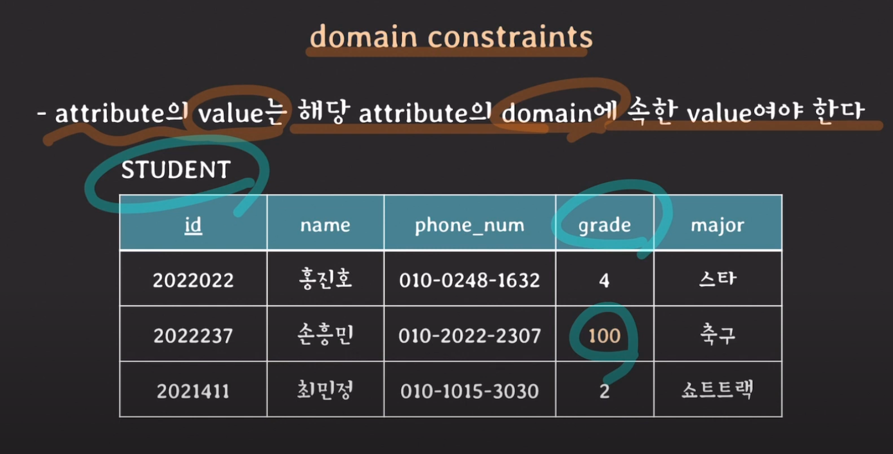

 

#### ✅ key constraints

서로 다른 tuple은 같은 value의 key를 가질 수 없다.

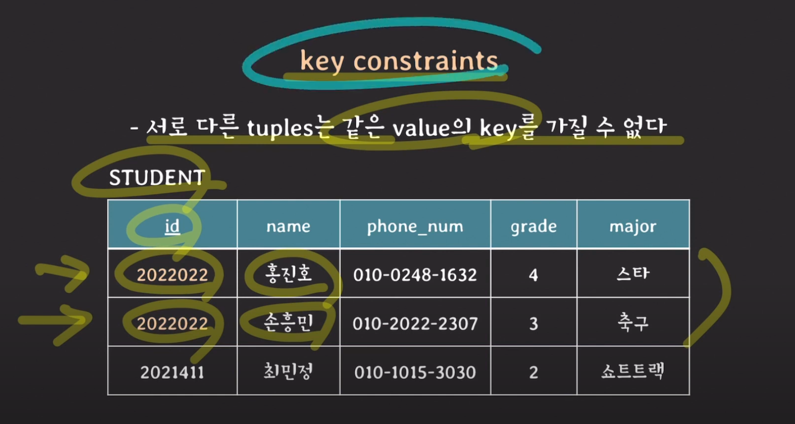

 

#### ✅ NULL value constraints

attribute가 NOT NULL로 명시됐다면 NULL을 값으로 가질 수 없다.

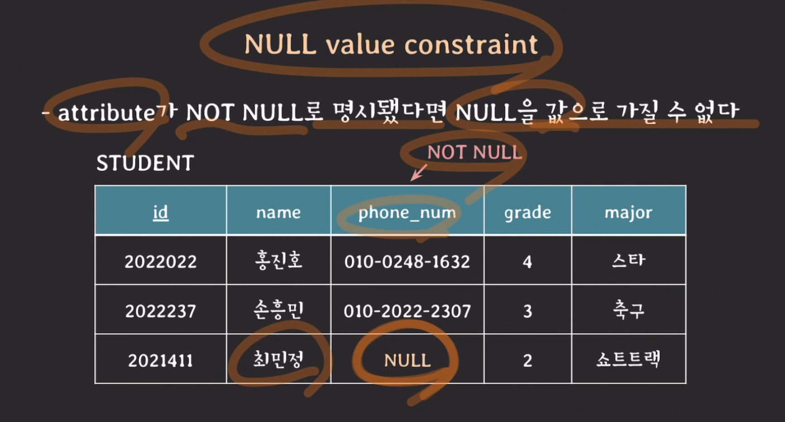

 

#### ✅ entity integrity constraint(엔티티 무결성 제약)

primary key는 value에 NULL을 가질 수 없다.

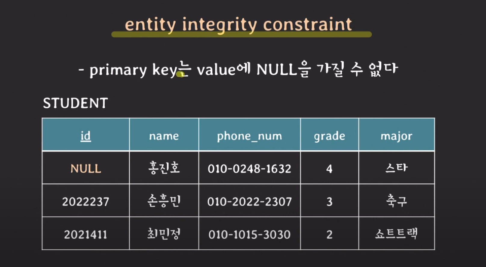

 

#### ✅ referential integrity constraint(참조 무결성 제약)

FK와 PK와 도메인이 같아야 하고 PK에 없는 values를 FK가 값으로 가질 수 없다.

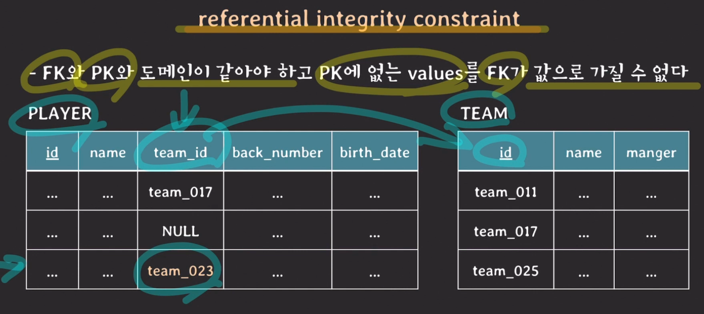

 

> 출처 : [쉬운코드](https://youtu.be/gjcbqZjlXjM)님의 유튜브 강의
