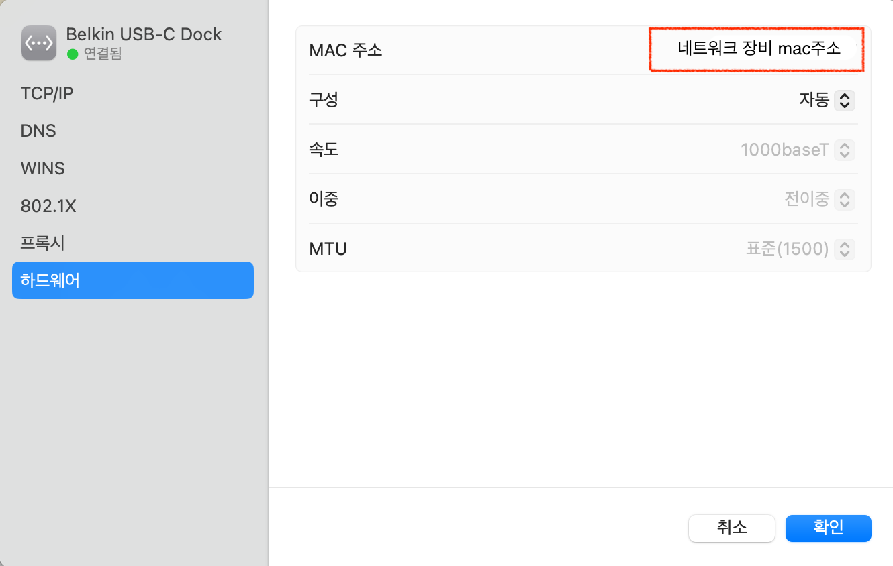

# **OSI 7 Layer - 2계층**

### 2계층에서 하는 일

- 2계층은 **하나의 네트워크 대역** 즉, **같은 네트워크 상**에서 존재하는 여러 장비들 중에서 **어떤 장비가 어떤 장비에게 보내는 데이터를 전달**. 추가적으로 **오류제어**, **흐름 제어**를 수행한다.

- 2계층은 하나의 네트워크 대역(LAN)에서만 통신할 때 사용한다.

- 다른 LAN과 통신할 때는 항상 3계층이 도와주어야 한다.

- 3계층의 주소와 3계층의 프로토콜을 이용하여야만 다른 네트워크와 통신이 가능하다.

### 2계층에서 사용하는 주소 : MAC

- MAC : 장비(랜카드)가 실질적으로 부여받은 고유 주소로 총 48bit(6byte)로 이루어져 있다.
  - 16진수로 표기하며 1바이트 마다 - 또는 :로 표기한다.
  - e.g.) 80:69:1A:00:00:00
  - OUI : IEEE에서 부여하는 일종의 제조회사 식별 ID(MAC 주소 앞의 16진수 6자리)
  - 고유번호 : 제조사에서 장비에 부여한 고유번호(MAC 주소 나머지 16진수 6자리)
    
    

### 2계층 프로토콜

- Ethernet 프로토콜

  - Ethernet Header
    
  - 총 14 bytes
  - 목적지 주소(Destination Address) : 데이터를 전달받을 상대방 시스템의 MAC 주소 6바이트
  - 출발지 주소(Source Address) : 데이터를 전달하는 시스템의 MAC 주소 6바이트
  - 상위 프로토콜 타입(Ethernet Type) : 다음 계층의 프로토콜이 무엇인지 알려주는 곳. 2바이트, IPv4(0x0800), ARP(0x0806)

  - ethernet 프로토콜 패킷(프레임) 예시
    

  - IPv4 패킷 예시
    

> 출처 : [네트워크 기초 - 따라하면서 배우는 IT](https://www.youtube.com/playlist?list=PL0d8NnikouEWcF1jJueLdjRIC4HsUlULi)
