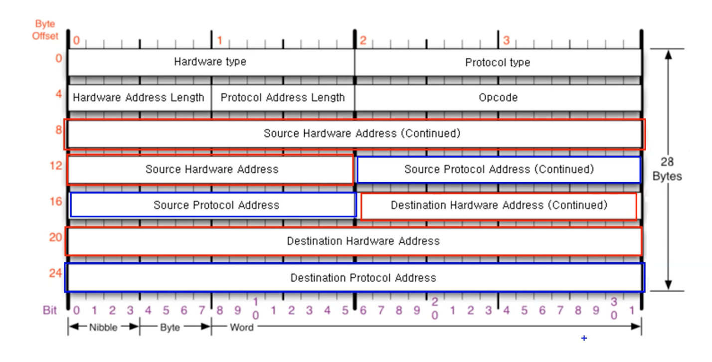
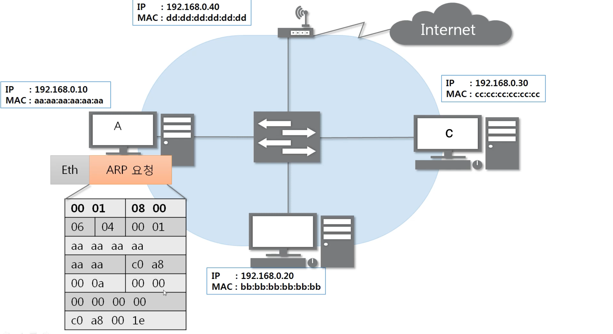
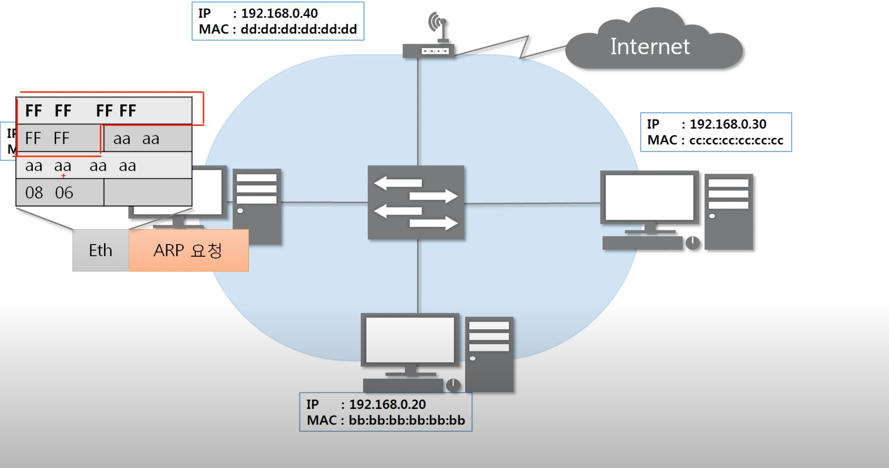
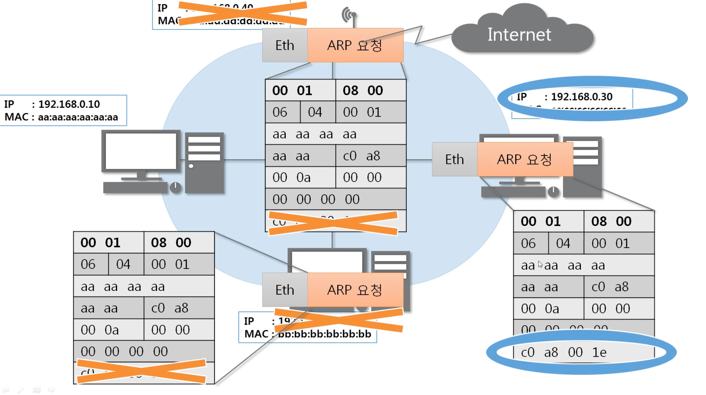
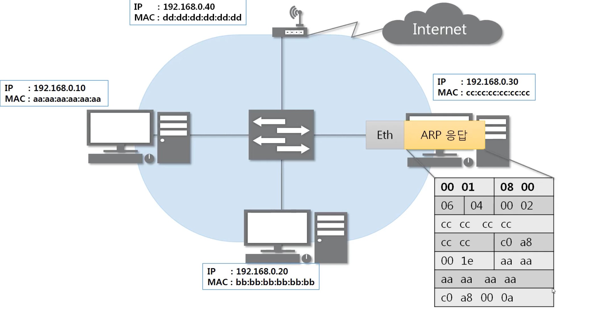
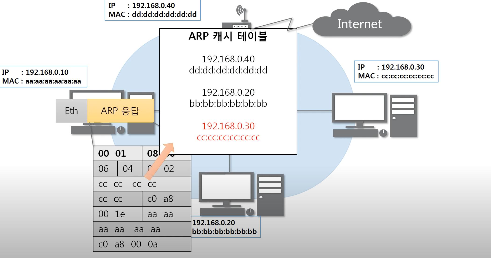
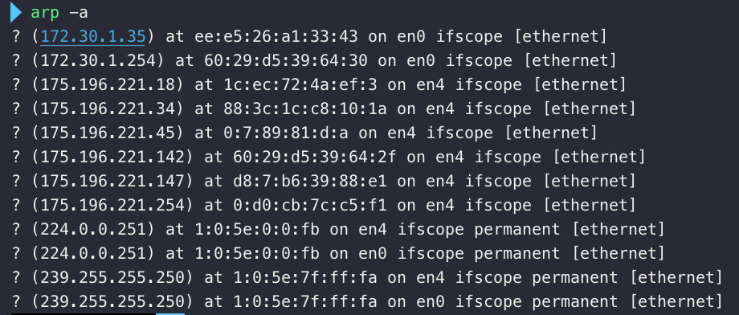
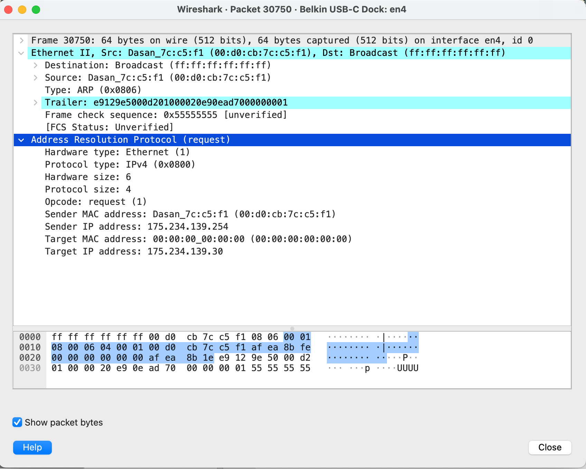

# **OSI 7 Layer - 3계층 - ARP 프로토콜**

## **ARP 프로토콜**

### **ARP가 하는 일**

ARP 프로토콜은 같은 네트워크 대역에서 통신을 하기 위해 필요한 MAC주소를 IP주소를 이용해서 알아오는 프로토콜이다.

같은 네트워크 대역에서 통신을 한다고 하더라도 데이터를 보내기 위해서는 7계층부터 캡슐화를 통해 데이터를 보내기 때문에 IP주소와 MAC주소가 모두 필요하다. 이 때 IP주소는 알고 MAC주소는 모르더라도 ARP를 통해 통신이 가능하다.

**<u>즉, IP주소를 MAC주소로 변환해준다.</u>**

<br>

### **ARP 프로토콜의 구조**



<br>

✅ 하드웨어 타입 : 2계층 주소의 타입

보통 이더넷 프로토콜이 오므로 0x0001이다.

✅ 프로토콜 타입 : 3계층 주소의 타입

IPv4 프로토콜이 오므로 0x0800이다.

✅ 하드웨어 주소 길이 : 2계층 주소의 길이

이더넷 프로토콜은 6byte이므로 0x06

✅ 프로토콜 주소 길이 : 3계층 주소의 길이

IPv4 프로토콜은 4byte이므로 0x04

✅ 오퍼레이션 코드 : ARP 요청 패킷인지 ARP 응답 패킷인지 알려주는 필드

0x0001이면 요청 패킷, 0x0002이면 응답 패킷

✅ 출발지 MAC 주소

✅ 출발지 IP 주소

✅ 목적지 MAC 주소

독특한 것이, ARP 요청을 보낼 때는, 목적지의 MAC주소를 알 수 없어 빈 값으로 둔다.

목적지의 MAC 주소를 모르기 때문에 목적지 IP주소를 통해 목적지 MAC 주소를 알아낸다.

어떻게 목적지의 MAC주소를 알아낼 수 있는지는 하단에 설명한다.

✅ 목적지 IP주소

<br>

---

## **ARP 프로토콜의 통신과정**

### **IP주소로 MAC주소를 알아오는 과정**



<br>

A컴퓨터가 C컴퓨터로 ARP 요청을 보낸다.

이 때, A컴퓨터는 C컴퓨터의 맥주소를 모르기 때문에 목적지의 MAC주소를 비운다(00:00:00:00:00:00)

<br>



<br>

이더넷 프로토콜은 위와 같이 캡슐화한다.

목적지의 맥주소를 모르기 때문에 목적지의 맥주소를 FFFFFFFFFF(FF:FF:FF:FF:FF:FF)로 채운다.

> IP 주소에서 255:255:255:255는 브로드캐스트를 의미한다.
>
> 즉, MAC주소도 FF:FF:FF:FF:FF:FF은 브로드캐스트를 의미한다.

즉, 같은 네트워크(LAN)에 있는 모든 기기들에게 ARP 요청을 보내는 것이다.

이때 중간에 위치한 스위치 장비(2계층)는 이더넷 프로토콜을 디캡슐화하여 어느 MAC주소로 이 요청을 보내야 하는지 확인한다.

목적지의 맥주소가 브로드캐스트이므로 스위치 장비가 LAN대역의 모든 기기에게 이 요청을 보낸다.

<br>



<br>

각 기기는 자신의 IP 주소와 ARP 프로토콜의 목적지 IP 주소가 일치하는지를 확인하고, 일치하지 않는 기기들은 패킷을 버린다.

이 상태에서 C 기기는 자신에게 온 요청에 대한 ARP 응답을 만든다.

<br>



<br>

ARP 응답헤더에 C기기 자신의 맥주소와 IP를 담는다.

또한, C 기기는 자신에게 요청을 보낸 기기의 IP주소와 MAC 주소를 알고있기 때문에 담아준다.

따라서 이더넷 프로토콜에서도 목적지 MAC주소를 브로드캐스트로 하지 않고 목적지의 MAC주소를 담는다.

응답을 보내면, 스위치 장비가 이더넷 프로토콜을 디캡슐화하여 목적지의 맥주소를 확인한다.

맥주소가 aa:aa:aa:aa:aa:aa 이므로 A기기에게 ARP 응답을 전달한다.

<br>



<br>

이후 A기기는 ARP응답을 디캡슐화하여 요청을 보냈던 목적지의 맥주소를 확인하고 ARP 캐시테이블에 IP주소와 MAC주소를 저장한다.

> 192.168.0.30 사설 IP를 사용하는 기기의 맥주소가 cc:cc:cc:cc:cc:cc 라는 정보를 캐싱하는 것이다.

<br>

**이렇게 최초의 통신에서는 ARP통신으로 목적지의 MAC 주소를 확인한 후 본격적인 통신을 시작한다.**

<br>

---

## **실습**

### **ARP 테이블 확인해보기**

```bash
arp -a
```



<br>

arp 프로토콜은 같은 네트워크 대역에서만 쓰인다.

3계층 장비(라우터)는 브로드캐스트를 받으면 다른 네트워크 대역으로 브로드캐스트 해주지 않기 때문이다.

> 원래 브로드캐스트의 의미가 자신의 네트워크 대역 모두에게 보낸다는 뜻이다.

<br>

### **ARP 프로토콜 캡쳐**

<br>



<br>

> 출처 : [네트워크 기초 - 따라하면서 배우는 IT](https://youtu.be/s5kIGnaNFvM)
