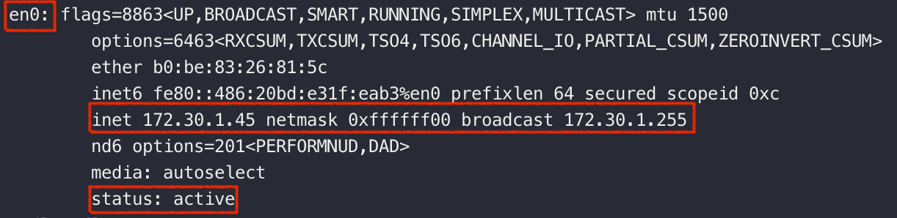
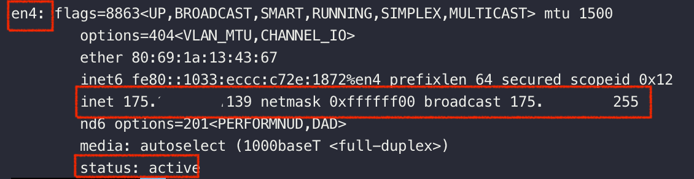

# **OSI 7 Layer - 3계층**

## 3계층이 하는 일

3계층은 다른 네트워크 대역 즉, 멀리 떨어진 곳에 존재하는 네트워크까지 어떻게 데이터를 전달할 지 제어하는 일을 담당한다.

LAN과 LAN을 연결, WAN 대역에서 통신할 때 필요.

발신에서 착신까지의 패킷의 경로를 제어한다.

 

## INTRO : 3계층에서 쓰는 주소

 

### 1. IPv4 : 현재 PC에 할당된 IP 주소

IPv4 프로토콜로 통신하기 위해서는 IP주소, 서브넷마스크, 게이트웨이가 필요하다.

#### 공인 ip : en4 인터페이스의 inet 부분

IP 주소는 임의로 우리가 부여하는 것이 아니라 전 세계적으로 ICANN이라는 기관이 국가별로 사용할 IP 대역을 관리하고, 우리나라는 한국인터넷진흥원(KISA)에서 국내 IP주소들을 관리하고 있다.

이것을 ISP(Internet Service Provider의 약자, KT, LG, SKT와 같이 인터넷을 제공하는 통신업체)가 부여받고 우리는 ISP 회사의 가입을 통해 IP를 제공받아 인터넷을 사용하게 된다. 이렇게 발급받은 IP를 공인 IP라고 한다.

#### 사설 ip : en0 인터페이스의 inet 부분

공유기를 사용한 인터넷 접속 환경일 경우 공유기(라우터)가 공인 IP를 할당 받는데

공유기에 연결되어 있는 네트워크 기기에는 사설 IP를 할당한다.

즉 사설 IP는 어떤 네트워크 안에서만 내부적으로 사용되는 고유한 주소이다. 사설 IP는 보통 내 컴퓨터에서 사용하는 로컬 IP라고도 불린다.

공인 IP는 외부, 내부 상관없이 해당 IP에 접속할 수 있으나 사설 IP는 내부에서만 접근이 가능하다.

> 사설IP 주소는 다음 3가지 주소대역으로 고정된다.
>
> > Class A : 10.0.0.0 ~ 10.255.255.255
> >
> > Class B : 172.16.0.0 ~ 172.31.255.255
> >
> > Class C : 192.168.0.0 ~ 192.168.255.255

 

### 2. 서브넷 마스크 : IP 주소에 대한 네트워크의 대역을 규정하는 것

en4 인터페이스의 netmask 뒤 부분. 16진수로 되어있는데 10진수로 바꿔보면 255.255.255.0 이다.

> 서브넷 마스크 : 클래스풀한 네트워크 대역을 나눠주는데 사용하는 값  
> 어디까지가 네트워크 대역을 구분하는데 사용하고 어디서부터 호스트를 구분하는데 사용하는지 지정

 

### 3. 게이트웨이 : 외부와 통신할 때 사용하는 네트워크의 출입구

**en4 인터페이스의 broadcast - 1**

> 게이트웨이 주소 : 해당 네트워크 대역에서 가장 작은 IP주소 +1 or 해당 네트워크 대역에서 가장 큰 IP주소 -1
>
> 브로드캐스트 주소: 해당 네트워크 대역에서 가장 큰 IP주소, 해당 네트워크 대역에 모든 시스템에 통신을 할 때 사용하는 IP

✅ en0는 wifi일 때 사용하는 인터페이스. status가 active

✅ en1~en4는 Thunderbolt 인터페이스. status가 active

✅ 아래 사진은 썬더볼트에 벨킨 독을 연결해서 이더넷 네트워크를 사용중이기 때문에 en4 네트워크 인터페이스가 활성화(status가 active) 되어 있는 것. wifi 환경일때는 en0가 활성화(status가 active)된다.

 

---

## IPv4 프로토콜

### 일반적인 IP 주소

IP 주소는 총 4bytes 구조인데, 1byte 씩 10진수로 표현한다.

1byte는 8bit이므로, 표현할 수 있는 십진수는 0~255이다.

 

### Classful IP : 이전에는 IP 주소를 Class로 나누어서 썼었다.

|            Class            |     네트워크 대역 구분      |              2진수 시작              |               2진수 끝               | 10진수 시작 |    10진수 끝    |
| :-------------------------: | :-------------------------: | :----------------------------------: | :----------------------------------: | :---------: | :-------------: |
|          A 클래스           | 0XXXXXXX, 첫 번째 필드 까지 | 0 0000000.00000000.00000000.00000000 | 0 1111111.11111111.11111111.11111111 |   0.0.0.0   | 127.255.255.255 |
|          B 클래스           | 10XXXXXX, 두 번째 필드 까지 | 10 000000.00000000.00000000.00000000 | 10 111111.11111111.11111111.11111111 |  128.0.0.0  | 191.255.255.255 |
|          C 클래스           | 110XXXXX, 세 번째 필드 까지 | 110 00000.00000000.00000000.00000000 | 110 11111.11111111.11111111.11111111 |  192.0.0.0  | 223.255.255.255 |
| D 클래스   (멀티캐스트) |          1110XXXX           | 1110 0000.00000000.00000000.00000000 | 1110 1111.11111111.11111111.11111111 |  224.0.0.0  | 239.255.255.255 |
|    E 클래스   (예약)    |          1111XXXX           | 1111 0000.00000000.00000000.00000000 | 1111 1111.11111111.11111111.11111111 |  240.0.0.0  | 255.255.255.255 |

 

A 클래스에서는 첫 번째 필드로 네트워크 대역을 구분하고 2~4 필드로 PC를 구분했다.

그렇다면 A 클래스로는 네트워크 대역을 2^7(128)개로 나눌 수 있고, 네트워크 대역 마다 2^24 개의 PC를 구분할 수 있다.

B 클래스에서는 1~2번째 필드로 네트워크 대역을 구분하고 3~4 필드로 PC를 구분한다.

그렇다면 B 클래스로는 네트워크 대역을 2^(6+8)개로 나눌 수 있고, 네트워크 대역 마다 2^16 개의 PC를 구분할 수 있다.

C 클래스에서는 3번째 필드까지를 네트워크 대역을 구분하고, 마지막 필드로 PC를 구분한다.

그렇다면 C 클래스로는 네트워크 대역을 2^(5+8+8)개로 나눌 수 있고, 네트워크 대역 마다 2^8 개의 PC를 구분할 수 있다.

 

### Classless IP

IPv4 프로토콜에서 IP 주소를 Classful하게 사용하면 사용할 수 있는 IP 주소의 개수는 2^32 즉, 약 43억개이다.

충분할 것 같지만 43억개의 IP 주소는 이미 모두 고갈되었다.

요즘 개인이 소유하고 있는 네트워크 기기도 많아졌고 개인이 사용하는 네트워크 외에도 회사, 관공서 등등 모든 곳에 네트워크가 사용되고 있고 네트워크 수요가 점점 늘어나고 있다.

심지어 Class로 네트워크 대역을 나누다보면 낭비되는 네트워크가 많이 생긴다.

그래서 요즘에는 **Classless한 IP 주소**를 사용한다.

#### 예시

<table >
  <tr>
    <td colspan='2' background-color='black' font-color='white'>
    <!-- 
 -->
    <b>192.168.32.189/26</b>
    </td>
  </tr>
  <tr>
    <td>IP 주소</td>
    <td>192.168.32.189</td>
  </tr>
  <tr>
    <td>서브넷 마스크</td>
    <td>255.255.255.192</td>
  </tr>
  <tr>
    <td>네트워크 ID</td>
    <td>192.168.32.128</td>
  </tr>
  <tr>
    <td>브로드캐스트 주소</td>
    <td>192.168.32.191</td>
  </tr>
  <tr>
    <td>사용 가능 IP 범위</td>
    <td>192.168.32.129 ~ 192.168.32.190</td>
  </tr>
</table>

> 네트워크 ID : 해당 네트워크 대역에서 가장 작은 IP주소, 해당 네트워크 대역을 대표하는 IP
>
> 브로드캐스트 주소: 해당 네트워크 대역에서 가장 큰 IP주소, 해당 네트워크 대역에 모든 시스템에 통신을 할 때 사용하는 IP
>
> 호스트 할당 가능한 주소 : 해당 네트워크 대역에서 가장 작은 IP주소 +1 ~ 해당 네트워크 대역에서 가장 큰 IP주소 -1
>
> 게이트웨이 주소 : 해당 네트워크 대역에서 가장 작은 IP주소 +1 or 해당 네트워크 대역에서 가장 큰 IP주소 -1

 

#### Classless IP에서는 서브넷 마스크로 네트워크 대역을 구분한다

어디까지가 네트워크 대역을 구분하는데 사용하고 어디서부터 호스트를 구분하는데 사용하는지 지정

서브넷 마스크는 각 필드의 숫자를 2진수로 표기했을 때 1로 시작해야 하고 1과 1사이에는 0이 올 수 없다는 규칙을 가지고 있다.

만약 서브넷 마스크가 255.255.255.192 라면

255.255.255.192 -> 11111111.11111111.11111111.11000000

이때, 해당 네트워크 대역에서 IP를 할당받을 수 있는 PC의 대수는 2^6 대이다.

192.168.32.189/26 에서 26을 prefix라 하는데, 서브넷 마스크를 2진수 변환 했을 때 1의 갯수이다.

그래서 prefix를 보면 네트워크 대역에서 할당할 수 있는 IP의 개수(2^(32-26) = 2^6)를 알 수 있다.

ex) 192.168.100.68 255.255.255.192 와 같이 IP주소와 서브넷마스크를 쓰면?
192.168.100.0와 같이 C클래스에 해당하는 네트워크를 192.168.100.0, 192.168.100.64, 192.168.100.128, 192.168.100.192와 같이 4개의 작은 네트워크 대역으로 나눈 것이고 해당 IP 주소는 2번째 네트워크에 해당하는 것이다.

Classful IP 에서는 네트워크 대역을 필드 단위, 즉 class 단위로 나누었지만 서브넷 마스크로는 더욱 쪼개서 네트워크 대역을 나눌 수 있다.

 

## 사설 IP와 공인 IP

37분 부터 시작
