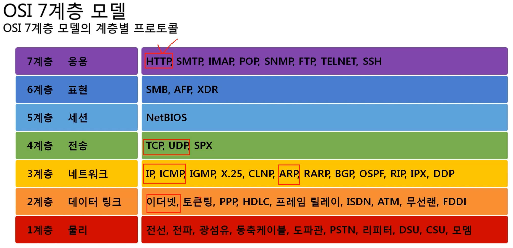
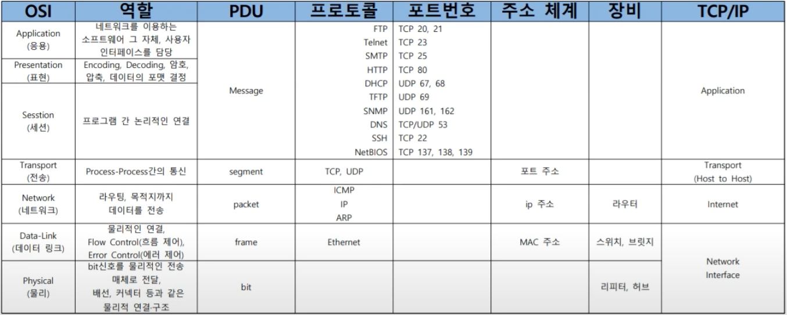
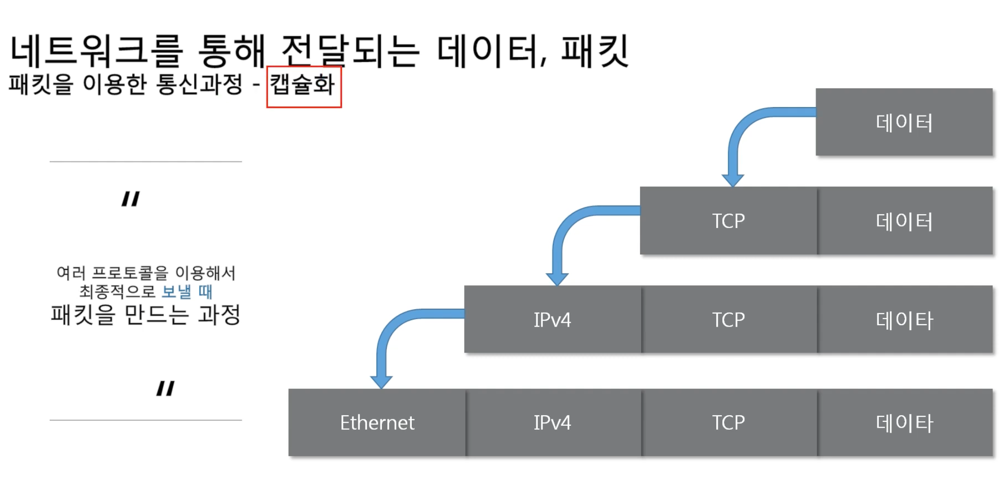
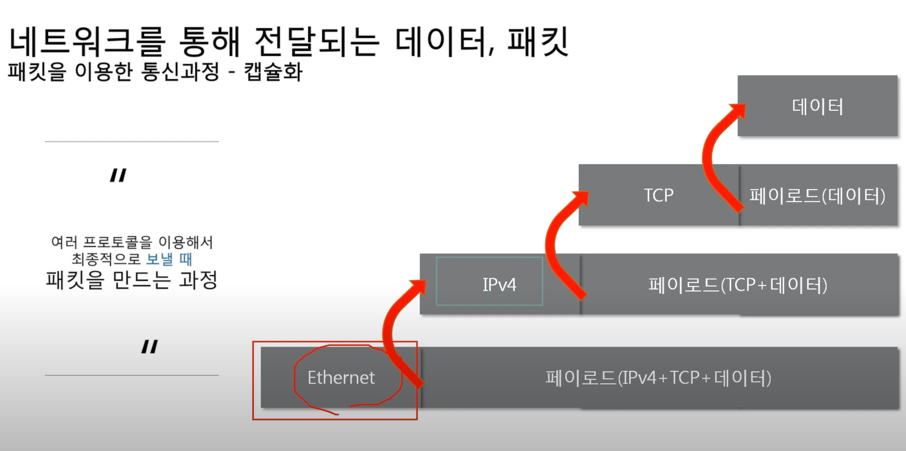
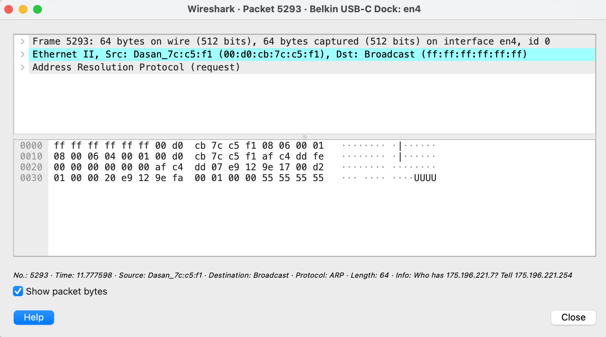
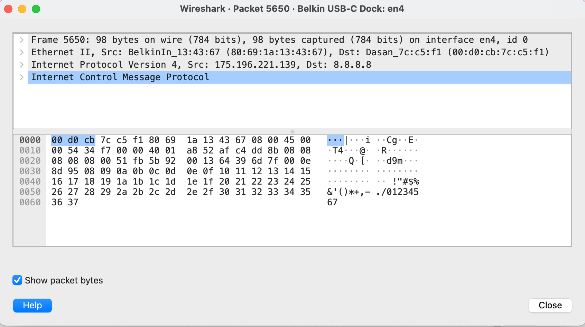

# **네트워크란 무엇인가?**

## 네트워크란

노드들이 데이터를 공유할 수 있게 하는 디지털 전기 통신망

📌 노드 : 네트워크에 속한 컴퓨터 또는 통신 장비를 뜻하는 말

<br />

## 인터넷이란

전 세계의 컴퓨터가 서로 연결되어 정보를 교환할 수 있는 하나의 거대한 네트워크

<br />

## 웹이란

인터넷 네트워크를 이용하여 통신되는 정보의 집합

<br />

## 네트워크의 분류

### 크기에 따른 분류

📌 LAN(Local Area Network) : 가까운 지역을 하나로 묶은 네트워크

📌 WAN(Wide Area Network) : 먼 지역을 묶은 네트워크, 즉 LAN과 LAN을 다시 하나로 묶은 것

📌 MAN(Metropolitan Area Network)

📌 VLAN, CAN, PAN 등등

<br />

### 연결 형태에 따른 분류

📌 Star형 : 중앙 장비에 모든 노드가 연결

<br />

일반적으로 가정집에서는 공유기를 통해서 핸드폰, 컴퓨터, TV 등등이 연결된다.

이 때 만약 공유기가 고장난다면? 네트워크를 사용할 수 없게 된다.

보통 LAN 대역을 star형으로 구성한다.

📌 Mesh형 : 여러 노드들이 서로 그물처럼 연결

📌 실제 인터넷은 여러 형태를 혼합한 혼합형으로 구성되어 있다.

<br />

## 네트워크의 통신방식

📌 유니 캐스트 : 특정 대상과만 1:1로 통신

📌 멀티 캐스트 : 특정 다수와 1:N으로 통신

📌 브로드 캐스트 : 네트워크에 있는 모든 대상과 통신

<br />

## 네트워크 프로토콜

### 프로토콜

네트워크에서 노드와 노드가 통신할 때 어떤 노드가 어느 노드에게 어떤 데이터를 어떻게 보내는지 작성하기 위한 양식

### 여러가지 프로토콜

📌 Ethernet 프로토콜 (MAC 주소) : 가까운 곳과 통신

📌 ICMP, IPv4, IPv6, ARP (IP 주소) : 멀리 있는 곳과 통신

📌 TCP, UDP (포트번호) : 여러가지 프로그램과 통신

📌 패킷
패킷방식의 컴퓨터 네트워크가 전달하는 데이터의 형식화된 블록. 여러 프로토콜들로 캡슐화 되어 있음

형식 : | Ethernet | IPv4 | TCP | 데이터 |

<br />

## 실습

### 1. 구글과 로컬 컴퓨터가 어떻게 연결되어 있는지 확인

📌 traceroute : 네트워크 연결 상태를 구체적으로 파악하는 데 사용 되는 진단 도구. 패킷이 출발지에서 목적지까지 이동하는 길목(홉) 하나 하나를 확인할 수 있다.

```bash
traceroute 8.8.8.8

traceroute to 8.8.8.8 (8.8.8.8), 64 hops max, 52 byte packets
 1  * * *
 2  211.38.36.105 (211.38.36.105)  6.499 ms  4.089 ms  4.991 ms
 3  112.189.150.113 (112.189.150.113)  5.068 ms  4.646 ms  2.653 ms
 4  112.189.159.65 (112.189.159.65)  4.940 ms
    112.189.145.201 (112.189.145.201)  4.422 ms
    112.189.145.149 (112.189.145.149)  5.702 ms
 5  * * *
 6  112.174.90.30 (112.174.90.30)  9.808 ms
    112.174.90.78 (112.174.90.78)  9.593 ms  9.644 ms
 7  112.174.84.38 (112.174.84.38)  9.948 ms
    112.174.84.22 (112.174.84.22)  11.940 ms
    112.174.84.58 (112.174.84.58)  11.843 ms
 8  142.250.165.78 (142.250.165.78)  31.711 ms
    72.14.202.136 (72.14.202.136)  36.099 ms  34.607 ms
 9  * * *
10  72.14.238.23 (72.14.238.23)  32.584 ms
    dns.google (8.8.8.8)  33.961 ms  34.320 ms
```

<br />

패킷이 지나는 홉마다의 IP 주소와 구간 별 패킷이 이동하는 시간을 체크할 수 있다.

traceroute를 사용하는 목적은 아래와 같이 정리할 수 있다.

📌 패킷이 목적지로 향하는 전체 경로를 파악할 수 있다.

📌 경로에 존재하는 라우터의 정보를 확인할 수 있다.

📌 각 경로에 도착하는데 걸리는 시간을 확인할 수 있다.

결론적으로 통신에 문제가 있을 때 구체적으로 어디에서 패킷이 막히는 건지, 속도가 지연되는 건지를 확인할 수 있다.

어쨌든, traceroute 키워드를 통해 로컬 컴퓨터(출발지)와 google(목적지)이 어떻게 연결이 되어있는지 확인할 수 있다.

<br />

### 2. 프로토콜 직접 확인해보기

Wireshark를 이용하여 현재 컴퓨터에서 인터넷을 통해 주고받고 있는 모든 내용을 직접 확인해보기.

<br />

---

# **네트워크 모델**

## TCP/IP 모델

📌 1960년대 말 미 국방성의 연구에서 시작되어 1980년대 초 프로토콜 모델로 공개

📌 현재의 인터넷에서 컴퓨터들이 서로 정보를 주고받는데 쓰이는 통신규약(프로토콜) 모음이다.

📌 총 4가지 계층으로 이루어져 있다.

1계층 : 네트워크 인터페이스

2계층 : 네트워크

3계층 : 전송

4계층 : 응용

<br />

## OSI 7계층

1984년 네트워크 통신을 체계적으로 다루는 ISO에서 표준으로 지정한 모델

데이터를 주고 받을 때 데이터 자체 흐름을 각 구간별로 나눠 놓은 것

<br />



<br />

| 계층 |    이름     | 내용                                                                                                                |
| :--: | :---------: | :------------------------------------------------------------------------------------------------------------------ |
|  7   |    응용     | 여러가지 서비스를 제공하는 실질적인 프로그램, 사용자 인터페이스                                                     |
|  6   |    표현     | 데이터를 어떤 형식으로 전달할지 정하는 계층 ex)그림파일(jpeg,png), 압축파일(zip,tar.gz), 일반 텍스트                |
|  5   |    세션     | 논리적인 연결을 정의하는 계층, 네트워크 장치들 간의 연결 설정의 유지 동기화 등을 어떻게 수행할지를 정의             |
|  4   |    전송     | 포트주소를 이용해서 통신, 오류 제어(신뢰성 유무), 특정 프로그램 간의 통신(웹브라우저 and 웹서버)                    |
|  3   |  네트워크   | IP주소를 이용해서 통신, 전송 경로를 선택하여 어느 경로로 가는 것이 최선인지를 결정, 특정 네트워크를 찾아가는 역할   |
|  2   | 데이터 링크 | MAC 주소를 이용해서 통신, 특정 네트워크에서 특정 PC를 찾아가는 역할                                                 |
|  1   |    물리     | 상위 계층에서 캡슐화된 데이터를 bit bit 단위로 변경, 전기 신호로 전송하고 받은 전기 신호를 bit 단위로 해석하는 역할 |

<br />



<br />

## OSI 7계층과 TCP/IP의 공통점과 차이점

### 공통점

계층적 네트워크 모델

계층간 역할 정의

### 차이점

계층의 수 차이

OSI는 역할 기반, TCP/IP는 프로토콜 기반

OSI는 통신 전반에 대한 표준

TCP/IP는 데이터 전송기술 특화

<br />

## 패킷

패킷이란 네트워크 상에서 전달되는 데이터를 통칭하는 말로 네트워크에서 전달하는 데이터의 형식화된 블록이다.

📌 헤더 | 페이로드 | 풋터

📌 일반적으로 풋터는 잘 사용하지 않는다.

<br />

패킷은 제어정보와 사용자 데이터로 이루어지며 사용자 데이터는 페이로드라고도 한다.

📌 패킷 제어정보에는 순서가 있다.

📌 패킷은 여러 프로토콜로 캡슐화 된다.

<br />

#### <u>캡슐화</u> : 여러 프로토콜을 이용해서 데이터를 **보낼 때** 패킷을 만드는 과정



하위계층의 프로토콜이 마지막(앞 쪽)에 붙는다.

TCP는 4계층, IPv4는 3계층, Ethernet은 2계층이다.

<br />

#### <u>디캡슐화</u> : 패킷을 **받았을 때** 프로토콜들을 하나씩 확인하면서 데이터를 확인하는 과정



<br />

## PDU(Protocol Data Unit)

📌 세그먼트 : 4계층의 PDU(TCP + data)

📌 패킷 : 3계층의 PDU(IPv4 + TCP + data)

📌 프레임 : 2계층의 PDU(Ethernet + IPv4 + TCP + data)

<br />

### 예시

#### arp 프로토콜의 패킷



<br />

#### icmp 프로토콜의 패킷



<br />

> 출처 : [네트워크 기초 - 따라하면서 배우는 IT](https://www.youtube.com/playlist?list=PL0d8NnikouEWcF1jJueLdjRIC4HsUlULi)
