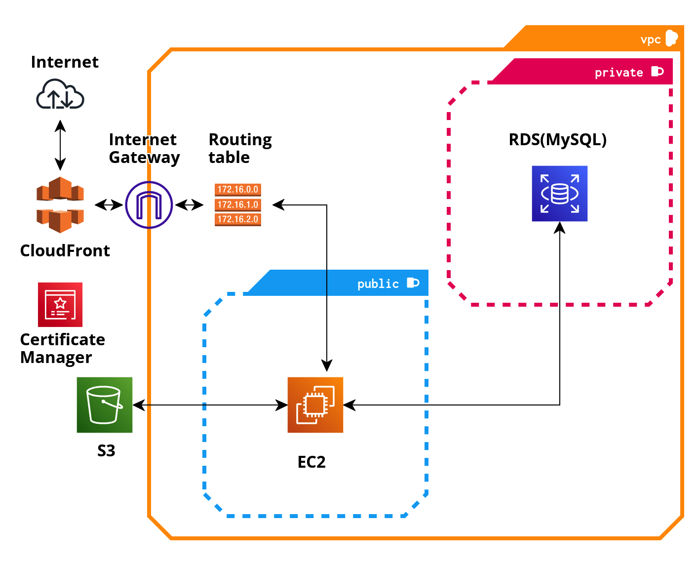

# **let's Git it 프로젝트 회고**

let's Git it은 현재(2023년 4월 기준) 운영 중이며, 실제 사용자의 피드백(버그, 의견 등)를 받아 서비스를 개선하고 있습니다.

프로젝트 운영을 시작한 지 한 달이 훌쩍 지났지만, 프로젝트를 진행하면서 학습한 내용과 고민들을 정리해둘 필요를 느껴 회고를 작성합니다. 자세한 내용은 게시물로 정리해두었으며 각 항목에 링크를 걸어두었습니다.

> 링크가 있는 항목은 밑줄이 그어져 있습니다. 클릭하시면 자세한 회고를 확인하실 수 있습니다.
>
> 아직 추가되지 않은 회고는 내용이 정리 되는 대로 수시로 업데이트 될 예정입니다.

 

## **📌 기획의도**

처음 프로젝트를 기획할 당시 유저들의 사용자 기반의 피드백을 받고, 서비스를 개선하는 경험을 하고 싶었습니다.

lets Git it은 사용자가 가볍고 재미있게 이용해볼 수 있으면서 나름의 의미도 있는 서비스를 기획하고자 했습니다.

이러한 기획 의도 아래 let's Git it이 탄생하게 되었습니다.

 

## **📌 let's Git it 소개**

📆 2023.01.11 ~ 2023.03.02 (서비스 운영중)  

let's Git it은 **개발 동기부여를 위한 깃허브 랭킹 서비스**입니다. 랭킹 산출에 필요한 데이터는 Github 유저들의 사용 데이터(pr, commit, fork, star 등) 14가지를 기반으로 점수를 산출하여 랭킹을 제공하고 있습니다.

주요 기능으로는 Top 100 ranker의 목록과 자신의 랭킹과 티어 검색 및 지표 분석 제공, 랭킹 및 지표를 타인과의 비교할 수 있는 기능, 그리고 개발 관련 질문과 사이드 프로젝트, 채용 정보 등을 공유할 수 있는 커뮤니티 게시판이 있습니다.

**(이 글을 보신 분이라면 링크 눌러서 랭킹을 한 번 확인해보세요~!)**

✅ let's GIT it 서비스 바로가기 : https://let-s-git-it.vercel.app

✅ let's GIT it 깃허브 레포지토리 : https://github.com/applleeee/Lets-Git-It

 

 

---

## **프로젝트를 진행하며 성장한 점(요약)**

### ✅ **[다양한 웹 취약점에 대해 알고 공격에 대한 보안 조치를 취할 수 있게 되었다.](https://growth-msleeffice.tistory.com/146)**

프로젝트 개선을 논의하는 과정에서 로그인 시 주어지는 accessToken의 보안 취약점에 대해 생각해보게 되었다. accessToken도 권한 부여를 위해 페이로드에 개인정보가 담기기 때문이다. 그래서 웹 보안에 대해 알아보게 되었고 대표적인 취약점 공격인 XSS, CSRF 공격에 대해 학습했다.

이러한 점들을 고려하여, 엑세스 토큰 탈취를 차단하기 위해 accessToken을 브라우저에서 접근할 수 없도록 브라우저 자바스크립트 내에 private 변수로 받아서 사용하는 방법을 적용하기로 했다. 이 경우, 화면이 다시 랜더링되면 accessToken이 사라지기 때문에 accessToken을 다시 발급 받을 수 있도록 refreshToken을 발행했다.

 

### ✅ **[CORS 정책의 기본을 다질 수 있었고, 이를 고려하여 올바르게 API를 개발할 수 있게 되었다.](https://growth-msleeffice.tistory.com/147)**

현재 진행하고 있는 프로젝트의 client server와 api server는 도메인이 다르기 때문에 서로 쿠키를 주고받기 위해서는 CORS 정책을 잘 지켜줘야 한다.

그렇게 기본이라고 강조했던 CORS 정책인데. 막상 개발하려니 어렴풋하게만 알고 있다는 느낌이 들었고, 그전에 진행해온 프로젝트에서 CORS에 대해 크게 고려하지 않고 개발해왔었다는 생각이 들어 조금 부끄러웠다. 만약 CORS에 대해 잘 알았다면... client와 api 서버의 domain을 애초에 똑같게 했을 것이다.

'CORS를 잘 모르면 삽질을 많이 하게 될 것이다.', 'BackEnd의 도움 없이 FrontEnd가 CORS를 해결하는 것은 불가능하다.'는 이야기를 들어왔던 터라, 이번 기회에 CORS 정책에 대해 정리하고 넘어가고자 한다.

 

### ✅ **소프트웨어 아키텍처와 디자인 패턴, OOP에 대해 알게 되었고, 유지보수와 재사용성을 고려한 아키텍쳐 설계 및 코드 구현을 할 수 있는 기초를 닦고 있는 중이다.**

프로젝트를 시작 할 당시, 객체지향적으로 코드를 작성하거나 아키텍쳐에 대해 잘 몰랐기 때문에 처음부터 객체지향적인 설계는 엄두도 못냈었다.

프로젝트 배포를 끝내고 나서야 기능을 변경하거나 코드를 리펙토링 하는 과정에서 고쳐야 할 것들이 눈에 너무 띄었다. 그때까지도 객체지향의 개념이 무엇인지 몰랐기 때문에, 그냥 느낌적으로 '기능 별로 묶어 놔야겠다.', '이 함수 기능이 너무 복잡한데 기능을 좀 나눠야겠다. 이 기능만 다른 누군가 쓸 수도 있잖아?' 이런 생각으로 리펙토링을 했었다.

그런데 아는 만큼 보인다고 했던가. [객체지향의 4가지 특징과 SOLID](https://growth-msleeffice.tistory.com/144)에 대해 반복 학습하고 나니 이제는 내가 작성한 코드가 뭐가 잘못 되었는지 보이기 시작했다.(어쩌면 대부분 스파게티 코드 일지도...?) 그래서 좋은 아키텍쳐를 설계하고 좋은 코드를 작성할 수 있는 개발자가 되기 위해 아키텍처, 디자인 패턴, OOP에 대해 학습 중이고 5월 중에 대대적인 리펙토링이 예정되어 있다.

 

### ✅ **나만의 학습 방향에 대해 고민하고, 확신을 갖게 되었다.**

프로젝트를 배포하기 전까지는 빠른 output에 몰두한 나머지, 새롭게 알게 된 것들을 정리하지 못했다. 그래서 개발을 완료하고 나서도 무언가 내 안에 남아있는 느낌이 들지 않았다. 프로젝트 중간 개인적인 이슈로 약 2주간 프로젝트에 참여하지 못하는 상황이 생겼기 때문에 정리하지 않으면 금방 휘발될 줄 알면서도 기능을 만들어내는데 급급할 수 밖에 없었다.

그래서 뒤늦게 그때 살펴봤던 것들을 뒤적이면서 학습한 내용을 정리하고 있다. 프로젝트 동안의 학습량이 꽤 쌓여있고 현재도 새롭게 학습하는 것들이 있기 때문에 언제 다 정리하나 막막하지만 조금씩 정리해가면서 어렴풋한 개념들이 그려지기 시작했다.

 

### ✅ **실제로 서비스를 운영하면서 사용자들의 피드백을 기반으로 프로젝트를 개선해볼 수 있는 좋은 경험이었다.**

UI/UX 관련 피드백이 주를 이루었기 때문에 담당한 기능에 대한 피드백을 받아보지는 못했지만 팀원들의 버그 수정, UI/UX와 핵심 도메인 로직을 개선 등의 과정에서 겪는 어려움을 해결할 수 있도록 아이디어와 의견들을 적극적으로 제시했고 스크럼 회의를 주도했다.

또한 피드백이 없더라도 지속적으로 개선할 점들을 찾기 위해 노력했다. 그래서 보안 관련 설정이나, API 문서화, 코드의 아키텍쳐와 디자인 패턴에도 관심을 갖게 되었다. 현재도 개선해야 할 점이 한 두 가지가 아닌 것 같아서 고군분투 중이다.

 

### ✅ **간단한 AWS infrastructure 기반의 CI/CD 파이프라인을 구축할 수 있게 되었다.**

api를 개발하는 경험에 비해 DevOps 경험이 비교적 적었기 때문에, 실제 서비스를 운영할 AWS Cloud Infra 구축 방법을 빠르게 학습하여 output을 내는 것을 프로젝트 동안 최우선점으로 두었다.

그 과정에서 network 관련 학습이 필요하다고 느껴 꾸준히 [Network 관련 CS 지식을 학습, 정리하여 포스팅](https://growth-msleeffice.tistory.com/category/Network) 하는 것을 시작했다.

 

### ✅ **Nest.js, Typescript Skill이 향상되었다.**

 

---

## **📌 담당 역할 소개 및 상세**

### **1. Auth API 개발**

✅ Github oauth 2.0 기반 인증 API, JWT를 이용한 인가 API 개발

> 🛠️ [인증/인가 과정에서 XSS, CSRF 보안 개선 사례](https://growth-msleeffice.tistory.com/146)
>
> 🔜 Cross-Site 간 cookie를 주고 받기 위한 CloudFront 설정 방법(포스팅 예정)

✅ 유저의 활동 정보(post, comment 관련)를 담은 user 객체 반환하는 권한 부여 로직 개발(guard, strategy)

✅ accessToken 재발급, 로그아웃 API 개발

 

### **2. Comment API 개발**

✅ depth, groupOrder attribute를 활용한 게시판 댓글/대댓글 CRUD API 개발

✅ 게시판 댓글/대댓글 좋아요 생성/삭제 API 개발

 

### **3. User API 개발**

✅ 마이페이지 조회/수정 API 개발

 

### **4. Database schema 설계**

 

### **5. DevOps**

✅ **브라우저와 서버 통신 간 보안 향상을 위해 API 서버에 HTTPS 적용**

> 🔜 Certificate Manager와 Route 53을 활용한 https 설정

✅ AWS infrastructure 구축

> 🔜 (회고 포스팅 예정)

✅ CI/CD 파이프라인 구축

> 🔜 (회고 포스팅 예정)

 

### **6. 기타**

✅ 컨트롤러, 서비스, 레포지토리 레이어의 Unit test 작성

✅ [효율적인 API 문서 관리를 위한 Swagger 도입](https://growth-msleeffice.tistory.com/108)

✅ httpExceptionFilter 작성

 

---

## **💻 Stack**

✅ TypeScript([NestJS](https://growth-msleeffice.tistory.com/101)), TypeORM, MySQL

✅ AWS EC2, RDS, VPC, S3, Route 53, CloudFront, Certificate Manager, System Manager

✅ Docker, GitHub Actions, Jest

 

---

## **📝 필요 개선 사항(As Is To Learn! 😁)**

**1. (학습 중) 코드의 유지보수성, 재사용성, 확장성 개선을 위한 리펙토링**

✅ DB 중심의 아키텍쳐를 도메인 중심 구조로 전환하여 유지보수성 개선(layered pattern -> hexagonal architecture & Domain Driven Design) (학습중)

✅ OOP를 적용하여 코드의 재사용성과 유지보수성 개선(학습중)

✅ [SOLID 원칙](https://growth-msleeffice.tistory.com/144), 클린코드 적용하여 리펙토링 예정

✅ 순환 참조 문제, 불필요한 공급자 주입 등 구조 개선

**2. (예정) DB 성능 최적화**

✅ query 성능 최적화

✅ CQRS 적용

**3. (예정) 에러 로깅 시스템 구축**

**4. (예정) CloudFront 엣지 로케이션 캐싱 적용**

**5. (예정) API SERVER 로드밸런싱 적용**

 
