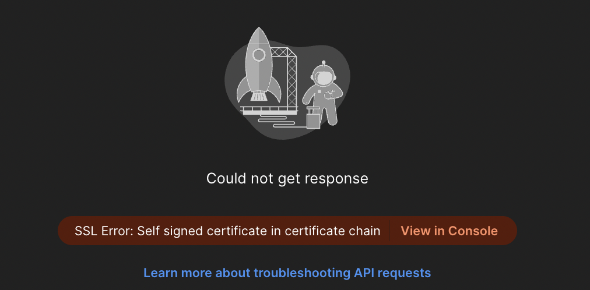
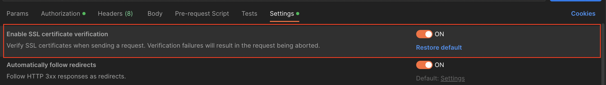

# **[Nest.js] 로컬에서 https 서버 구동하고 postman으로 테스트 하기**

진행하고 있는 프로젝트에서 refresh token을 secure, httpOnly 옵션으로 쿠키에 담아 전송해주기로 했다. 그런데 프로덕트 api 서버가 https 서버로 세팅되어 있기 때문에 로컬에서 쿠키가 전송되는지 테스트를 하기 위해서는 로컬 서버도 https로 구동해야 했다. 그래서 mkcert라는 라이브러리를 사용하여 postman으로 쿠키를 확인할 수 있도록 세팅했다.

<br>

### 1. mkcert로 인증서 만들기

1-1. 설치

```
npm install -g mkcert
```

1-2. CA 만들기

```
mkcert -install

mkcert -CAROOT #CA 저장 위치 확인
```

1-3. 인증서 만들기

```
mkcert -cert-file [cert file 경로] -key-file [cert key file 경로] localhost
```

> 출처 : https://www.npmjs.com/package/mkcert

<br>
<hr>

### 2. https sever 설정

```ts
async function bootstrap() {
  const ssl = process.env.SSL === 'true' ? true : false;
  let httpsOptions = null;
  if (ssl) {
    httpsOptions = {
      key: readFileSync(process.env.SSL_KEY_PATH),
      cert: readFileSync(process.env.SSL_CERT_PATH),
    };
  }
  const app = await NestFactory.create(AppModule, { httpsOptions });
}

  app.enableCors({
    origin: process.env.CORS_ORIGIN || process.env.CORS_LOCAL_ORIGIN,
    methods: ['GET', 'POST', 'DELETE', 'PUT', 'PATCH', 'OPTIONS'],
    credentials: true,
  });

  app.use(cookieParser(process.env.COOKIE_SECRET_KEY));

  const PORT = process.env.PORT;

  await app.listen(PORT);
}

bootstrap();
```

<br>
<hr>

### 3. postman으로 통신하기

위와 같이 설정한 후 서버를 실행하여 postman 통신을 하면 아래와 같은 오류가 뜬다.

```
SSL Error: Self signed certificate in certificate chain
```

이와 같은 오류는 다음과 같은 이유로 발생한다.



> chatGPT : 자체 서명된 인증서의 경우 인증서는 신뢰할 수 있는 타사 인증 기관(CA)에서 서명한 것이 아니라 서버 자체에서 생성하고 서명한 것입니다. 클라이언트는 인증서의 진위를 확인할 수 없기 때문에 "인증서 체인에 자체 서명된 인증서"라는 오류 메시지가 표시됩니다.

<br>

이런 이유 때문에, postman으로 자체 서명된 인증서로 만든 https 서버에 테스트를 하고자 한다면 **Enable SSL certificate verification** 옵션을 on에서 off로 바꿔주면 통신이 가능해진다.



<br>
<hr>

> [출처] <br> - https://docs.nestjs.com/faq/multiple-servers <br> - https://github.com/Subash/mkcert/blob/8a03d4eef7aed843e3707d1490cdf13fffab2cf9/readme.md
