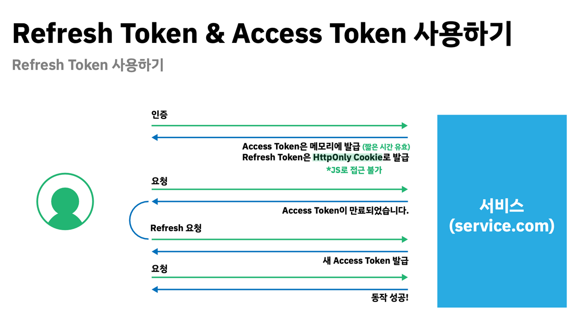

# **인증/인가 과정에서 XSS, CSRF 보안 개선 사례**

프로젝트 개선을 논의하는 과정에서 로그인 시 주어지는 accessToken의 보안 취약점에 대해 생각해보게 되었다.

원래는 회원가입 이후의 인증과 인가에 JWT로 만든 accessToken만을 사용했다. 그리고 api 서버에서 반환된 accessToken은 브라우저의 localStorage에서 관리되었다. 하지만, 이렇게 accessToken이 브라우저에서 쉽게 접근할 수 있게 노출되어 있는 것이 계속 마음에 걸렸다. 로컬 스토리지에 저장된 토큰을 jwt.io에서 decode하면 페이로드를 볼 수 있기 때문이다. 물론 accessToken에 담겨있는 유저의 정보는 인가에 필요한 최소한의 정보만 담고 있지만, 그것도 어쨌든 개인정보이기 때문에 조치가 필요해 보였다.

그래서 웹 보안에 대해 알아보게 되었고 대표적인 취약점 공격인 XSS, CSRF 공격에 대해 알게되었다. 해당 공격에 대한 자세한 내용은 [별도로 작성한 글](https://growth-msleeffice.tistory.com/114)에서 확인할 수 있다.

고심 끝에 엑세스 토큰 탈취를 차단하기 위해, accessToken을 브라우저에서 접근할 수 없도록 브라우저 자바스크립트 내에 private 변수로 받아서 사용하는 방법을 적용하기로 했다. 이 경우, 화면이 다시 랜더링되면 accessToken이 사라지기 때문에 accessToken을 다시 발급 받을 수 있도록 refreshToken을 발행했다.

refreshToken은 브라우저에 저장되어 있어야 하는데, 로컬 저장소에 저장하는 것은 accessToken처럼 XSS 공격에 취약하다는 문제를 갖게 된다. 따라서, refreshToken은 cookie에 담아 보내주기로 했다. cookie 또한 XSS 공격에 취약하지만 httpOnly 옵션을 주어서 브라우저에서 쿠키에 접근할 수 없도록 했고, secure 옵션을 주어서 https 통신일 때만 쿠키를 사용할 수 있게 하여 XSS 취약점을 보완했다.

결론적으로, accessToken은 브라우저 코드 내의 private 변수로 사용, refreshToken은 httpOnly cookie로 발행해 XSS 공격을 방어한다. CSRF 공격은 referrer 검증 또는 CSRF 토큰을 발행해 대부분의 공격을 방어할 수 있다고 한다. 다만, referrer check의 경우, 변조 프로그램으로 referrer를 쉽게 조작할 수 있다고 하니 CSRF 토큰 발행을 하는 것이 나아보인다.

이러한 사항들을 반영하여 개발을 완료했다. 하지만, 이러한 코드를 AWS 인프라로 배포하는 과정에서 생각지 못한 문제들을 겪게 되었고 코드를 수정하는 것 보다, 이러한 이슈들을 해결하는데 더욱 많은 시간을 쓰게되었다. 어떠한 문제들을 겪었고 어떻게 해결했는지 이 글과 함께 연결하여 반드시 정리해 두어야겠다는 생각이 들었기 때문에, 정리가 되는대로 이 글에서도 참조할 수 있도록 링크를 추가할 예정이다.

> 참고 :
>
> \- [JavaScript 보안 가이드 1편 - 입력데이터 검증 및 표현](https://blog.medianavi.kr/2023-01-27-javascript-secure-guide-part1/)
>
> \- [CSRF(Cross-Site Request Forgery) 공격과 방어](https://junhyunny.github.io/information/security/spring-boot/spring-security/cross-site-reqeust-forgery/)

<br />

---

## **새롭게 알게 된 것**

✅ 다양한 웹 취약점에 대해 알고 공격에 대한 보안 조치를 취할 수 있게 되었다. 그리고 https가 만능이 아니라는 생각이 들었다.

✅ [CORS 정책의 기본](https://growth-msleeffice.tistory.com/147)을 다질 수 있었고, 이를 고려하여 올바르게 API를 개발할 수 있게 되었다.

<br />

---

## **기존의 Login 및 권한부여 방식**


> 출처 : https://velog.io/@yaytomato/%ED%94%84%EB%A1%A0%ED%8A%B8%EC%97%90%EC%84%9C-%EC%95%88%EC%A0%84%ED%95%98%EA%B2%8C-%EB%A1%9C%EA%B7%B8%EC%9D%B8-%EC%B2%98%EB%A6%AC%ED%95%98%EA%B8%B0

**📌 1. 로그인 시도** : github code를 body에 담아 post 요청

<br />

**📌 2. JWT 생성** : github code로 github access token을 받아와서 github access token으로 github에 있는 user 정보에 접근(userName, github id 등)하여 우리 DB에 있는 유저인지 확인 후 등록되어 있는 유저이면 JWT(accessToken) 생성

<br />

**📌 3. AccessToken return** : accessToken을 Response body에 담아 return

<br />

**📌 4. 브라우저 저장** : accessToken을 브라우저의 LocalStorage에 담아 저장

<br />

**📌 5. Authorization request(권한 부여 요청)** : 인가(Authorization)가 필요한 리소스에 접근할 때 마다 request header Authorization에 accessToken을 담아서 요청.

<br />

**📌 6. 유효성 체크** : accessToken을 AuthGuard를 활용하여 토큰의 만료기한이 지났는지, 우리가 만들어준 토큰인지, 토큰에 담긴 유저 식별 정보가 올바른지 검증한 후 리소스에 접근할 권한을 부여(Authorization).

<br />

**📌 7. 로그아웃** : 로그아웃 시 브라우저에 저장된 accessToken을 삭제한다.

<br />

## **기존 로직의 문제**

📌 **1. JWT는 개인정보** : 유저 식별 정보가 담겨있기 때문에 개인정보나 다름 없다.

<br />

📌 **2. 토큰 만기** : 토큰의 만기는 30분이나, 짧은 유효기간으로 인해 잦은 로그인이 불편할 것으로 예상되어 토큰의 만기를 검증하지 않도록 설정되어 있음.

<br />

📌 **3. token을 localStorage에 token 저장** : accessToken의 탈취가 쉬움

→ 세 가지 문제가 복합적으로 작용하여 보안 문제를 겪을 수 있음.

<br />

---

## **개선 방향**

✅ accessToken은 인가(Authorization)용, refreshToken은 accessToken 재발급 용으로 사용됩니다.

✅ refreshToken을 secure httpOnly 쿠키로, accessToken은 JSON payload로 받아와서 웹 어플리케이션 내 로컬 변수로 이용.

✅ 이를 통해 CSRF 취약점 공격 방어하고, XSS 취약점 공격으로 저장된 유저 정보 읽기는 막을 수 있음

✅ 하지만 XSS 취약점을 통해 API 콜을 보낼 때는 무방비하니 XSS 자체를 막기 위해 서버와 클라이언트 모두 노력해야 함

<br />

### **변경된 Login 및 권한부여 방식**



> 사진 출처 : 원티드 프리온보딩 3월 프론트엔드 강의자료

📌 **1. 로그인 시도** : 기존과 동일

<br />

📌 **2. JWT 생성** : 기존과 동일하게 accessToken 생성하고 추가로 refreshToken을 생성하고 암호화하여 DB에 저장.

정상적인 사용자는 기존의 accessToken으로 접근하며 accessToken이 만료된 경우 서버에서는 데이터베이스에 저장된 refreshToken과 검증 후 새로운 accessToken을 발급한다.

<br />

📌 **3. refreshToken, accessToken 반환** : refreshToken은 응답 쿠키에 httpOnly secure signed 옵션을 적용하여 담고, accessToken은 body에 담아 return.

이때의 이슈는 **same origin이 아닌 경우 secure cookie를 브라우저에 저장할 수 없다.** 이럴 때는 reverse proxy 서버를 두고 cors를 우회하거나 아래의 cors 설정을 통해 서로 다른 도메인간 쿠키를 주고받을 수 있다.

✅ cross-site 간 리소스 공유 시, 브라우저는 credentials 모드가 include인 경우 모든 요청에 인증 정보를 담게 된다.

서버는 응답 시, 모든 요청을 허용한다는 의미의 **Access-Control-Allow-Origin** 헤더에 \*(와일드카드)를 사용하면 안되고, 반드시 **명시적인 URL**을 지정해야 한다.

또한 응답 헤더에는 반드시 **Access-Control-Allow-Credentials : true**가 존재해야 한다,

✅ CORS 응답에 설정된 쿠키에는 일반적인 third-party cookie 정책이 적용된다.

따라서, cross-site간 cookie를 주고 받기 위해서는 **sameSite 속성을 'none'으로 변경하고 쿠키를 secure 쿠키**로 만들어 주어야 한다.

✅ CORS에 대한 자세한 내용은 [이 글](https://growth-msleeffice.tistory.com/147)에서 확인할 수 있다.

<br />

📌 **4. accessToken이 만료된 경우 또는 페이지 새로고침으로 메모리에서 사라진 경우** : refreshToken으로 accessToken을 재발급 받는다. 이 때, refreshToken의 만기까지 절반 이상 지난 경우 refreshToken을 재발급한다.

<br />

📌 **5. 로그아웃** : 로그아웃 시 api 요청을 통해 db 서버에 저장된 refreshToken을 삭제하고 브라우저의 캐쉬를 삭제하는 응답을 보낸다.

<br />

### **✅ 결론 : CORS를 사용하려면 클라이언트와 서버가 Access-Control-\*\* 류의 Header를 주고 받도록 설정이 되어있어야 한다.**

<br />

---

### **예시 코드**

```js
// 아래 코드는 예시 코드로, 실제 프로젝트의 코드와는 다릅니다.

// main.ts
async function bootstrap() {

  const app: NestExpressApplication = await NestFactory.create(AppModule);
  // other something...
  app.enableCors({
      origin: `https://${process.env.CORS_ORIGIN}`,
      methods: ['GET', 'POST', 'DELETE', 'PUT', 'PATCH', 'OPTIONS'],
      credentials: true,
  })
  // other something...
  await app.listen(PORT);
}
bootstrap()

// auth.controller.ts
const login = (req, res) => {
  // do something...
  const refreshToken = this.authService.getCookieWithRefreshToken();

  await this.userService.saveRefreshToken(refreshToken, userId);

  res
    .cookie('x_auth', refreshToken, {
      domain: `https://${process.env.CORS_ORIGIN}`,
      path: '/',
      httpOnly: true,
      maxAge: Number(jwtConstants.jwtRefreshExpiresIn) * 1000,
      sameSite: 'none' as const,
      secure: true,
      signed: true,
    })
    .json({ success: true });
};
```
