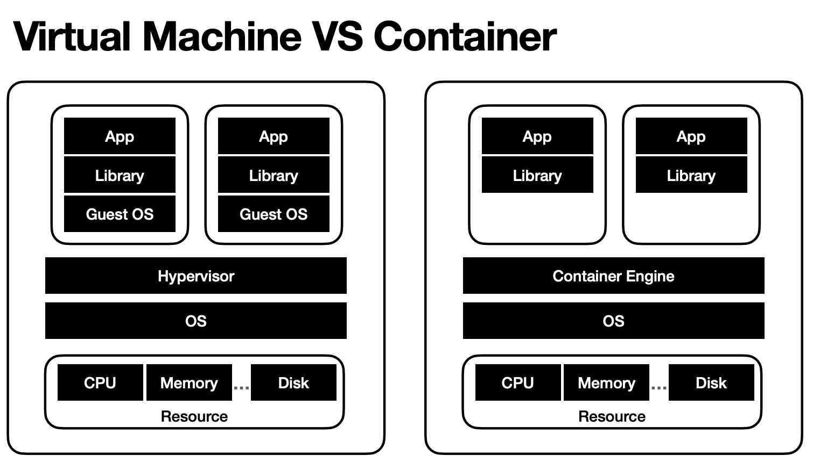
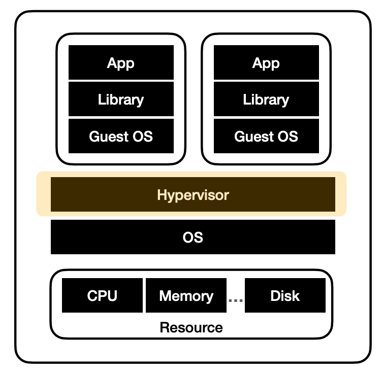
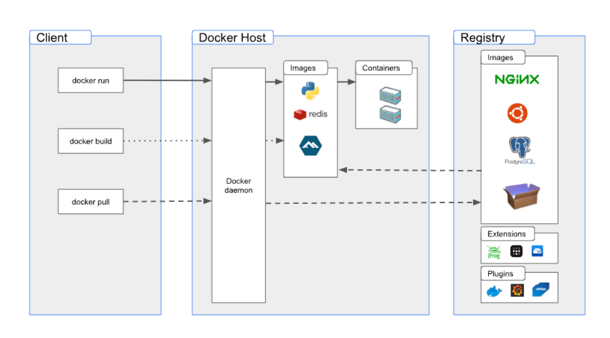
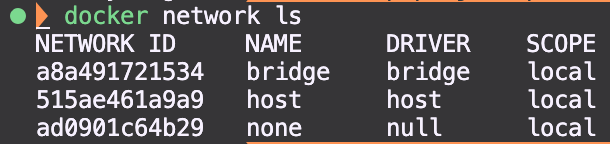
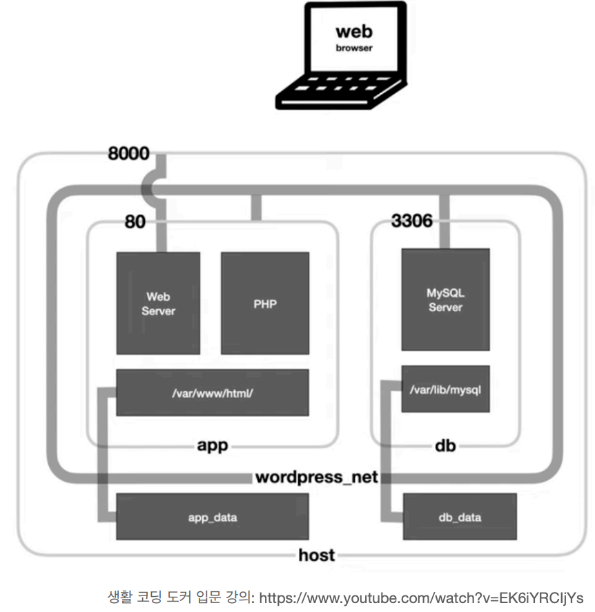

# 컨테이너 기술과 Docker의 기본 개념에 대해 알아보자!

### 도커란 무엇일까

- **컨테이너** 기반 **가상화** 도구
- 애플리케이션을 **컨테이너**라는 단위로 격리하여 실행하고 배포하는 기술

### 컨테이너란 무엇일까



- 컨테이너는 **가상화 기술** 중 하나
  - 리눅스 컨테이너 기술인 LXC(Linux Containers) 기반
- 애플리케이션을 컨테이너라는 단위로 격리하여 실행하고 배포하는 기술
- 다양한 운영체제에서 사용할 수 있으며, 컨테이너화된 애플리케이션을 손쉽게 빌드, 배포, 관리할 수 있는 다양한 기능을 제공
- 위 기능들을 통해 애플리케이션을 빠르게 개발하고, 효율적으로 배포, 관리할 수 있음

### 가상화(virtualiztion) 기술이란

- **하나의 물리적인 컴퓨터 자원**(CPU, 메모리, 저장장치 등)을 **가상적으로 분할**하여 여러개의 **가상 컴퓨터 환경**을 만들어내는 기술.
- 이를 통해 물리적인 컴퓨터 자원을 더욱 **효율적**으로 사용할 수 있으며, 서버나 애플리케이션 등을 운영하는데 있어 **유연성**과 **안정성**을 제공한다.



- 하이퍼바이저 (Hypervisor) 란?
  - 가상 머신(Virtual Machine, VM)을 생성하고 구동하는 소프트웨어
  - OS에 자원을 할당 및 조율
  - OS들의 요청을 번역하여 하드웨어에 전달

### Docker Architecture



- 도커 데몬(Docker daemon = dockered)
  - 도커 엔진의 핵심 구성요소
  - 도커 호스트에서 컨테이너를 관리하고 실행하는 역할
  - 컨테이너를 생성, 시작, 중지, 삭제하는 등의 작업을 수행
  - 컨테이너 이미지를 관리하고 외부에서 이미지를 다운로드하고 빌드하는 작업을 수행
- 도커 클라이언트
  - 도커와 상호작용
  - docker 명령어를 사용하면 Docker daemon으로 보내어 실행
- 도커 오브젝트
  - 도커 이미지 : 도커 컨테이너를 만들기 위한 읽기 전용 템플릿
  - 도커 컨테이너
    - 한 도커 이미지의 실행 가능한 인스턴스
    - 애플리케이션을 실행하기 위한 모든 파일과 설정 정보를 포함하는 패키지
  - 도커 레지스트리
    - 도커 이미지를 관리하고 저장하는곳
      - Docker hub : 디폴트 레지스트리, 누구나 접근 가능한 공개형 저장소

---

<br>

# 로컬 환경에서 도커를 활용해보자!

- 도커 컴포즈란 무엇인가?
- 도커 컴포즈 설정파일
- 도커 컴포즈를 활용하여 워드 프레스 서비스 실행하기

### 도커 컴포즈란?

- Compose 파일은 Docker 애플리케이션의 서비스, 네트워크 및 볼륨을 정의하는 YAML 파일입니다.

[https://docs.docker.com/compose/compose-file/](https://docs.docker.com/compose/compose-file/)

- 도커 컨테이너를 일괄적으로 정의하고 제어하는 도구
- 설정 파일을 도커 CLI로 번역하는 역할

### 도커 컴포즈 파일 구성

- version
- services
  - 실행하려는 컨테이너들을 정의하는 역할
  - 이름, 이미지, 포트매핑, 환경변수, 볼륨 등을 포함
  - 해당 정보를 가지고 컨테이너를 생성하고 관리
  - image : 컨테이너를 생성할 때 쓰일 이미지 지정
  - build : 정의된 도커파일에서 이미지를 빌드해 서비스의 컨테이너를 생성하도록 설정
  - environment : 환경변수 설정, docker run 명령어의 —env, -e 옵션과 동일
  - command : 컨테이너가 실행될 때 수행할 명령어, docker run 명령어의 마지막에 붙이는 커맨드와 동일
  - depends_on : 컨테이너 간의 의존성 주입, 명시된 컨테이너가 먼저 생성되고 실행
  - port : 개방할 포트 지정, docker run 명령어의 -p와 동일(포트포워딩)
  - expose : 링크로 연계된 컨테이너에게만 공개할 포트 설정
  - volumes : 컨테이너에 볼륨을 마운트함
  - restart : 컨테이너가 종료될 때 재시작 정책
    - no: 재시작 되지 않음
    - always : 외부에 영향애 의해 종료되었을 때 항상 재시작(수동으로 끄기 전까지)
    - on-faliure : 오류가 있을 시에 재시작

### 도커 컴포즈 명령어

- 컨테이너 생성

  ```bash
  docker-compose -f [yml 파일명] up -d
  ```

  - -f : 도커 컴포즈 파일 지정하기
  - up: 도커 컴포즈 파일로, 컨테이너를 생성하기
  - -d : 백그라운드에서 실행하기

- 사용하지 않는 네트워크 삭제

  ```bash
  docker network prune
  ```

- 도커 네트워크 리스트 조회

  ```bash
  docker network ls
  ```

  

  > bridge : 도커 엔진에 의해 자동으로 생성되는 가상 네트워크. 컨테이너끼리 연결되는 기본 네트워크\
  > host : 호스트 컴퓨터의 네트워크 인터페이스를 그대로 사용하는 네트워크\
  > none : 네트워크를 사용하지 않는 컨테이너

- 도커 네트워크 생성

  ```bash
  docker network create [네트워크명]
  ```

- 실행중인 컨테이너 중지
  ```bash
  docker stop $(docker ps -aq)
  ```

# Q&A

- 볼륨이란 ?
  쉽게말해서 도커 내부에서 생성된 파일을 호스트 컴퓨터에 저장하는걸 말하는거같아요!
  컨테이너 종료될 때 내부에서 생성한 파일도 함께 삭제되는데 그때 발생할 수 있는 문제를 해결하기위해 컴퓨터의 특정 위치와 파일을 공유하는 시스템인 듯합니다!
- docker-compose.yml 의 depends_on 옵션에 db 하나가 아니라 여러 개 옵션을 나열하면 혹시 나열한 순서대로 실행이 되나요?
  depends_on 옵션에 여러 개의 서비스를 나열하면 해당 서비스들의 실행 순서를 보장할 수는 없습니다. depends_on 옵션은 단순히 해당 서비스가 시작되기 전에 필요한 다른 서비스들을 나열하는 역할을 하며, 각각의 서비스가 언제 시작될지는 Docker가 결정합니다.
  [https://docs.docker.com/compose/compose-file/compose-file-v3/#depends_on](https://docs.docker.com/compose/compose-file/compose-file-v3/#depends_on)
- 아래 YAML 파일에서 volumes에 호스트의 볼륨에 어떠한 설정 파일들을 미리 넣어두고 build를 하면 컨테이너의 볼륨에도 반영이 된다고 볼 수 있을까요?
  yes

  ```yaml
  version: '3.0'

  services:
    db:
      image: mysql:latest
      volumes:
        - ./db_data:/var/lib/mysql
      restart: always
      environment:
        MYSQL_ROOT_PASSWORD: root_pass
        MYSQL_DATABASE: wordpress
        MYSQL_USER: docker_pro
        MYSQL_PASSWORD: docker_pro_pass

    app:
      depends_on:
        - db
      image: wordpress:latest
      volumes:
        - ./app_data:/var/www/html
      ports:
        - '8000:80'
      restart: always
      environment:
        WORDPRESS_DB_HOST: db:3306
        WORDPRESS_DB_NAME: wordpress
        WORDPRESS_DB_USER: docker_pro
        WORDPRESS_DB_PASSWORD: docker_pro_pass
  ```

  

- 만약 실무에서 docker compose로 빌드하게 되면 기존에 만약 db를 올리고 다시 down 하고 up하면 db는 그대로 있는걸까요?
  host와 volume으로 마운트 해놓으시면 내렸다가 올리셔도 유지된다. 즉 volumes 옵션이 없다면, 이전의 db는 사라진다고 보면 된다.
- 요새는 인스턴스로 redis, mysql 이런 것들도 많이 잘 나와있던데, 보통 현업에서 배포할 때에 docker-compose로 서버랑 DB랑 같이 묶어서 배포하나요? 아니면 따로 인스턴스로 따서 하나요?
  지금 실습한 것은 로컬의 테스트 환경을 쉽게 구축 하는 법을 배운 것이라고 보면 된다. 실제 서비스를 운영할 때는 이렇게 안한다.
