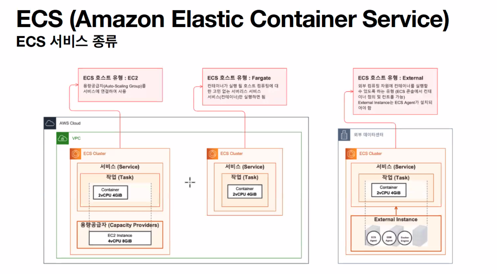
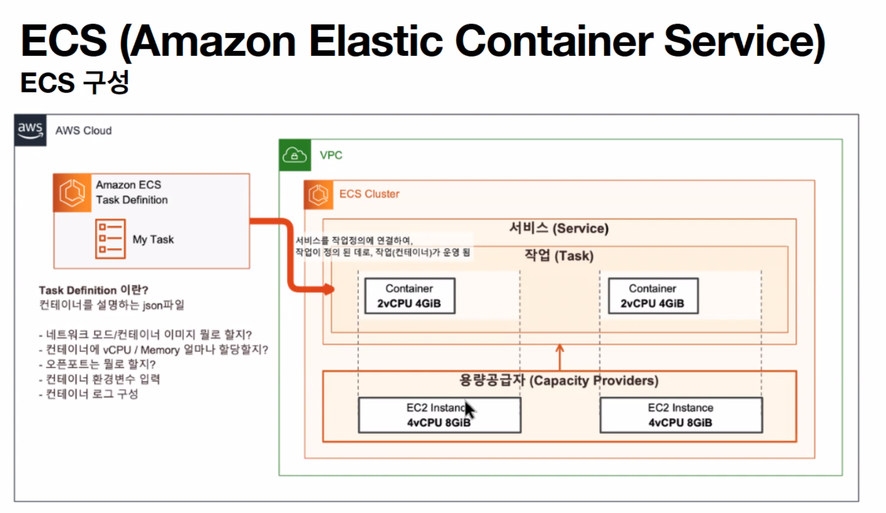
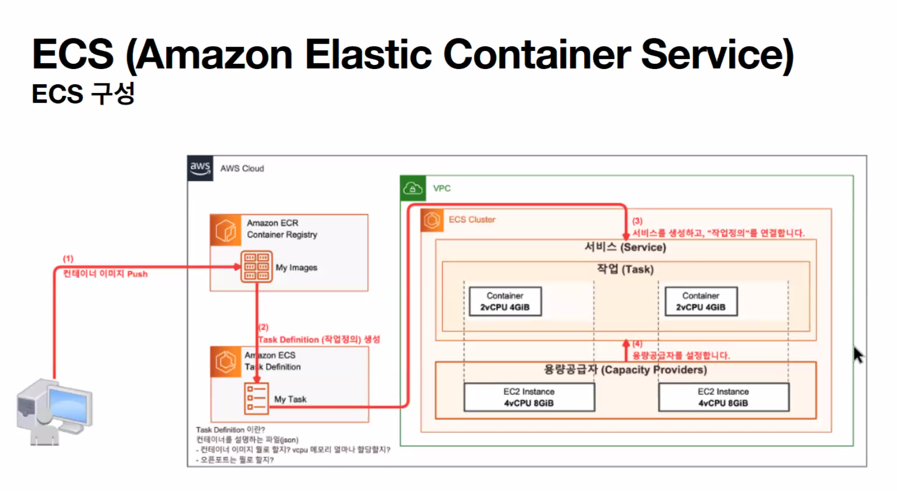

# 도커를 활용하는 클라우드 서비스에 대해 알아보자!

### 컨테이너 오케스트레이션이란?

> 출처 : https://www.hpe.com/kr/ko/what-is/container-orchestration.html

- 일반적으로 애플리케이션은 의도에 따라 애플리케이션이 실행되게 하기 위해 네트워킹 수준에서 정리가 필요한 개별적으로 컨테이너화된 구성 요소(주로 마이크로 서비스로 칭함)로 구성됩니다. 이러한 방식으로 다수의 컨테이너를 정리하는 프로세스를 컨테이너 오케스트레이션이라고 합니다.
- 오늘날의 개발에서, 애플리케이션은 더 이상 하나의 통일체가 아니라 특정 애플리케이션이 설계 의도대로 기능하도록 함께 작동해야 하는 수십 또는 수백 개의 느슨하게 결합되고 컨테이너화된 요소로 구성됩니다. 컨테이너 오케스트레이션은 개별 구성 요소와 애플리케이션 계층의 작업을 정리하는 과정을 의미합니다.

### 컨테이너 오케스트레이션 툴

- GCP
  - GKE(Google Kubernetes Engine)
- AWS

### 컨테이너 오케스트레이션의 기능

- 컨테이너 클러스터링

  - 여러 대의 노드를 하나의 클러스터로 묶어, 애플리케이션을 분산하여 실행하고 자원을 효율적으로 활용하는 기능
  - 여러 대의 물리적인 또는 가상의 서버를 하나의 시스템 처럼 동작하게 하는 기술
  - 컨테이너를 실행하는 호스트의 자원을 효율적으로 분배, 컨테이너가 안정적으로 실행되도록 함.
  - 여러 대의 컨테이너를 묶어 하나의 서버처럼 사용할 수 있도록 지원.

- 서비스 디스커버리

  - 컨테이너를 자동으로 발견하고 서비스 이름과 IP주소 등을 관리하여 애플리케이션 간의 연결을 관리하는 기능
  - 클라우드 환경에서의 컨테이너 생성, 배치, 이동에 따른 IP, Port 정보 업데이트 및 관리

- 오토 스케일링

  - 애플리케이션의 트래픽 양에 따라 자동으로 컨테이너 수를 조절하여 자원 사용량을 최적화하고 가용성을 보장하는 기능

- 로드 밸런싱

  - 여러 대의 노드에서 실행중인 컨테이너들을 조절하여 트래픽을 균등하게 분배, 애플리케이션의 성능을 최적화 하는 기능

- 롤아웃과 롤백

  - 새로운 버전의 애플리케이션을 롤아웃하고 이전 버전으로 롤백하는 기능

- 자동 복구

  - 컨테이너나 노드 장애 시 자동으로 복구하는 기능

- 모니터링과 로깅
  - 컨테이너나 노드의 상태를 모니터링하고 로그를 수집하여 애플리케이션의 성능과 문제점을 분석하는 기능
- 보안과 네트워크 관리
  - 컨테이너와 노드 보안을 관리하고 네트워크 설정을 관리하는 기능

### 대표적인 컨테이너 오케스트레이션 툴/서비스

- 도커 스웜

  - Docker Inc.이 개발한 도커 컨테이너 오케스트레이션 도구. 쿠버네티스가 등장하기 전까지 많이 쓰였다. 간단하게 작동할 수 있고 설정이 쉬움

- 쿠버네티스

  - 구글에서 개발함. 구글 자체 서비스가 다양화되고 대용량 트래픽을 감당해야 할 필요성이 생기면서 쿠버네티스 개발하여 서비스에 적용함.
  - 대규모에 적합함 : 스케일링 기능 강화, 서비스 디스커버리 기능 강화
  - 가장 기능이 풍부하고 널리 사용 됨

- GKE(Google Kubernetes Engine)

  - GCP에서 제공하는 쿠버네티스 기반의 관리형 컨테이너 오케스트레이션 서비스

- EKS(Amazon Elastic Kubernetes Service)

  - AWS에서 제공하는 쿠버네티스 기반의 관리형 쿠버네티스 서비스
  - 사용자는 쿠버네티스 API를 사용하여 EKS 클러스터를 관리할 수 있다.

- ECS(Amazon Elastic Container Service)
  - AWS에서 제공하는 관리형 컨테이너 오케스트레이션 서비스
  - Docker 컨테이너를 실행하기 위한 기능을 제공
  - 사용자는 ECS를 사용하여 컨테이너를 배포, 관리, 스케일링

### ECS 서비스 종류

1. EC2

- 컨테이너가 운영되는 자원이 AWS EC2
- 용량공급자(Capacity Providers)를 통해 EC2 Auto-ScalingGroup을 연결
- ECS에서 제공하는 관리형 지표 "CapacityProviderReservation"에 따라 EC2를 용량을 추가/제거 할 수 있으며, 컨테이너의 숫자의 증가/축소에 따라 EC2도 함께 증가/축소하게 된다.
- 비용 : 호스트로 사용하는 EC2 요금만 과금

2. Fargate

- 서버리스 유형으로 EC2를 배포하거나 관리할 필요 없이 그냥 서비스만 운영
- 컨테이너가 어디서 운영되는지 관리할 필요 없음
- 비용 : 시간당 vCPU, Storage 용량 비용이 부과

3. External

- AWS 인프라가 아닌 호스트에서 ECS에서 정의한 서비스
- 호스트 & 컨테이너 등 실제 서비스는 물리적으로 AWS 밖에서 동작
- AWS 콘솔에서 관리

# Q&A

> 출처 : 원티드 프리온보딩 4월 docker 강의
